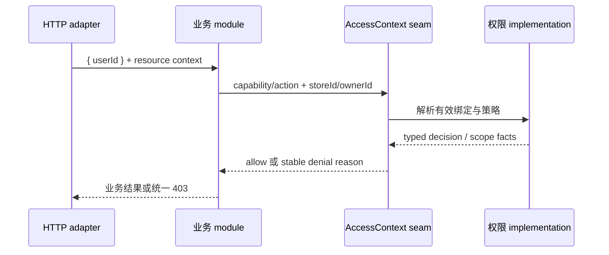

# AccessContext 访问主体与访问范围统一 PRD

## 1. 文档信息

| 项目 | 内容 |
|---|---|
| 需求名称 | AccessContext 访问主体与访问范围统一深化 |
| 文档版本 | v1.1 |
| 当前状态 | 评审修订版（S0 已补齐） |
| 创建日期 | 2026-08-21 |
| 产品负责人 | 待补充 |
| 关联材料 | `CONTEXT.md`、ADR-0013、`docs/architecture-review-mallbay-20260807.md`、权限模型改造 PRD、[scope mapping 与 endpoint 契约清单](./access-context-scope-mapping-inventory.md) |
| 需求类型 | 后端权限治理与跨 module 架构深化 |

## 2. 需求背景

### 2.1 业务背景

MallBay 的权限结果由有效权限绑定、权限策略和业务请求共同决定。当前代码已经有 `AccessContext` seam，但部分业务 module 仍自行读取 `isAuditor`、`storeMember`、岗位或 role code，再将这些字段解释为总部、门店或本人范围。

这使同一个访问主体在不同 module 中可能经过不同的解释路径，权限变更需要修改多个 implementation，测试也必须越过当前 seam 进入 Prisma 和旧 actor 形状。

### 2.2 当前问题

- `isAuditor` 已不再是新的总部授权来源，但仍被遗留 caller 读取。
- 业务 module 重复执行 `withStoreMember`、销售/店长/财务角色推导和门店范围判断。
- 当前 `AccessContext.scope()` 返回 Prisma 风格 `where`，使权限 module 泄漏资源查询形状。
- role code、binding scope 和 grant scope 的原始结构仍可能被业务 module 直接解释。
- runtime snapshot 是迁移期兼容 implementation，不应成为 caller 的权限来源。

### 2.3 需求依据

- ADR-0013 已明确：`isAuditor` 不再是新的总部授权来源。
- 已确认的架构设计决定：AccessContext 拥有访问主体、访问能力和访问范围 facts；资源关系仍由业务 module 解释。
- 当前部署为单 API container；本期不引入分布式权限失效机制。

## 3. 产品目标

- 让所有受保护 module 通过一个稳定的 AccessContext interface 获取访问主体、访问能力和访问范围。
- 使 HQ、门店和本人范围的计算集中在权限 implementation，业务 module 不再读取旧 actor 字段或 role code。
- 让列表、详情和写操作使用一致的访问范围判断，降低横向越权风险。
- 让权限 contract tests 成为主要测试表面，业务 module 可以用 fake AccessContext 验证自己的资源范围映射。
- 在不改变已有权限策略、业务事实、订单状态、库存事实和财务事实的前提下，完成旧 actor 解释路径的可删除迁移。

本期不设业务增长目标；以权限安全、迁移一致性和测试可验收性作为上线目标。

## 4. 非目标

本期不包含：

- 新增或删除业务角色。
- 重新设计 `HQ/STORE` 绑定或 `GLOBAL/STORE/OWN` 授权模型。
- 新增显式拒绝权限。
- 将客户、订单、施工、库存或财务的资源关系全部搬入权限 module。
- 让 AccessContext 生成 Prisma 查询 `where`。
- 将跨店施工、订单销售归属等业务关系建模成通用权限规则。
- 引入 Redis、pub/sub 或其他分布式权限失效机制。
- 删除 `isAuditor`、`StoreMember.position` 等历史字段；本期只删除其作为新权限放行来源的 caller 解释。
- 直接修改订单、库存、现金、客户或施工事实。

## 5. 用户角色与使用主体

本需求没有新的业务页面，使用主体为后端业务 module 和其维护者。

| 角色 | 使用场景 | 可获得内容 | 约束 |
|---|---|---|---|
| 业务 module implementation | 读取或执行资源操作前判断访问能力和访问范围 | typed AccessContext 结果 | 不读取 `isAuditor`、`storeMember`、role code，不访问 runtime snapshot |
| HTTP adapter | 将请求身份转换为访问主体并映射统一错误 | `{ userId }` 和通用 403 | 不自行计算权限，不根据旧字段放行 |
| 权限 implementation | 读取有效绑定、策略、版本和缓存，计算访问结果 | AccessResolution、AccessScopeFacts、稳定拒绝原因 | 不拥有客户、订单、施工等资源查询语义 |
| 测试 implementation | 为业务 module 提供 fake AccessContext | 可控的允许/拒绝和范围结果 | 不 mock Prisma 权限查询作为业务 module 的主要测试方式 |

## 6. 核心业务对象

| 对象 | 定义 | 关键字段 | 生命周期或失效条件 |
|---|---|---|---|
| 访问主体 | 发起一次读取或操作、并由有效身份和权限绑定决定范围与动作的用户 | `userId` | 用户失效、权限绑定失效或策略变化后重新计算 |
| 访问能力 | 访问主体针对资源可以执行的动作 | `capability`、`action` | 由有效权限绑定和已发布策略计算，不由页面按钮决定 |
| 访问范围 | 访问主体在一次请求中可以覆盖的总部、门店和本人责任范围 | `global`、`storeIds`、可选 `ownerId` | 请求上下文、绑定或策略变化后重新计算 |
| 访问决策 | 对一次访问能力和访问范围请求的允许或拒绝结果 | `allowed`、`reason`、版本信息 | 单次请求结果，不持久化为业务事实 |
| 权限解析结果 | 当前访问主体的有效角色、权限和版本快照 | `policyVersion`、`bindingVersion`、`generatedAt` | 策略发布、角色绑定变化、角色停用后失效 |
| legacy actor bridge | 迁移期把旧权限结果或旧 actor 形状连接到新 seam 的内部 implementation | bridge 内部状态 | 所有核心 caller 迁移并通过删除门后删除 |

## 7. 核心权限语义

### 7.1 两层范围语义

现有权限模型继续保留两层语义：

- **绑定范围**：用户角色绑定在 `HQ` 或 `STORE(storeId)` 上。
- **授权范围**：角色权限项可授予 `GLOBAL`、`STORE` 或 `OWN`。

AccessContext implementation 负责将两层语义计算为业务 caller 可消费的访问范围 facts。caller 不读取原始 role、binding 或 grant 结构。

### 7.2 访问范围 facts

本期对外稳定结果采用以下业务含义，具体 TypeScript 命名可由研发按此语义落地：

```ts
type AccessScopeFacts = {
  allowed: boolean;
  global: boolean;
  storeIds: string[];
  ownerId?: string;
};
```

规则：

- `global=true` 表示当前 capability/action 在总部范围可覆盖所有门店；此时 `storeIds` 不作为限制条件。
- `global=false` 时，`storeIds` 表示访问主体可以覆盖的门店集合。
- `ownerId` 只用于表达本人责任范围；业务 module 不得把它解释为任意用户的可选 owner。
- `allowed=false` 时，业务 module 不得使用部分范围继续查询或写入。
- AccessContext 不返回 Prisma `where`；业务 module 负责把 facts 映射为自己的资源查询条件。

### 7.3 角色与能力

- role code 只存在于权限 policy implementation 和管理配置中。
- 业务 module 只询问 capability/action 和访问上下文。
- `SALES`、`MANAGER`、`FINANCE`、`HQ_ADMIN` 等 role code 不得成为业务 module 的直接放行条件。
- “订单销售人”“施工负责人”“跨店来源门店”等资源关系仍由对应业务 module 根据资源事实解释。

## 8. 核心流程

### 8.1 单资源访问判断



主流程：

1. HTTP adapter 从请求身份提取 `userId`，不得根据 `isAuditor` 扩大权限。
2. 业务 module 根据自身资源事实提供 `storeId`、可选 `ownerId` 和 capability/action。
3. AccessContext implementation 按用户状态、绑定范围、角色状态、权限策略和请求上下文计算结果。
4. 允许时，业务 module 将访问范围 facts 映射为自己的列表过滤、详情校验或写入前置条件。
5. 拒绝时，业务 module 不读取资源的其他字段来补充放行；HTTP adapter 对外返回通用无权限结果。

### 8.2 无门店筛选的列表范围解析

1. 列表请求没有指定 `storeId` 时，业务 module 调用范围解析能力获取可覆盖门店集合。
2. HQ 全局访问返回 `global=true`，查询全局可见范围。
3. 门店绑定访问返回具体 `storeIds`，查询只能使用这些门店作为资源过滤条件。
4. 已知可见门店集合为空时，列表、搜索、候选和预览返回 `200`，保持原有 envelope，集合为空、分页 total 为 0。
5. 汇总接口返回 `200`，保持原有 envelope，数值为 0、集合为空；导出接口返回 `200` 空文件并保留格式、表头和响应头。
6. 请求显式指定不在 `storeIds` 中的 `storeId` 时返回 `403 STORE_OUT_OF_SCOPE`，不得降级为空结果。
7. 权限上下文无效或资源范围无法解析时返回 `403 SCOPE_UNRESOLVED`，不得扩大为全局查询、跳过校验或使用当前用户的默认门店进行隐式放行。

### 8.3 跨店资源访问

1. 业务 module 识别资源涉及的来源门店、执行门店或其他组织关系。
2. 对每一个需要核验的组织范围，分别调用对应 capability/action。
3. AccessContext 不理解“跨店施工”或“来源/执行”关系，只返回每次访问范围判断。
4. 业务 module 按自身规则组合判断结果；任一来源/执行门店越权返回 `403 STORE_OUT_OF_SCOPE`，任一门店无法解析返回 `403 SCOPE_UNRESOLVED`，整请求失败且不产生部分副作用。

### 8.4 权限变更后的缓存处理

1. 权限策略发布、角色绑定变化、角色停用或相关用户状态变化后，权限 implementation 清理受影响缓存。
2. 下一次请求无需重新登录即可重新计算权限。
3. 当前单 API container 不新增分布式失效机制。
4. caller 不得直接读取 runtime snapshot；runtime snapshot 只作为迁移期内部 bridge。

## 9. 功能需求

### 9.1 AccessContext public interface 深化

#### 功能目标

将当前薄包装深化为一个有足够 depth 的 module：小而稳定的 interface 隐藏权限解析、缓存和兼容 implementation。

#### Interface 规则

- actor 输入统一为 `{ userId }`；旧字符串输入仅可作为短期兼容，不得新增调用者依赖。
- `resolve` 返回访问主体的有效权限解析结果，供权限 implementation 和管理读取使用；业务 module 不以 role code 做业务判断。
- `can` 负责单次 capability/action 判断，返回允许或拒绝。
- `scope` 负责返回 typed AccessScopeFacts，不返回 Prisma `where`。
- `require` 在拒绝时抛出带稳定内部 reason code 的访问错误；HTTP adapter 将其转换为统一 403。
- interface 不依赖 HTTP Request、Prisma 类型或具体业务资源表。
- 对外稳定错误码为 `ACCESS_DENIED`、`STORE_OUT_OF_SCOPE`、`OWNER_OUT_OF_SCOPE`、`SCOPE_UNRESOLVED`、`RESOURCE_NOT_FOUND`；详细规则见 [scope mapping 与 endpoint 契约清单](./access-context-scope-mapping-inventory.md)。

#### 前置条件

- 用户身份存在。
- 权限策略和角色绑定使用当前有效版本。
- 请求上下文中的 `storeId`、`ownerId`（如提供）格式有效。

#### 例外情况

- 用户不存在或已失效：拒绝，不降级到旧岗位判断。
- 权限解析失败：普通访问拒绝；高风险操作默认拒绝。
- 范围无法解析：拒绝，不回退到全局范围。

### 9.2 业务 module 迁移

迁移对象包括治理入口和所有受保护业务 module：`stores`、`users`、`members`、`settings`、`orders`、`sales-quotes`、`returns`、`inventory`、`purchases`、`construction`、`after-sales`、`customers`、`customer-settlements`、`finance`、`reports`、`notifications`、`invoices`、`rebates`、`commissions`、`pricing`、`products`、`warranties`、`permissions/auth` 等。完整 controller route、资源字段和契约以 [scope mapping 与 endpoint 契约清单](./access-context-scope-mapping-inventory.md) 为准。

每个 module 必须完成：

- 删除 caller-side `isAuditor` 放行分支。
- 删除 caller-side `withStoreMember` 权限解析；资源查询所需的成员信息仍可作为业务数据读取，但不得作为权限来源。
- 删除直接读取 role code 的放行逻辑。
- 通过 AccessContext 获取 capability/action 和访问范围 facts。
- 保留本 module 的资源关系解析、状态规则、事务和领域错误。
- 为列表、详情、写入和导出使用一致的访问范围规则。

### 9.3 能力目录

- 各业务 module 维护自己的 capability/action 常量或目录声明。
- AccessContext 不维护所有业务能力的资源语义，只执行统一授权计算。
- 新 capability/action 必须有对应的权限矩阵映射和至少一个 contract test。
- role code 不得作为新能力的唯一说明。

### 9.4 迁移 bridge 与删除门

迁移分为五个阶段：

| 阶段 | 主要动作 | 完成条件 |
|---|---|---|
| Contract | 固定 typed interface、scope facts、reason code 和权限矩阵测试 | contract tests 通过 |
| Governance | 迁移 `stores/users/settings/auth` 等治理入口 | 治理入口不再以旧字段放行 |
| Business callers | 迁移核心业务 module 的资源 scope 映射 | 目标 caller 全部使用 AccessContext |
| Deletion | 删除 caller-side legacy actor 解释和无 caller 的 bridge | 生产扫描无新增旧路径，删除测试通过 |
| Gate | 全量测试、类型检查、构建和代表页面验收 | 阶段门全部通过 |

迁移期间不得新增新旧两套权限实现同时放行的路径。旧 bridge 可保留在权限 implementation 内，但业务 module 不得直接依赖它。

## 10. 状态流转

AccessContext 本身不创建业务状态，但迁移存在以下状态：

| 状态 | 含义 | 可执行操作 | 是否终态 |
|---|---|---|---:|
| Contract | interface 和测试表面已固定 | 修订 contract、补充矩阵测试 | 否 |
| Governance | 治理入口已迁移 | 迁移业务 caller | 否 |
| Business callers | 核心业务 caller 已迁移 | 删除旧 actor 解释 | 否 |
| Deletion ready | 无 caller 的旧路径可删除 | 执行删除门验证 | 否 |
| Completed | 旧 caller 解释删除、全量验证通过 | 后续维护 | 是 |

状态流转：

`Contract → Governance → Business callers → Deletion ready → Completed`

任何 contract test、类型检查、权限矩阵或代表页面验收失败时，不能进入下一状态；失败不改变已完成状态，只记录待处理项。

## 11. 数据与字段

| 字段 | 含义 | 类型 | 必填 | 数据来源 | 规则 |
|---|---|---|---:|---|---|
| `userId` | 访问主体稳定身份 | string | 是 | HTTP adapter / 内部调用者 | 不得由页面提交的岗位字段替代 |
| `storeId` | 本次资源访问的目标门店 | string | 否 | 业务资源事实或请求上下文 | 单资源判断可提供；无值时进入列表范围解析 |
| `ownerId` | 本次资源访问涉及的责任人 | string | 否 | 业务资源事实 | 仅用于本人责任范围，不可扩大为任意 owner |
| `capability` | 业务 module 声明的访问能力 | string | 是 | 业务 module capability 目录 | 必须存在权限目录映射 |
| `action` | 对访问能力执行的动作 | string | 是 | 业务 module capability 目录 | 由权限策略授权 |
| `allowed` | 是否允许访问 | boolean | 是 | AccessContext implementation | `false` 时不得继续查询或写入 |
| `global` | 是否可覆盖全部门店 | boolean | 是 | 绑定范围与授权范围计算 | 仅总部绑定与 GLOBAL 授权组合可产生 |
| `storeIds` | 可覆盖门店集合 | string[] | 是 | 有效门店绑定与授权范围 | `global=true` 时不作为限制条件 |
| `ownerId`（结果） | 本人责任范围对应身份 | string | 否 | 访问主体与请求 owner 匹配 | 不代表可访问任意用户数据 |
| `reason` | 内部稳定拒绝原因 | enum | 拒绝时 | AccessContext implementation | HTTP adapter 默认不向外暴露细节 |
| `policyVersion` | 权限策略版本 | number | 是 | 已发布权限策略 | 结果必须携带 |
| `bindingVersion` | 用户绑定版本 | number | 是 | 有效角色绑定 | 绑定变化后递增并使旧结果失效 |
| `generatedAt` | 结果生成时间 | ISO datetime | 是 | AccessContext implementation | 用于诊断和审计，不作为权限唯一依据 |

## 12. 权限与数据范围验收矩阵

| 访问主体 | 绑定与授权 | 目标请求 | 预期结果 |
|---|---|---|---|
| 总部管理员 | `HQ_ADMIN/HQ` + `GLOBAL` | 任意门店资源 | 允许，`global=true` |
| 门店用户 | `STORE(s1)` + `STORE` | `storeId=s1` | 允许，`storeIds=[s1]` |
| 门店用户 | `STORE(s1)` + `STORE` | `storeId=s2` | 拒绝，`STORE_OUT_OF_SCOPE` |
| 销售用户 | `STORE(s1)` + `OWN` | `storeId=s1, ownerId=本人` | 允许本人范围 |
| 销售用户 | `STORE(s1)` + `OWN` | `storeId=s1, ownerId=他人` | 拒绝，`OWNER_OUT_OF_SCOPE` |
| 复合角色用户 | `HQ/HQ + STORE(s1)` | 总部与门店入口 | 按各 capability/action 分别判断 |
| 旧 `isAuditor=true` 用户 | 无 `HQ_ADMIN/HQ` | 总部资源 | 拒绝 |
| 任意用户 | 无法解析资源门店 | 详情、写入或列表 | 拒绝或返回既有空结果语义，不全量放行 |

## 13. 异常与边界情况

| 场景 | 触发条件 | 系统处理 | 用户/调用者反馈 |
|---|---|---|---|
| 旧 actor 仍被传入 | caller 传入 `isAuditor/storeMember` | adapter 只取 `userId`，旧字段不参与放行 | 业务结果不因旧字段扩大 |
| 用户不存在 | `userId` 无对应有效用户 | 拒绝并记录诊断信息 | 通用 403 或现有无权限结果 |
| 权限策略版本变更 | 发布或回滚成功 | 清理相关缓存，下一请求重新解析 | 无需重新登录 |
| 绑定变化 | 新增、停用或角色停用 | 清理目标用户或全局相关缓存 | 下一请求使用新结果 |
| 缓存读取失败 | 解析无法确认当前结果 | 高风险操作拒绝；普通访问按保守策略拒绝 | 通用错误，不自动放行 |
| 无门店列表查询 | 请求不含 `storeId` | 返回 global 或具体 `storeIds`；集合为空返回 200 空结果 | 不得默认查询全量 |
| 显式门店越权 | 请求明确指定不在访问范围的 `storeId` | 返回 `403 STORE_OUT_OF_SCOPE` | 不得转换为空结果 |
| 资源范围无法解析 | 资源缺少规范门店/owner 或跨店字段不完整 | 返回 `403 SCOPE_UNRESOLVED`，写入无副作用 | 不得回退到 actor 默认门店 |
| 无可见门店导出 | `storeIds=[]` 且非显式越权 | 返回 `200` 空文件，保留格式和表头 | 不返回权限错误 |
| 跨店资源 | 同时存在来源和执行门店 | module 分别调用权限判断 | 领域 module 决定组合结果 |
| 并发权限变更 | 请求读取旧版本同时发生绑定/策略变化 | 结果携带版本；mutation 清理缓存 | 不重新登录即可最终按新结果判断 |
| 多 API 进程 | 当前本期不支持 | 不引入分布式失效 | 作为后续技术评估项 |
| 未登记 capability | 业务 module 使用未登记 code | 默认拒绝 | 发布或构建阶段报告缺失映射 |

## 14. 测试与验收标准

### 14.1 AccessContext contract tests

- **Given** 用户拥有 `HQ_ADMIN/HQ` 和 `GLOBAL`，**When** 请求任意门店，**Then** 允许且返回 `global=true`。
- **Given** 用户只绑定门店 A，**When** 请求门店 B，**Then** 拒绝并返回 `STORE_OUT_OF_SCOPE`。
- **Given** 用户拥有本人范围，**When** 请求本人 owner，**Then** 允许；请求他人 owner，**Then** 拒绝并返回 `OWNER_OUT_OF_SCOPE`。
- **Given** 用户只有 `isAuditor=true`、没有有效 `HQ_ADMIN/HQ`，**When** 请求总部能力，**Then** 拒绝。
- **Given** 用户拥有多个角色，**When** 解析访问范围，**Then** 允许结果为角色权限并集，不重复扩大绑定范围。
- **Given** 角色绑定被停用，**When** 用户无需重新登录再次请求，**Then** 使用新结果拒绝原有权限。
- **Given** 无法解析资源范围，**When** 详情或写入操作执行，**Then** 默认拒绝。
- **Given** 列表没有 `storeId` 且 `storeIds=[]`，**When** 请求列表/搜索/候选/预览，**Then** 返回 `200` 空结果并保持原 envelope。
- **Given** 汇总没有可见门店，**When** 请求 summary，**Then** 返回 `200`，数值为 0、集合为空。
- **Given** 导出没有可见门店，**When** 请求 export，**Then** 返回 `200` 空文件并保留格式、表头和响应头。
- **Given** 请求显式指定不在 `storeIds` 的门店，**When** 请求列表或写入，**Then** 返回 `403 STORE_OUT_OF_SCOPE`，不返回空结果。
- **Given** 跨店请求的 source 或 execution 门店无法解析，**When** 执行 mutation，**Then** 返回 `403 SCOPE_UNRESOLVED` 且不产生部分副作用。

### 14.2 业务 module contract tests

- **Given** fake AccessContext 返回门店范围 A，**When** module 查询列表，**Then** 查询只使用 A 的资源过滤。
- **Given** fake AccessContext 返回拒绝，**When** module 查询详情或写入，**Then** 不访问或修改资源事实。
- **Given** fake AccessContext 返回跨店两次判断结果，**When** module 执行跨店操作，**Then** 按 module 规则组合 source/execution 结果。
- **Given** module 被删除旧 actor 字段，**When** 扫描生产代码，**Then** 不存在新增 `isAuditor/storeMember/roleCode` 放行路径。

### 14.3 迁移阶段门

- **Given** 所有目标 caller 已迁移，**When** 执行 legacy 扫描，**Then** 旧权限解释只存在于 permissions implementation 内部 bridge。
- **Given** 删除 runtime snapshot bridge，**When** 执行 API 类型检查、测试和构建，**Then** 全部通过且无 caller 依赖。
- **Given** 权限变更后不重新登录，**When** 调用受保护接口，**Then** 按新 bindingVersion/policyVersion 判断。
- **Given** 三档代表页面分别使用门店用户、复合角色用户和无总部绑定旧用户，**When** 打开页面并直接访问受保护入口，**Then** 菜单和后端结果一致。

## 15. 指标与埋点

本期不新增业务增长指标。上线前补充基线；以下技术指标目标为建议值，需研发和测试确认：

| 指标 | 口径 | 当前基线 | 建议目标 |
|---|---|---|---|
| 旧 caller 权限放行路径 | 业务 module 中直接以旧字段或 role code 放行的生产路径数量 | 待扫描确认 | 0 |
| 未登记 capability | 业务调用 code 未在权限目录中登记的数量 | 待扫描确认 | 0 |
| 访问范围越权成功数 | 受保护接口实际返回越权资源的数量 | 待补充 | 0 |
| 权限变更生效延迟 | mutation 成功到下一请求使用新结果的时间 | 待测量 | 单 API 进程内按失效语义即时生效 |
| contract tests 失败数 | AccessContext 与目标 caller contract tests 失败数量 | 待补充 | 0 |

沿用现有权限拒绝审计事件；不把前端菜单隐藏作为安全指标。

## 16. 风险与依赖

| 风险/依赖 | 影响 | 应对 |
|---|---|---|
| 业务 module 资源门店或 owner 关系不一致 | 列表、详情和写入范围可能不同 | 每类资源建立 scope 解析和过滤清单，无法解析默认拒绝 |
| 旧 caller 数量较多 | 迁移周期和回归成本增加 | 分阶段迁移，每阶段使用 deletion test 和 contract test |
| `isAuditor` 历史语义存在差异 | 迁移后可能出现漏权 | 以有效 `HQ_ADMIN/HQ` binding 为准，先建立差异清单再删除旧路径 |
| 多角色权限并集复杂 | 测试组合增多 | 固化权限矩阵测试，按 HQ/STORE/OWN 组合覆盖 |
| 多进程部署尚未支持即时失效 | 扩容后可能出现短暂旧结果 | 当前明确单 API 部署假设；扩容前必须补分布式失效设计 |
| 治理入口仍直接接收布尔管理员字段 | 旧路径继续扩散 | 先迁移 `stores/users/settings/auth`，禁止新增布尔放行参数 |

## 17. 研发拆分建议

1. 固化 AccessContext typed contract、访问范围 facts、reason code 和 contract tests。
2. 将 capability/action 目录按 module 归属整理并建立缺失映射扫描。
3. 迁移治理入口 `stores/users/settings/auth`。
4. 迁移订单、库存、施工、客户、财务、报表、定价等核心 caller。
5. 为列表、详情、写入和跨店资源补齐 scope mapping tests。
6. 删除 caller-side `isAuditor/storeMember/roleCode` 放行路径。
7. 删除无 caller 的 runtime snapshot 和 legacy actor bridge。
8. 执行 API/Web 类型检查、全量测试、构建和代表页面验收。

## 18. 待确认事项

| 编号 | 待确认问题 | 影响范围 | 建议确认角色 | 优先级 |
|---|---|---|---|---|
| 1 | `AccessScopeFacts` 的最终 TypeScript 字段名是否按本文示例落地 | public interface 类型 | 研发负责人 | 中 |
| 2 | 当前各 module 的 capability/action 完整目录与未登记调用清单 | 迁移工作量 | 产品/研发 | 高 |
| 3 | 单 API container 扩容前是否需要提前设计分布式失效 | 部署与一致性 | 研发/运维 | 中 |
| 4 | 产品负责人、研发负责人、测试负责人 | 评审与交付责任 | 项目负责人 | 中 |

上述待确认项不再阻塞本次 S0。资源字段、endpoint route group、无门店查询、范围解析失败、跨店失败和批量原子性规则已经在 [scope mapping 与 endpoint 契约清单](./access-context-scope-mapping-inventory.md) 中固定；研发可以在不改变本契约的前提下补充最终 TypeScript 命名和 capability 目录登记。

## 19. 验收结论

当 contract tests、目标 caller 迁移、删除测试、全量回归和代表页面验收全部通过，且未改变既有权限矩阵和业务事实语义时，本需求可判定完成。

## 20. 变更记录

| 版本 | 日期 | 变更内容 | 修改人 |
|---|---|---|---|
| v1.0 | 2026-08-21 | 根据 AccessContext 设计树、领域上下文和现有权限 PRD生成 | Codex |
| v1.1 | 2026-08-21 | 补齐资源 scope mapping、endpoint inventory、无门店和范围解析失败响应契约 | Codex |
