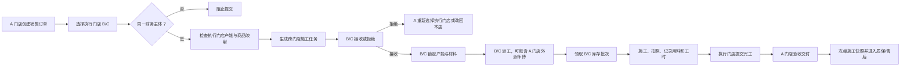

# 跨门店施工协作详细实施计划

> 文档状态：正式实施基线  
> 适用范围：MallBay 门店运营系统  
> 编制日期：2026-07-28  
> 一期场景：A 门店接单，A 门店师傅或协作师傅前往 B/C 门店施工，B/C 门店默认提供材料  

## 1. 已确认的业务决策

本计划以以下决定为不可变更的第一期实施前提：

1. A、B、C 门店属于同一法人或同一财务主体。
2. 销售订单仍归属于接单门店 A，收入、收款、开票及客户关系由 A 门店负责。
3. 施工由 B/C 门店承接时，材料默认由实际执行门店 B/C 提供并从 B/C 库存批次出库。
4. 第一期不收取门店间协作费，不生成内部应收、内部应付或服务费结算单。
5. 一辆车对应一张销售订单；企业客户和个人客户都可以维护多辆车，但单张订单只关联其中一辆。
6. “跨门店施工”是执行组织关系，不是施工地点类型。原有“到店/外出”继续表示相对于执行门店的物理施工地点。
7. A 门店人员不因临时前往 B/C 施工而变成 B/C 门店成员，系统通过具体任务授权其访问必要数据。

## 2. 建设目标

建立一套可追踪、可控制、可核算但不过度复杂的跨门店施工机制，使系统能够明确回答：

- 订单是谁接的、收入归哪个门店；
- 施工由哪个门店执行、哪些人员参与；
- 使用了哪个门店的哪些库存批次；
- 材料和人工成本来自哪里；
- A、B/C 各自能看什么、能操作什么；
- 任务处于待接收、待派工、施工中还是待验收；
- 跨店成本如何进入订单毛利，同时避免重复入账；
- 出现缺料、改期、拒绝、取消或返工时由谁处理。

## 3. 第一期不做的内容

以下事项不进入本次开发范围，避免把施工协作升级为内部交易系统：

- 门店间协作服务费；
- 门店间收入分成；
- 内部应收、内部应付和内部发票；
- 跨法人或跨财务主体协作；
- 自动计算差旅费、里程费和住宿补贴；
- A 门店向 B/C 门店调拨材料作为默认流程；
- 同一订单同时由多个执行门店拆分施工；
- 一张订单同时关联多辆车。

后续若需要协作费，应新增独立的“内部协作结算”模块，不得复用销售订单施工收费或伪装成普通费用。

## 4. 核心业务口径

### 4.1 双门店维度

订单必须同时具备两个明确、不可混淆的门店字段：

| 字段 | 含义 | 负责内容 |
| --- | --- | --- |
| 归属门店 `storeId` | 接单及商业归属门店 A | 客户、销售员、报价、收入、收款、发票、售后主责 |
| 执行门店 `executionStoreId` | 实际组织施工的门店 B/C | 产能、排班、派工、材料、施工记录、执行成本 |

本店施工时两个字段相同；跨门店施工时两个字段不同。

历史订单统一回填：

```text
executionStoreId = storeId
```

### 4.2 施工地点

保留现有施工地点枚举：

- `IN_STORE`：在执行门店内施工；
- `OUTSIDE`：执行门店组织人员前往客户地址或其他外部地址施工。

例如：

- A 接单，B 店内施工：`storeId=A`、`executionStoreId=B`、`constructionLocation=IN_STORE`；
- A 接单，B 组织人员去客户处施工：`storeId=A`、`executionStoreId=B`、`constructionLocation=OUTSIDE`。

不得新增一个名为“跨门店”的施工地点值，否则会把组织关系与物理地点混为一谈。

### 4.3 收入与成本归属

第一期采用以下核算方式：

| 项目 | 门店口径 | 说明 |
| --- | --- | --- |
| 销售收入、收款、发票 | A 门店 | 始终跟随订单归属门店 |
| 材料库存减少 | B/C 门店 | 跟随实际出库批次 |
| 材料实际成本 | B/C 门店 | 优先取实际入库价/批次成本 |
| 施工人工与提成 | B/C 执行任务 | 按实际参与人员及已确认工时/提成计算 |
| 订单毛利 | 订单维度 | A 收入减去 B/C 实际执行成本 |
| 协作服务费 | 不产生 | 第一期固定为 0 |

“订单毛利读取 B/C 成本”只是订单利润归集，不应再次生成一笔 B/C 费用。财务流水、库存流水和成本结算必须通过同一来源记录关联，避免同一成本重复计入。

### 4.4 材料成本来源优先级

按当前统一成本口径执行：

1. 已出库批次存在实际单位成本：使用实际批次成本，来源标记为“实际”；
2. 实际成本暂缺：使用 B/C 对应产品的材料成本标准，来源标记为“标准”；
3. 两者均缺失：标记为“待补齐”，不得虚构为 0；
4. 成本结算前，实际入库价补录后允许自动刷新；
5. 财务完成成本结算后永久冻结，只能通过调整单更正并保留原因。

## 5. 总体业务流程



### 5.1 订单创建

1. 销售人员在 A 门店创建订单。
2. “执行门店”默认当前门店 A。
3. 用户可选择与 A 属于同一财务主体、已启用跨店协作的 B/C。
4. 选择执行门店后，系统检查：
   - 执行门店是否启用；
   - 是否属于同一财务主体；
   - 所选日期和施工类型是否有产能；
   - 每个订单产品是否存在执行门店商品映射；
   - 执行门店是否维护相应施工收费/工时标准。
5. 草稿允许暂缺商品映射；正式提交前必须补齐。
6. 正式提交后创建跨门店施工任务，并通知执行门店。

### 5.2 执行门店接收

B/C 施工主管或店长查看只读订单快照，包括：

- 来源门店；
- 客户及车辆必要信息；
- 施工类型、地点、预约时间；
- 产品、数量、单位；
- 材料准备状态；
- 推荐班组及预计工时；
- 备注和交付要求。

B/C 可以接收或拒绝，拒绝时必须填写原因。拒绝不会自动取消原销售订单，而是退回 A 重新选择执行门店或调整预约。

### 5.3 材料准备与出库

1. B/C 接收任务后，系统按商品映射查找 B/C 产品。
2. 自动匹配或人工选择 B/C 库存批次。
3. 锁定、领取和出库全部落在 B/C 库存。
4. 施工人员主任务页直接显示“施工批次”，例如：

```text
BOP-001（已领取 1 卷）
PPF-202607-03（已领取 6.5 米）
```

5. 零散出库继续使用产品支持的单位换算规则，允许卷、米等合法单位，数量精度由产品单位配置决定。
6. B/C 缺料时，采购需求在 B/C 门店生成，A 只收到进度和风险提醒。

### 5.4 派工与施工

- B/C 施工主管负责排班和派工；
- 可派 B/C 本店师傅，也可选择任务已授权的 A 门店外派师傅；
- A 师傅仍属于 A，不新增 B/C 的永久门店成员关系；
- 施工人员只能查看被分配任务所需的客户、车辆、产品、批次和照片信息；
- 施工开始、照片、材料领取、工时、完工均记录执行门店和实际操作人。

### 5.5 完工与验收

1. 执行人员上传施工前、施工中、施工后照片。
2. B/C 施工主管确认实际用料、实际参与人员、实际工时及异常。
3. B/C 提交完工，任务进入“待来源门店验收”。
4. A 店长或订单销售员确认交付。
5. 验收后更新原销售订单施工进度，不重新创建一张 B/C 销售订单。
6. 质保与售后仍关联原订单，同时保留执行门店和施工人员，用于责任追踪和报表分析。

## 6. 状态机设计

建议新增跨门店执行任务状态：

| 状态 | 中文名称 | 允许操作 |
| --- | --- | --- |
| `PENDING_ACCEPTANCE` | 待执行门店接收 | B/C 接收或拒绝；A 可取消申请 |
| `REJECTED` | 已拒绝 | A 查看原因并重新选择 |
| `READY_TO_DISPATCH` | 已接收待派工 | B/C 商品映射、锁料、安排产能、派工 |
| `READY_TO_DISPATCH` | 待派工 | B/C 派工 |
| `DISPATCHED` | 已派工 | 领取材料、调整人员 |
| `IN_CONSTRUCTION` | 施工中 | 拍照、记录用料与工时 |
| `PENDING_SOURCE_ACCEPTANCE` | 待来源门店验收 | A 验收或退回补充 |
| `COMPLETED` | 已完成 | 只读，进入成本确认及质保 |
| `CANCELLED` | 已取消 | 释放产能与库存锁定 |

关键约束：

- 同一订单最多只有一个有效执行任务；
- 只有接收后才可锁定 B/C 产能和库存；
- 已出库后取消必须先完成库存退回或差异处理；
- 施工开始后不得直接更换执行门店；
- 完工退回只能补充证据或修正执行记录，不能改订单商业金额；
- 所有状态变化写入审计日志。

## 7. 数据模型实施方案

### 7.1 财务主体

新增 `FinancialEntity`：

| 字段 | 说明 |
| --- | --- |
| `id` | 主键 |
| `code` | 财务主体编码 |
| `name` | 名称 |
| `status` | 启用/停用 |
| `createdAt/updatedAt` | 审计时间 |

在 `Store` 增加：

- `financialEntityId`；
- `crossStoreConstructionEnabled`；
- 财务主体关联和索引。

安全迁移策略：初始为每个门店创建独立财务主体，避免升级后自动开放跨店数据；再由系统管理员明确把 A/B/C 合并至同一主体。

### 7.2 订单

在 `Order` 增加：

```text
executionStoreId
```

并增加：

- 来源门店、执行门店组合索引；
- 执行门店与预约日期索引；
- 服务端校验同一财务主体；
- 历史数据回填 `executionStoreId = storeId`。

`Order.storeId` 的语义保持不变，不做重命名，降低现有模块回归风险。

### 7.3 跨门店施工任务

新增 `CrossStoreConstructionTask`：

| 字段 | 说明 |
| --- | --- |
| `id` | 主键 |
| `orderId` | 唯一关联订单 |
| `sourceStoreId` | A 门店 |
| `executionStoreId` | B/C 门店 |
| `status` | 执行任务状态 |
| `materialSupplyMode` | 一期固定 `EXECUTION_STORE` |
| `requestedById/requestedAt` | 发起人和时间 |
| `acceptedById/acceptedAt` | 接收人和时间 |
| `rejectedById/rejectedAt/rejectReason` | 拒绝记录 |
| `submittedById/submittedAt` | 完工提交 |
| `sourceAcceptedById/sourceAcceptedAt` | A 验收 |
| `cancelledById/cancelledAt/cancelReason` | 取消记录 |
| `scheduleSnapshot` | 预约、地点等快照 |
| `version` | 乐观锁版本 |
| `createdAt/updatedAt` | 审计时间 |

任务表用于流程协作，不替代 `ConstructionRecord`。`ConstructionRecord.storeId` 在新订单中明确表示执行门店。

### 7.4 商品映射

当前产品为门店级数据，同一品牌和型号在 A、B/C 可能拥有不同产品 ID、销售单位和成本。必须新增 `CrossStoreProductMapping`，不能直接拿 A 的产品 ID 查询 B/C 库存。

建议字段：

| 字段 | 说明 |
| --- | --- |
| `financialEntityId` | 限定同一财务主体 |
| `sourceProductId` | A 订单产品 |
| `executionStoreId` | B/C |
| `executionProductId` | B/C 库存产品 |
| `sourceUnit/executionUnit` | 默认单位 |
| `conversionSnapshot` | 必要的单位换算快照 |
| `status` | 启用/停用 |
| `createdById/updatedById` | 维护人 |

唯一约束：

```text
sourceProductId + executionStoreId
```

保存时验证产品确实属于对应门店、单位可换算、产品未停用。映射停用只影响新任务，不修改已冻结任务快照。

### 7.5 库存与成本

新跨店任务应满足：

- `OrderInventoryAllocation.storeId = executionStoreId`；
- `InventoryMovement.storeId = executionStoreId`；
- `InventoryBatch.storeId = executionStoreId`；
- `PurchaseRequirement.storeId = executionStoreId`；
- 记录 `sourceOrderId/orderItemId/crossStoreTaskId` 以便追踪；
- 成本结算保留 `sourceStoreId`、`executionStoreId` 和成本来源快照。

服务端不得信任前端传入的库存门店 ID，必须从有效任务的 `executionStoreId` 推导。

### 7.6 人员授权

现有 `StoreMember` 是单门店归属，不应为临时外派复制成员。任务访问授权通过以下关系判断：

1. 用户是来源门店具备权限的店长、销售员；
2. 用户是执行门店具备权限的店长、施工主管、库存或采购人员；
3. 用户是该任务的已分配施工人员；
4. 用户是同财务主体的财务只读角色。

如现有 `ConstructionAssignment` 足以记录人员，则直接用其作为任务授权依据；只有需要在正式派工前预授权 A 门店候选师傅时，才新增 `CrossStoreWorkerGrant`，避免重复模型。

## 8. 权限矩阵

| 功能 | A 销售/店长 | B/C 店长/施工主管 | B/C 库存/采购 | 已派施工人员 | 财务 |
| --- | --- | --- | --- | --- | --- |
| 创建和修改商业订单 | 允许 | 只读 | 不可见 | 不可见 | 只读 |
| 选择执行门店 | A 店长/授权销售 | 不允许 | 不允许 | 不允许 | 不允许 |
| 接收/拒绝任务 | 查看结果 | 允许 | 不允许 | 不允许 | 只读 |
| 维护客户、车辆、售价 | 允许 | 不允许 | 不允许 | 不允许 | 不允许 |
| 锁料、出库 | 查看状态 | 管理 | 允许 | 领取确认 | 只读 |
| 排班、派工 | 查看 | 允许 | 不允许 | 查看本人 | 只读 |
| 施工照片和记录 | 查看 | 管理 | 不允许 | 允许本人任务 | 只读 |
| 提交完工 | 查看 | 允许 | 不允许 | 可提交给主管 | 只读 |
| 来源门店验收 | 允许 | 查看结果 | 不允许 | 查看结果 | 只读 |
| 收款、发票 | 允许 | 不允许 | 不允许 | 不允许 | 允许 |
| 成本确认 | 查看汇总 | 确认执行数据 | 提供材料数据 | 提供工时数据 | 最终结算 |

后端权限必须以任务、来源门店、执行门店和角色共同判断。前端隐藏按钮只能改善体验，不能替代接口鉴权。

## 9. 接口改造

### 9.1 门店与商品

- `GET /stores/:storeId/eligible-execution-stores`
  - 返回同一财务主体且已启用协作的门店；
  - 返回可用产能摘要和材料准备状态。
- `GET /cross-store-product-mappings`
- `POST /cross-store-product-mappings`
- `PATCH /cross-store-product-mappings/:id`
- `POST /cross-store-product-mappings/:id/disable`

### 9.2 订单

创建和修改订单 DTO 增加 `executionStoreId`。服务端负责：

- 同财务主体校验；
- 执行门店启用校验；
- 产能校验；
- 商品映射校验；
- 生成或更新跨门店任务；
- 本店订单不创建多余的跨店任务记录。

修改执行门店时必须在一个事务内释放旧产能、释放未出库锁定、获取新产能并更新任务。已开始施工后禁止修改。

### 9.3 任务

- `GET /construction/cross-store-tasks?direction=incoming|outgoing`
- `GET /construction/cross-store-tasks/:id`
- `POST /construction/cross-store-tasks/:id/accept`
- `POST /construction/cross-store-tasks/:id/reject`
- `POST /construction/cross-store-tasks/:id/dispatch`
- `POST /construction/cross-store-tasks/:id/start`
- `POST /construction/cross-store-tasks/:id/submit-completion`
- `POST /construction/cross-store-tasks/:id/accept-completion`
- `POST /construction/cross-store-tasks/:id/cancel`
- `GET /construction/cross-store-tasks/:id/material-readiness`

所有写接口增加幂等键或基于版本号的并发校验，防止重复接收、重复出库和重复完工。

### 9.4 库存

现有自动匹配、锁定、出库、释放接口需改为从订单读取 `executionStoreId` 和商品映射。禁止客户端自由指定另一门店批次。

接口错误须返回明确业务信息，例如：

- `EXECUTION_STORE_NOT_ELIGIBLE`；
- `PRODUCT_MAPPING_MISSING`；
- `EXECUTION_STORE_CAPACITY_FULL`；
- `EXECUTION_STORE_INVENTORY_SHORTAGE`；
- `CROSS_STORE_TASK_NOT_ACCEPTED`。

## 10. 页面改造

### 10.1 新建订单

在“施工预约”区域增加“执行门店”：

- 默认当前门店；
- 仅显示同财务主体、启用中的可协作门店；
- 展示“本店施工”或“跨门店施工”标签；
- 切换后重新检查产能、商品映射、施工标准和建议施工收费；
- 施工地点仍为“到店/外出”；
- 选 B/C 且“到店”时，文案显示“到执行门店 B 施工”；
- 正式提交前汇总提示缺失项。

### 10.2 A 门店订单详情

增加“跨门店施工”卡片：

- 来源门店 → 执行门店；
- 当前任务状态；
- B/C 接收人及时间；
- 施工人员；
- 材料准备和施工批次；
- 预约、施工和验收时间线；
- 拒绝、缺料、改期等异常；
- 完工照片和来源门店验收入口。

### 10.3 B/C 施工任务中心

增加以下页签：

- 本店订单；
- 外店协作·待接收；
- 外店协作·待备料；
- 外店协作·待派工；
- 施工中；
- 待来源门店验收；
- 已完成。

任务卡突出“来源门店 A”和“本店为执行门店”，避免店员误认为这是 B/C 的销售订单。

### 10.4 施工人员任务页

显示：

- 来源门店；
- 执行门店；
- 施工地点；
- 本人角色和协作人员；
- 施工批次及领取数量；
- 必传照片清单；
- 实际用料和工时；
- 异常上报。

不得开放完整客户档案、价格、收款和其他门店订单列表。

### 10.5 库存与采购

库存匹配页显示：

```text
来源订单：A 门店 ORD...
执行门店：B 门店
材料供应：执行门店
```

缺料采购需求自动归 B/C，来源保留 A 订单号和跨店任务号。

### 10.6 财务与报表

报表增加可筛选维度：

- 归属门店；
- 执行门店；
- 是否跨门店；
- 材料成本来源；
- 施工人员；
- 施工项目。

关键列包括销售收入、已收款、实际材料成本、实际施工人工、提成、总成本、毛利、成本来源和协作费。协作费第一期固定显示“未启用”，不显示为一笔 0 元交易。

## 11. 通知与审计

### 11.1 通知类型

新增：

- `CROSS_STORE_TASK_PENDING_ACCEPTANCE`
- `CROSS_STORE_TASK_ACCEPTED`
- `CROSS_STORE_TASK_REJECTED`
- `CROSS_STORE_PRODUCT_MAPPING_MISSING`
- `CROSS_STORE_MATERIAL_SHORTAGE`
- `CROSS_STORE_TASK_DISPATCHED`
- `CROSS_STORE_COMPLETION_PENDING_ACCEPTANCE`
- `CROSS_STORE_TASK_COMPLETED`
- `CROSS_STORE_TASK_CANCELLED`

### 11.2 通知对象

| 事件 | 通知对象 |
| --- | --- |
| 新任务 | B/C 店长、施工主管 |
| 接收/拒绝 | A 店长、订单销售员 |
| 缺映射/缺料 | B/C 店长、库存/采购人员；同步 A 店长 |
| 派工 | 被派施工人员 |
| 提交完工 | A 店长、订单销售员 |
| 验收/退回 | B/C 店长、施工主管和参与人员 |
| 取消或异常 | A、B/C 双方责任人 |

### 11.3 审计内容

每次跨店操作记录：

- 订单号、任务号；
- 来源门店、执行门店；
- 操作、前后状态；
- 操作人、角色、时间；
- 原因；
- 产能、材料锁定和出库关联号；
- 关键字段变更前后快照。

## 12. 分阶段实施任务

### 阶段 0：规则固化与数据盘点

目标：确保上线前明确门店关系、商品映射量和历史数据质量。

任务：

- 盘点所有门店及其财务主体；
- 确认 A/B/C 归组；
- 统计跨店可能使用的产品、单位和库存批次；
- 统计现有 `OUTSIDE` 订单，确认不误判为跨店；
- 统计人员所属门店及施工岗位；
- 输出数据清理清单。

验收：

- 每个启用门店都有且仅有一个财务主体；
- 不存在把普通外出施工识别成跨店施工的历史记录；
- 试点产品均有映射方案。

### 阶段 1：数据库与领域模型

主要文件：

- `apps/api/prisma/schema.prisma`
- `apps/api/prisma/migrations/*`
- `apps/api/src/permissions/*`
- 共享枚举和 DTO 所在包。

任务：

- 新增财务主体和门店关联；
- 新增 `Order.executionStoreId`；
- 新增跨门店任务、商品映射和相关枚举；
- 增加索引、唯一约束和外键；
- 回填历史订单；
- 增加数据库不变量预检脚本。

验收：

- 全量历史订单执行门店不为空；
- 本店订单行为不变；
- 无法创建跨财务主体任务；
- 一个订单不能出现两个有效跨店任务。

### 阶段 2：执行门店选择与商品映射

主要文件：

- `apps/api/src/stores/*`
- `apps/api/src/products/*`
- `apps/web/app/settings/*`
- `apps/web/app/products/*`

任务：

- 提供可协作执行门店查询；
- 提供商品映射维护页面；
- 校验单位换算；
- 支持启用/停用映射；
- 显示缺失映射清单和批量处理入口。

验收：

- A 只能选择同财务主体的 B/C；
- 停用门店、停用产品和停用映射不出现在新任务中；
- 草稿可保存缺映射，正式提交被明确阻止。

### 阶段 3：订单、预约和产能

主要文件：

- `apps/api/src/orders/create-order.use-case.ts`
- `apps/api/src/orders/*`
- `apps/api/src/construction/capacity-reservation.service.ts`
- `apps/web/app/orders/create/page.tsx`
- `apps/web/app/orders/[id]/*`

任务：

- 新建订单增加执行门店；
- 容量预约改为使用执行门店；
- 建立跨店任务；
- 执行门店变更时安全释放并重锁产能；
- 增加 A 门店详情卡和状态时间线。

验收：

- 选择 B 后只占用 B 产能；
- A 产能不被错误扣减；
- 重复提交不重复创建任务或占用产能；
- 本店订单回归通过。

### 阶段 4：任务接收、派工和权限

主要文件：

- `apps/api/src/construction/construction.service.ts`
- `apps/api/src/construction/*controller*`
- `apps/api/src/permissions/permission-policy.ts`
- `apps/web/app/construction/assignments/page.tsx`
- `apps/web/app/construction/tasks/*`

任务：

- 实现任务状态机；
- 实现接收、拒绝、派工和完工验收；
- 支持 A 师傅任务级访问；
- 允许 B/C 本地人员协作；
- 限制商业字段和跨店列表访问；
- 增加并发与幂等控制。

验收：

- A 师傅无需加入 B 成员即可完成被派任务；
- 未被分配人员无法打开任务；
- B/C 无法修改 A 的销售价格、收款或客户主数据；
- 财务看不到派工、出库等可写按钮。

### 阶段 5：库存、批次与成本

主要文件：

- `apps/api/src/inventory/inventory.service.ts`
- `apps/api/src/inventory/*`
- `apps/api/src/purchases/*`
- `apps/web/app/inventory/matching/*`
- `apps/web/app/construction/materials/*`

任务：

- 按映射后的 B/C 产品匹配库存；
- 锁定、出库、释放和流水均使用执行门店；
- 零散单位出库与换算回归；
- 缺料在执行门店生成采购需求；
- 实际材料成本进入订单成本快照；
- 增加成本来源标记和冻结规则。

验收：

- A 库存不发生变化；
- B/C 正确减少对应批次库存；
- 出库流水能打开并关联 A 订单、跨店任务和 B/C 批次；
- 小数数量按合法单位成功锁定和出库；
- 成本不被财务流水重复计算。

### 阶段 6：通知、报表与审计

主要文件：

- `apps/api/src/notifications/*`
- `apps/api/src/finance/*`
- `apps/api/src/reports/*`
- `apps/web/app/reports/*`
- `apps/web/app/finance/*`

任务：

- 增加跨店通知；
- 增加来源/执行门店维度；
- 完善成本来源、人员、项目明细；
- 增加跨店操作审计展示；
- 所有导出增加归属门店、执行门店和跨店任务号。

验收：

- 关键节点责任人收到通知；
- 报表按 A 或 B/C 筛选结果一致；
- 收入只出现一次，材料成本只出现一次；
- 导出明细与页面合计一致。

### 阶段 7：试点与上线

建议先开通 A↔B，再开通 C：

1. 开启财务主体关系；
2. 完成试点商品映射；
3. 开启门店级功能开关；
4. 创建一张零金额内部测试单走完全流程；
5. 创建一张真实小额订单；
6. 核对库存、成本、报表和通知；
7. 稳定后开放 C。

## 13. 数据迁移与兼容

### 13.1 迁移顺序

1. 部署可空字段和新表；
2. 为每个门店创建独立财务主体；
3. 回填 `Order.executionStoreId = Order.storeId`；
4. 发布兼容旧数据的服务端；
5. 配置 A/B/C 财务主体；
6. 维护试点商品映射；
7. 开启功能开关；
8. 数据验证通过后，再将关键字段改为非空或增加应用层强约束。

### 13.2 历史数据

- 历史订单全部视为本店执行；
- 历史 `OUTSIDE` 仍是原门店外出施工；
- 不为历史订单补造跨门店任务；
- 不伪造历史执行门店、材料批次或成本；
- 历史报表继续按原口径，新跨店订单显示双门店维度。

### 13.3 回滚

- 功能开关关闭后禁止创建新跨店任务；
- 已创建任务继续允许完成，避免形成悬挂库存；
- 新字段和新表不立即删除；
- 未接收任务可取消并释放预约；
- 已出库任务只能按业务流程退料/完工，不允许数据库硬回滚。

## 14. 测试矩阵

### 14.1 单元测试

- 同财务主体与跨主体校验；
- 本店/跨店判定；
- 商品映射与单位换算；
- 状态机合法/非法流转；
- 任务级权限；
- 成本来源优先级；
- 执行门店产能占用；
- 幂等接收、锁料、出库和完工。

### 14.2 集成测试

至少覆盖：

1. A 接单、A 施工；
2. A 接单、B 店内施工、B 材料、A 师傅；
3. A 接单、B 店内施工、B 材料、B 师傅；
4. A 接单、C 外出施工；
5. B 拒绝后改派 C；
6. 缺商品映射；
7. B 缺料生成 B 采购需求；
8. 卷转米后零散出库；
9. 施工开始后尝试更换执行门店；
10. 完工后 A 退回补充照片；
11. 实际入库价迟补后成本刷新；
12. 财务结算后成本冻结；
13. 取消任务释放产能和库存；
14. 不同财务主体跨店被拒绝。

### 14.3 权限测试

使用独立账号验证：

- A 店长；
- A 销售；
- A 外派师傅；
- B 店长；
- B 施工主管；
- B 库管/采购；
- B 本店师傅；
- 财务；
- 无关 C 门店普通人员。

必须同时验证页面按钮和直接调用 API，防止只隐藏前端按钮而接口仍可越权。

### 14.4 回归测试

重点回归：

- 新建及修改普通销售订单；
- 本店排班、派工、照片和完工；
- 库存锁定、零散出库和流水关联；
- 采购需求；
- 施工成本确认；
- 收款、发票、返利和售后；
- 销售、施工、财务及售后报表；
- 全量导出。

## 15. 监控与预警

上线后至少监控：

- 待接收超过约定时间的任务数；
- 接收后未锁定材料的任务数；
- 缺商品映射任务数；
- 材料不足任务数；
- 已开始但长时间未完工任务数；
- 已提交但 A 未验收任务数；
- 任务状态与订单施工状态不一致数；
- 出库门店与执行门店不一致数；
- 成本来源为“待补齐”的订单数；
- 重复库存流水或重复成本记录数。

数据库预检应在 API 启动前检测关键不变量，但对可修复的历史脏数据应提供清理脚本和明确记录，避免直接造成生产服务无限重启。

## 16. 主要风险与控制

| 风险 | 控制措施 |
| --- | --- |
| 把跨店误当成外出施工 | 独立 `executionStoreId`，不修改地点枚举语义 |
| B/C 扣错产品库存 | 必须经过商品映射，服务端从任务推导门店和产品 |
| A 师傅无法访问 B 任务 | 使用任务级授权，不修改永久门店成员关系 |
| 跨店数据泄露 | 只开放任务快照和必要字段，接口逐任务鉴权 |
| 收入或成本重复 | 收入跟来源门店，成本跟实际流水；订单利润只引用不复制 |
| 执行门店产能超卖 | 使用现有原子预占机制，并把作用域改为执行门店 |
| 重复接收/重复出库 | 状态机、唯一约束、版本号和幂等键 |
| 历史外出订单被误迁移 | 历史执行门店统一等于归属门店，不反推跨店 |
| 商品单位不一致 | 映射保存时校验换算，任务冻结换算快照 |
| 关闭功能后悬挂任务 | 只阻止新建，允许已创建任务完成或规范取消 |

## 17. 完成定义

满足以下条件才视为一期完成：

- A 可以选择同财务主体的 B/C 作为执行门店；
- B/C 能接收、拒绝、派工和提交完工；
- A 外派师傅无需加入 B/C 门店成员即可执行指定任务；
- B/C 材料能按批次和正确单位锁定、领取、出库；
- A 库存不被误扣；
- 订单能同时展示归属门店和执行门店；
- 收入、收款、发票仍归 A；
- B/C 实际材料和人工成本能进入原订单利润；
- 不产生门店协作费、内部应收或内部应付；
- A 能验收 B/C 完工并进入原订单质保/售后；
- 权限、通知、审计、报表和导出全部支持双门店维度；
- 单元、集成、权限、回归测试通过；
- 数据迁移、回滚和生产监控方案已演练。

## 18. 建议开发优先级

| 优先级 | 工作包 | 前置依赖 |
| --- | --- | --- |
| P0 | 财务主体、执行门店字段、任务状态机 | 无 |
| P0 | 订单和产能切换到执行门店 | 数据模型 |
| P0 | 商品映射、B/C 锁料和出库 | 数据模型、任务接收 |
| P0 | 任务级人员权限 | 任务模型 |
| P0 | 接收、派工、施工、完工和来源验收 | 状态机、权限 |
| P1 | 通知和审计 | 核心流程 |
| P1 | 成本归集和财务报表 | 库存、施工成本 |
| P1 | 导出及运营监控 | 报表、审计 |
| P2 | 批量商品映射和高级异常看板 | 核心流程稳定 |
| 后续 | 协作费、收入分成、跨主体结算 | 另行立项 |

本计划是第一期开发与验收基线。如未来引入协作费或跨财务主体协作，必须通过新增版本扩展，不应改变已完成订单的历史收入、库存和成本快照。
