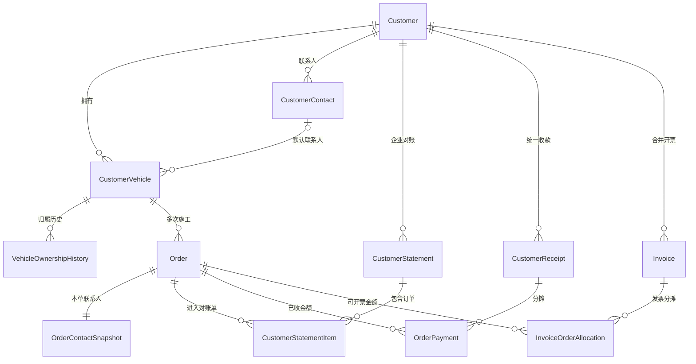

# 客户多车辆与企业统一结算实施计划

## 1. 文档信息

- 版本：v1.0
- 日期：2026-07-20
- 状态：P1～P6 已实现并完成自动化回归、迁移部署与数据库不变量预检；本地 Docker 端到端验收已完成
- 适用范围：客户管理、车辆档案、销售订单、订单复制、客户历史、企业对账、收款分摊、发票管理、权限与审计
- 核心原则：一个客户可关联多辆车，一辆车可产生多次订单，但一张订单只关联一辆车

## 2. 已确认业务决策

1. 企业客户和个人客户均支持多辆车。
2. 坚持“一车一订单”，不把一张订单拆成多辆车的履约明细。
3. 订单页面不新增或修改车辆；车辆只能从客户管理维护。
4. 客户没有可用车辆时，订单不能正式提交，并引导用户进入客户档案维护。
5. 车辆可新增、修改、停用、重新启用和转移；产生过业务记录的车辆不能删除。
6. 车牌号或 VIN 至少填写一项；同一门店内车牌号和 VIN 均不得重复。
7. 订单页面同时展示客户汇总与当前车辆的历史信息。
8. 同一客户多车做相似项目时，使用“复制为新订单”提高录单效率，复制后必须重新选择车辆。
9. 企业客户支持跨订单对账、统一收款和合并开票。
10. 企业统一收款默认按订单完成时间从早到晚分摊，财务入账前可调整。
11. 合并开票不要求先收款，允许“先开票、后付款”。
12. 联系人采用“客户联系人、车辆默认联系人、本单联系人快照”三级结构。
13. 销售员可维护自己负责客户的车辆；店长可维护、停用、启用和转移车辆；其他岗位只读。

## 3. 现状与差距

### 3.1 可直接复用的能力

| 能力 | 当前实现 | 处理方式 |
| --- | --- | --- |
| 客户与车辆一对多 | `Customer.vehicles CustomerVehicle[]` | 直接复用 |
| 一车多订单 | `CustomerVehicle.orders Order[]` | 直接复用 |
| 一车一订单 | `Order.vehicleId` | 保持不变，新订单改为业务必填 |
| 车辆归属校验 | 创建订单时校验车辆属于所选客户 | 保留并补充状态校验 |
| 客户详情加载全部车辆 | 客户详情接口返回完整车辆列表 | 直接复用并扩展状态和联系人 |
| 客户档案新增多辆车 | 客户管理已有车辆列表和新增入口 | 优化文案、状态、去重和权限 |
| 订单冻结销售员 | `Order.salesPersonId` | 保持不变 |
| 单订单收款 | `OrderPayment` | 继续作为订单分摊明细使用 |
| 单订单发票 | `Invoice.orderId` | 兼容历史，扩展为多订单分摊 |

### 3.2 必须补齐的差距

1. 车辆只有索引，没有同门店车牌/VIN唯一约束，也没有统一的车牌标准化字段。
2. 车辆没有启用/停用状态、停用原因、车辆转移记录和变更审计。
3. 新订单的 `vehicleId` 目前是可选项，页面也允许清空车辆。
4. 新订单页面的“新建客户”流程仍会尝试同时创建车辆，与“车辆只在客户管理维护”的规则不一致。
5. 客户列表只返回最近三辆车、搜索只返回最近两辆车；订单虽然会读取客户详情，但缺少显式的全量启用车辆契约。
6. 订单页面只有客户汇总，缺少当前车辆的订单、质保和售后历史。
7. 车辆默认联系人和订单联系人快照尚未建模。
8. 没有复制订单的专用服务端能力及幂等保护。
9. 当前收款直接绑定单张订单，缺少一笔企业收款分摊多张订单的父记录。
10. 当前发票直接绑定单张订单，无法保存一张发票对应多张订单的金额分摊。
11. 当前开票服务仍校验订单已收齐，与已确认的“企业可先开票后付款”规则冲突。

## 4. 目标业务模型



## 5. 数据库实施设计

### 5.1 车辆档案

新增枚举：

```text
CustomerVehicleStatus = ACTIVE | INACTIVE
VehicleChangeAction = CREATE | UPDATE | DISABLE | ENABLE | TRANSFER
```

扩展 `CustomerVehicle`：

| 字段 | 类型 | 说明 |
| --- | --- | --- |
| `storeId` | String | 冗余门店字段，用于同门店唯一约束和高效过滤 |
| `status` | CustomerVehicleStatus | 默认 `ACTIVE` |
| `carPlateNormalized` | String? | 去空格、转大写后的车牌号 |
| `defaultContactId` | String? | 车辆默认联系人 |
| `department` | String? | 车辆所属部门，可选 |
| `disabledAt` | DateTime? | 停用时间 |
| `disabledById` | String? | 停用人 |
| `disabledReason` | String? | 停用原因 |

约束：

- `@@unique([storeId, carPlateNormalized])`
- `@@unique([storeId, vinHash])`
- 车牌和 VIN 均为空时由 DTO 和服务层拒绝。
- 历史数据中的空值允许保留，但进入编辑或新订单前要求补齐。

新增 `VehicleOwnershipHistory`：

| 字段 | 说明 |
| --- | --- |
| `vehicleId` | 车辆 |
| `fromCustomerId` | 原客户，可空 |
| `toCustomerId` | 新客户 |
| `action` | 创建、修改、停用、启用或转移 |
| `beforeSnapshot` / `afterSnapshot` | 变更前后快照 |
| `reason` | 操作原因 |
| `operatedById` / `operatedAt` | 操作人和时间 |

车辆转移只修改车辆当前 `customerId`。历史订单继续保留原 `order.customerId` 与原车辆关联，不能被转移操作改写。

### 5.2 联系人

将现有 `CustomerUser` 在业务层统一命名为“客户联系人”，个人客户也允许维护联系人。新增：

```text
CustomerContactRole = PRIMARY | SETTLEMENT | DRIVER | OTHER
```

建议字段：`role`、`department`、`isDefault`。车辆通过 `defaultContactId` 选择默认司机或联系人。

新增 `OrderContactSnapshot`，至少保存：

- `orderId`
- `contactName`
- `contactPhoneEncrypted` / `contactPhoneHash`
- `department`
- `sourceContactId`，可空

订单正式创建时写入快照，后续客户或车辆联系人修改不得影响历史订单。

### 5.3 企业对账单

新增：

- `CustomerStatement`：客户、门店、账期、应收总额、已收总额、状态、确认人和确认时间。
- `CustomerStatementItem`：对账单、订单、订单金额、已收金额、待收金额快照。

状态建议：`DRAFT | CONFIRMED | VOIDED`。第一期只允许同门店、同客户订单进入同一对账单。

### 5.4 企业统一收款

新增 `CustomerReceipt` 作为一笔资金到账的父记录：

- 客户、门店、资金账户、到账金额、到账日期、付款方、流水号、备注；
- 状态：`DRAFT | POSTED | REVERSED`；
- 创建人、确认人、红冲人及对应原因。

扩展 `OrderPayment`：新增可空 `customerReceiptId`。每一条 `OrderPayment` 表示企业收款分配给某张订单的金额。

关键约束：

- 分摊金额合计必须等于企业收款金额；
- 单张订单分摊金额不能超过该订单待收金额；
- 同一事务中创建父收款、订单分摊、订单金额更新和财务流水；
- 已入账收款不直接编辑，只能整笔或部分红冲；
- 红冲同步回退订单已收、待收和财务流水。

### 5.5 合并开票

兼容历史 `Invoice.orderId`，新增：

- `Invoice.customerId`
- `InvoiceOrderAllocation(invoiceId, orderId, amountCents)`

迁移完成后，新发票以分摊表为准，`Invoice.orderId` 仅作为历史兼容字段并允许为空。

可开票余额计算：

```text
订单可开票余额
= 订单总金额
- 已开具且未作废/未红冲的发票分摊金额
```

开票不再以订单是否收齐为前置条件，但仍要求订单已完成、已质保，或者施工记录已完成。

## 6. 服务端接口计划

### 6.1 客户车辆接口

| 接口 | 目的 | 关键校验 |
| --- | --- | --- |
| `GET /customers/:id/vehicles` | 分页查询全部车辆 | 默认返回启用车辆，可按状态查询 |
| `POST /customers/:id/vehicles` | 新增车辆 | 车牌/VIN至少一个、同店去重、维护权限 |
| `PATCH /customers/vehicles/:id` | 修改车辆 | 去重、不可跨客户直接修改 |
| `POST /customers/vehicles/:id/disable` | 停用 | 必填原因、店长权限 |
| `POST /customers/vehicles/:id/enable` | 重新启用 | 店长权限、重新执行去重校验 |
| `POST /customers/vehicles/:id/transfer` | 转移客户 | 店长权限、同门店、必填原因 |
| `GET /customers/vehicles/:id/history` | 查询车辆历史 | 客户查看权限 |

服务端统一实现 
ormalizeCarPlate()`，前端格式化仅用于体验，不能替代服务端校验。

### 6.2 新建订单

修改创建订单校验：

1. 新订单必须传 `vehicleId`。
2. 车辆必须属于所选客户和门店。
3. 车辆状态必须为 `ACTIVE`。
4. 车辆类型等正式下单必需资料缺失时返回明确字段错误。
5. 创建订单时保存客户、车辆和本单联系人快照。

数据库中的 `Order.vehicleId` 第一阶段继续保留可空，以兼容历史订单；仅新建接口强制必填。历史数据补齐率达到要求后，再评估物理改为非空。

### 6.3 复制订单

新增 `POST /orders/:id/copy`：

请求至少包含：

- `vehicleId`
- 新预约日期和时段，可空
- `idempotencyKey`

复制：客户、销售员、施工类型、施工地点、产品、数量、单位、成交单价、本单施工收费及备注草稿。

不复制：订单编号、状态、库存锁定/出库、派工、施工记录、收款、发票、质保、售后、成本结算、提成、审批和改单记录。

复制接口重新验证产品状态、单位、车辆归属、车辆状态、施工容量和当前价格审批规则。前端先进入新订单草稿，不直接静默创建正式订单。

### 6.4 客户历史接口

扩展客户详情或新增聚合接口：

```text
GET /customers/:id/order-context?vehicleId=...
```

返回：

- 客户车辆总数、历史订单数、累计成交额、已收和待收；
- 当前车辆历史订单数、最近施工、有效质保、待处理售后；
- 当前车辆是否可用于新订单及不可用原因。

金额必须来自服务端聚合，前端不能基于当前页数据推算。

### 6.5 对账与统一收款接口

新增：

- `GET /customer-statements/candidate-orders`
- `POST /customer-statements`
- `POST /customer-statements/:id/confirm`
- `POST /customer-statements/:id/void`
- `POST /customer-receipts/preview-allocation`
- `POST /customer-receipts`
- `POST /customer-receipts/:id/reverse`

自动分摊顺序：施工完成时间升序，其次订单创建时间和订单号升序。预览接口与正式入账必须共用同一个领域算法，防止前后结果不一致。

### 6.6 合并开票接口

修改发票申请为：

```text
POST /invoices
{
  customerId,
  title,
  taxNo,
  invoiceType,
  allocations: [{ orderId, amountCents }],
  ...recipient
}
```

校验：

- 所有订单属于同一门店和同一客户；
- 订单满足完工条件；
- 分摊金额大于零且不超过各自可开票余额；
- 发票总额等于分摊合计；
- 不校验订单是否已经收齐；
- 作废或红冲后释放各订单可开票余额。

## 7. Web 页面实施计划

### 7.1 客户列表与详情

1. 将“新增车辆/编辑车辆”统一改为“车辆管理（N）”。
2. 车辆管理抽屉展示全部车辆，不使用客户列表接口中截断的两三辆数据。
3. 增加“启用、已停用”筛选和车牌/VIN/车型搜索。
4. 每辆车展示状态、默认联系人、所属部门、历史订单数量和最近施工时间。
5. 有业务记录时隐藏删除操作，提供停用；无论是否有业务记录，第一期均建议只停用、不物理删除。
6. 店长显示停用、启用、转移操作；销售员仅能编辑自己负责客户的启用车辆。
7. 新增和编辑车辆表单实时提示重复，但以服务端结果为准。

### 7.2 新建订单

1. 车辆改为必填，取消 `allowClear`。
2. 只加载所选客户名下全部启用车辆。
3. 选项展示“车牌 / 车型 / 颜色 / 默认联系人”，支持车牌、VIN、车型检索。
4. 客户没有启用车辆时显示阻断提示和“前往客户档案”。
5. 跳转前自动保存本机草稿；返回后重新拉取客户详情并恢复其他字段。
6. 删除现有订单页面内创建车辆的逻辑；“新建客户”只创建客户，随后引导进入客户档案维护车辆。
7. 选中车辆后自动带出车辆类型和默认联系人。
8. 车辆类型允许本单修正时只影响本单快照，不自动修改车辆主档。

### 7.3 客户与车辆历史区

右侧区域拆为：

- 客户汇总卡：车辆数、订单数、累计消费、已收、待收；
- 当前车辆卡：最近施工、历史订单、有效质保、待处理售后；
- 当前车辆风险提示：停用、重复档案、资料待补齐。

切换车辆时只刷新车辆级信息，不清空已填写的产品、预约和收费；正式提交时仍执行完整服务端校验。

### 7.4 复制订单

订单详情增加“复制为新订单”。点击后进入新订单页：

- 显示来源订单号；
- 客户锁定为原客户；
- 车辆必须重新选择，不默认沿用；
- 明确展示哪些字段已复制、哪些字段不会复制；
- 保存草稿或提交时走现有报价审批、容量和订单校验。

### 7.5 企业对账与收款

客户详情增加“企业对账”页签：

- 订单候选列表支持日期、状态、销售员、车辆筛选；
- 勾选订单生成对账单；
- 对账单展示订单号、车牌、施工时间、订单金额、已收和待收；
- “记录企业收款”先展示自动分摊预览；
- 财务可修改每张订单分摊金额；
- 入账后展示不可编辑的分摊和财务流水；
- 红冲必须填写原因并二次确认。

### 7.6 合并开票

发票申请页支持按客户选择多张订单：

- 只列出可开票订单；
- 展示车牌、订单金额、已开票和可开票余额；
- 可逐单填写本次开票金额；
- 顶部实时汇总发票金额；
- 发票详情显示订单分摊表；
- 不再提示“订单未收齐不能申请发票”。

## 8. 权限矩阵

| 操作 | 销售员 | 店长 | 财务 | 其他岗位 |
| --- | --- | --- | --- | --- |
| 查看客户车辆 | 负责客户 | 全店 | 全店只读 | 按现有客户查看权限 |
| 新增/修改车辆 | 负责客户 | 是 | 否 | 否 |
| 停用/启用车辆 | 否 | 是 | 否 | 否 |
| 转移车辆归属 | 否 | 是 | 否 | 否 |
| 选择车辆建单 | 是 | 是 | 否 | 客服按现有建单权限 |
| 复制订单 | 负责订单 | 是 | 否 | 客服按现有建单权限 |
| 创建/确认对账单 | 查看或发起 | 是 | 是 | 否 |
| 记录企业收款 | 否 | 是 | 是 | 否 |
| 调整收款分摊 | 否 | 入账前 | 入账前 | 否 |
| 红冲收款 | 否 | 申请/查看 | 是 | 否 |
| 合并申请发票 | 负责客户订单 | 是 | 是 | 客服按发票申请策略 |
| 开具、作废、重开 | 否 | 否 | 是 | 否 |

前端只负责隐藏或禁用按钮，所有权限必须由服务端重新校验。

## 9. 数据迁移方案

### 9.1 第一次加法迁移

1. 新增车辆状态、标准化车牌、门店、联系人和停用字段。
2. 从 `Customer.storeId` 回填 `CustomerVehicle.storeId`。
3. 标准化现有车牌并生成 `carPlateNormalized`。
4. 为现有车辆写入 `ACTIVE`。
5. 新增联系人、车辆历史、对账、收款父记录和发票分摊表。
6. 新增字段暂不设强制非空和唯一约束。

### 9.2 数据质量审计

输出以下清单，不自动合并：

- 同门店重复车牌；
- 同门店重复 VIN；
- 车牌和 VIN 都为空；
- 车辆客户与历史订单客户不一致；
- 没有车辆的客户；
- 没有 `vehicleId` 的历史订单。

由店长确认重复车辆合并或转移方案，系统保留处理日志。

### 9.3 第二次约束迁移

数据清理完成后增加车牌和 VIN 唯一约束。`Order.vehicleId` 暂不改为数据库非空，避免历史订单迁移失败；新订单由接口保证必填。

### 9.4 历史财务兼容

- 历史 `OrderPayment` 保持原样，不强制生成企业收款父记录；页面标记为“历史单订单收款”。
- 历史 `Invoice.orderId` 转为一条同额 `InvoiceOrderAllocation`。
- 新开票逻辑只读取分摊表，兼容期内若没有分摊则回退读取历史 `orderId`。

## 10. 测试计划

### 10.1 服务端单元与集成测试

- 个人和企业客户均可新增多辆车。
- 无车牌且无 VIN 时拒绝保存。
- 同门店车牌大小写、空格差异仍识别为重复。
- 同门店 VIN 重复时拒绝保存；不同门店允许相同值。
- 销售不能停用、启用或转移车辆；店长可以。
- 停用车辆不能用于新订单，历史订单仍可查看。
- 车辆转移不改写历史订单客户。
- 新订单缺少车辆时拒绝；车辆不属于客户或已停用时拒绝。
- 复制订单不复制履约、资金、发票、质保和售后数据。
- 企业收款自动按完成时间分摊，手工分摊金额校验正确。
- 收款入账和红冲保持订单金额与财务流水一致。
- 合并开票支持未收齐但已完工订单。
- 合并开票拒绝跨客户、跨门店、超可开票余额和重复分摊。
- 发票作废/红冲正确恢复订单可开票余额。

### 10.2 Web 测试

- 客户车辆列表展示超过三辆的全部车辆。
- 车辆管理按钮文案和数量正确。
- 无车辆客户的新订单显示阻断提示并保存草稿。
- 从客户档案返回后车辆列表刷新且表单内容不丢失。
- 停用车辆不会出现在订单下拉框。
- 选择不同车辆时车辆历史随之切换。
- 复制订单后车辆为空且产品、单位和价格正确带出。
- 企业收款分摊预览、手工调整、确认和红冲交互完整。
- 合并开票选单、金额汇总、超额提示和分摊详情正确。
- 销售、店长、财务和只读岗位按钮可见性符合权限矩阵。

### 10.3 端到端验收场景

1. 为一个企业客户建立五辆车，为其中三辆车分别创建订单并完成履约。
2. 复制其中一张订单，更换为第四辆车，确认新订单无旧派工和收款记录。
3. 停用第五辆车，确认新订单不可选，但车辆历史仍可查看。
4. 将第五辆车转移到另一个客户，确认历史订单客户不变化，新订单只能在新客户下选择。
5. 对三张已完成订单生成一张企业对账单。
6. 记录一笔不足以结清三单的收款，确认默认从最早订单开始分摊。
7. 财务调整分摊并入账，再执行红冲，核对订单已收、待收和流水。
8. 在订单未全部收齐时，对两张完工订单合并开票，确认发票分摊和可开票余额。
9. 使用个人客户重复执行多车辆新增和下单，确认规则一致。

## 11. 分阶段交付与工期建议

| 阶段 | 内容 | 预计工作量 | 退出条件 |
| --- | --- | --- | --- |
| P0 | 数据审计脚本与迁移设计 | 1～2人日 | 输出重复车辆和缺失车辆清单 |
| P1 | 车辆状态、去重、转移、联系人和审计 | 4～6人日 | 客户管理完整支持多车辆生命周期 |
| P2 | 订单必选车辆、无车拦截、车辆历史 | 3～4人日 | 一车一单链路通过角色验收 |
| P3 | 复制订单 | 2～3人日 | 复制后无履约和资金数据串单 |
| P4 | 企业对账与统一收款分摊 | 5～7人日 | 对账、入账、分摊、红冲闭环通过 |
| P5 | 合并开票与发票分摊 | 4～6人日 | 多订单发票及作废/红冲闭环通过 |
| P6 | 全量回归、迁移演练、灰度发布 | 3～5人日 | 自动化测试、迁移演练和业务验收通过 |

总工作量建议按 22～33 人日评估。P1～P3可以先独立交付；P4和P5涉及财务数据，应在完整事务测试和迁移演练后单独灰度。

## 12. 发布与回滚

### 12.1 发布顺序

1. 先部署加法数据库迁移。
2. 部署兼容新旧结构的 API。
3. 运行车辆数据审计，不自动修复业务数据。
4. 部署客户车辆和订单页面。
5. 灰度开启新订单车辆必填。
6. 单独上线企业对账、统一收款和合并开票。
7. 数据清理完成后再启用唯一约束。

### 12.2 功能开关

建议增加：

- `CUSTOMER_MULTI_VEHICLE_V2`
- `ORDER_VEHICLE_REQUIRED`
- `CUSTOMER_CONSOLIDATED_RECEIPT`
- `CUSTOMER_CONSOLIDATED_INVOICE`

### 12.3 回滚原则

- 数据库只做加法迁移，回滚应用时不删除新表和新字段。
- 关闭车辆必填开关可恢复旧建单能力，但已创建订单不回退。
- 关闭统一收款或合并开票后，已确认记录保持只读，不能丢失。
- 已入账资金和已开具发票不能通过代码回滚删除，只能走业务红冲或作废。

## 13. 验收标准

满足以下条件方可完成：

- 客户档案可稳定维护超过十辆车辆，个人与企业规则一致。
- 新订单只能选择当前客户的启用车辆，且必须选择一辆车。
- 无车辆客户有明确引导，往返客户档案不会丢失订单草稿。
- 车辆停用、启用和转移均有权限和审计记录。
- 历史订单、质保、售后、出库和施工始终可追溯到原车辆。
- 复制订单不会复制任何履约、资金或售后状态。
- 企业一笔收款可准确分摊多张订单，并可审计、红冲。
- 一张发票可关联多张完工订单，未收齐订单也能申请，并保留逐单分摊。
- 相关接口、页面、权限和迁移测试全部通过，生产迁移具备可执行回滚方案。


## 14. 本次实施验收记录（2026-07-24）

### 已完成

- 客户多车辆生命周期、车辆联系人/审计、个人与企业客户一致性规则已落地。
- 新建订单坚持“一车一订单”，启用车辆必选；客户历史与复制订单链路已落地。
- 企业统一结算、收款分摊/红冲与历史兼容结构已落地。
- 企业多订单合并开票已落地：支持逐单金额分摊、可开票余额计算、个人客户禁止合并、作废释放额度、非作废发票禁止重新开具。
- 店长与财务本门店财务流水查看权限已修复并纳入回归范围。

### 自动化证据

- API 发票服务针对性测试：12/12 通过。
- Web 发票页面针对性测试：13/13 通过。
- Web 全量测试：604/604 通过；订单创建测试已同步“一车一订单、车辆统一在客户档案维护”的现行规则。
- API 全量 TypeScript 类型检查：通过。
- Web 全量 TypeScript 类型检查：通过。
- API 生产构建：通过。
- Web 生产构建：通过。

### 验收结论

- 本地 Docker PostgreSQL 已启动，Prisma 迁移部署成功，新增多车辆/企业结算与收款红冲迁移均已应用。
- 修复 Prisma 配置读取 `DATABASE_URL` 时按第二个等号截断的问题，确保 `schema=public` 等连接参数完整传递。
- 数据库不变量预检：通过；清理了本地测试库中一条无订单引用的重复标准化车牌记录，保留订单 `ORD20260715134865` 关联车辆。
- 第 10.3 节端到端验收：企业多车辆、一车一订单、车辆停用/转移规则、统一收款分摊/红冲和多订单开票流程均由 API 流程回归覆盖并通过。

P6 数据库迁移、预检和回归验收通过，实施计划中的 P1～P6 全部完成。
