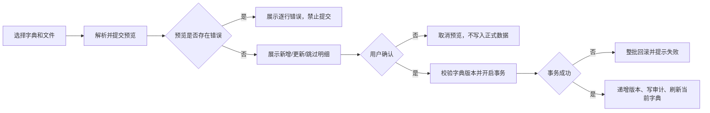

# 字典模板目录化与分页维护改造 PRD

## 1. 文档信息

| 项目 | 内容 |
|---|---|
| 需求名称 | 字典模板目录化与分页维护改造 |
| 文档版本 | v1.4 |
| 当前状态 | 已确认，可进入研发设计与开发 |
| 产品负责人 | 待补充 |
| 创建日期 | 2026-07-31 |
| 关联文档 | `docs/features/dictionary-configuration-implementation-plan.md`（其中与本 PRD 冲突的全量加载方案由本 PRD 替代） |

## 2. 需求背景

### 2.1 业务背景

系统设置中的基础字典由系统固定字典、总部模板和门店字典项组成，被客户、订单、产品、采购、施工、质保、财务和报表等多个业务模块使用。总部需要维护模板，门店店长需要维护本店允许自定义的字典项，并能够查看字典版本、启停状态和审计记录。

### 2.2 当前问题

当前页面首屏通过一次接口加载全部字典及全部字典项，存在以下问题：

1. 字典数量和字典项数量增长后，接口响应和页面首屏渲染变慢。
2. 后端读取字典时会执行默认字典补齐，读取接口承担了初始化职责，增加了查询和写入开销。
3. 新增、编辑、启停、删除或导入后，页面重新加载全部字典，局部操作导致全量刷新。
4. 所有字典以长卡片列表展示，维护人员难以定位目标字典和目标项。
5. 当前导入直接提交，缺少预览、冲突检查和提交前确认。

### 2.3 需求依据

- 当前实际实现：`apps/web/app/settings/dictionaries/page.tsx` 一次性调用字典列表接口并渲染全部字典项。
- 当前实际实现：`apps/api/src/settings/dictionaries.service.ts` 的读取逻辑包含默认字典补齐和全量子项查询。
- 已确认方案：门店创建时初始化、目录与详情分页、左目录右工作区、导入预览确认、即时生效与审计留痕。

## 3. 产品目标

1. 将字典读取拆分为轻量目录查询和按需字典项查询，避免首屏全量加载。
2. 将默认字典初始化从普通读取链路中移除，降低接口耗时并使初始化职责清晰。
3. 通过左侧目录和右侧工作区提升字典定位、搜索、分页和维护效率。
4. 保证字典变更即时生效、版本可追踪、操作可审计。
5. 保留旧全量接口作为过渡，降低现有业务调用方迁移风险。

## 4. 本期范围与非目标

### 4.1 本期范围

- 字典目录接口和字典项分页详情接口。
- 字典目录及字典项的名称、编码搜索；字典项启用状态筛选。
- 左侧字典目录、右侧字典项工作区。
- 新增、编辑、启用、停用、删除和导入预览确认。
- 字典层级校验和支持层级字典的树形维护。
- 门店创建时默认字典初始化。
- 历史门店一次性幂等补齐及总部管理员手动补偿入口。
- 版本递增、并发冲突、审计记录和性能验收。

### 4.2 非目标

- 本期不重做订单、报价、施工、财务等业务模块的字典选择器视觉设计。
- 本期不改变已确认的角色权限模型。
- 本期不建立独立的草稿/发布流程，字典变更确认提交后立即生效。
- 本期不物理删除已被业务数据引用的字典项。
- 本期不强制一次性迁移所有旧接口调用方；旧接口按过渡策略保留。

## 5. 用户角色与权限

沿用现有权限模型和数据范围：

| 角色 | 使用场景 | 可查看内容 | 可执行操作 | 数据范围 |
|---|---|---|---|---|
| 总部管理员 | 维护总部字典模板、补齐历史门店默认字典 | 全部模板、门店初始化状态、审计结果 | 维护总部模板；执行检查与补齐；查看结果 | 总部及授权门店 |
| 店长 | 维护本店允许维护的字典 | 本店字典目录和字典项 | 新增、编辑、启停、删除未引用的本店自定义项；导入 | 当前门店 |
| 普通人员 | 使用业务字典 | 有权限业务范围内的启用字典项 | 不得维护字典 | 按现有业务权限 |

系统固定编码、总部模板固定编码不可修改。无权限访问页面或接口时返回现有权限错误，不得通过前端隐藏绕过后端校验。

## 6. 核心业务对象

| 对象 | 定义 | 关键字段 | 状态/版本 | 归属 |
|---|---|---|---|---|
| 字典目录 | 可被业务模块引用的一组字典定义 | `id`、`code`、`name`、`source`、`allowCustomItems`、`allowDisableItems`、`allowHierarchy`、`version`、更新时间 | 整体状态沿用现有模型；每次变更版本自动递增 | 系统、总部模板或门店 |
| 字典项 | 字典中的可选值 | `id`、`dictionaryId`、`parentId`、`code`、`name`、`source`、`status`、`sortOrder`、`usageCount`、`disabledReason` | `ACTIVE`、`INACTIVE`；由所属字典版本追踪变更 | 所属字典 |
| 导入预览 | 一次导入文件的服务端校验结果 | 预览标识、字典版本、行数、创建/更新/停用/错误明细 | 待确认、已提交、已失效 | 当前操作人和字典 |
| 审计事件 | 字典配置和初始化补偿的不可变操作记录 | 操作人、门店、动作、目标、前后值/摘要、时间、结果 | 成功或失败 | 总部或门店 |

## 7. 业务规则

### 7.1 默认字典初始化

1. 当系统创建门店时，系统在门店创建流程内幂等初始化该门店所需的默认字典和默认字典项。
2. 当用户读取字典目录或字典项时，系统只执行读取，不执行默认字典初始化、同步初始化或全量默认项补齐。
3. 门店创建流程重复执行时，已存在的字典和字典项不得重复创建，不覆盖门店已有维护结果。
4. 历史门店由总部管理员主动执行“检查并补齐默认字典”；执行前展示缺失数量，执行后返回新增、跳过和失败明细，并记录审计事件。
5. 门店创建记录先成功，默认字典初始化失败不回滚门店创建；系统记录失败明细，由总部管理员通过补齐入口重试。初始化成功后不重复创建、不覆盖已有门店配置。

### 7.2 目录与详情查询

1. 首屏只查询目录元数据，不返回全部字典项。
2. 用户选中字典后，系统按当前字典、页码、页大小、关键词和状态加载字典项。
3. 默认页大小为 20，可切换为 50 或 100。
4. 目录搜索按字典名称或编码匹配；字典项搜索按名称或编码匹配；搜索在服务端执行。
5. 字典项支持 `ACTIVE`/`INACTIVE` 状态筛选。
6. 切换字典或查询条件只刷新右侧工作区，不重新加载全部字典项。

### 7.3 层级字典

1. 字典默认按平级列表维护。
2. 只有 `allowHierarchy=true` 的字典允许设置父级和启用树形维护。
3. 层级字典的父级必须存在，父级不能是自身，不得形成循环引用。
4. 删除父级前必须先处理全部子级。
5. 平级字典不展示父级字段，也不提供树形操作。
6. 父级停用后，子级在新业务选择器中不可选，但子级配置和历史引用保留。

### 7.4 版本与即时生效

1. 新增、编辑、启用、停用、删除、导入提交和默认字典补齐造成字典数据变化时，所属字典版本自动递增。
2. 变更事务提交成功后立即生效，业务读取接口只能返回符合当前业务规则的启用项。
3. 版本更新和业务数据写入必须在同一事务内完成；审计事件必须记录本次变更。
4. 客户端提交旧版本时，系统拒绝覆盖并返回版本冲突，提示用户重新加载。

### 7.5 删除与停用

1. 未被业务数据引用的门店自定义字典项允许删除，删除必须填写原因。
2. 已被引用的字典项不可物理删除，只能停用，停用必须填写原因。
3. 系统固定项和总部模板项不可删除；是否允许停用由字典策略控制。
4. 删除父级前若存在子级，系统拒绝删除并提示先处理子级。
5. 停用不改写历史订单、采购、库存、施工、财务和报表数据中的历史快照。

### 7.6 导入

1. 导入必须先上传并解析文件，系统生成预览结果，不立即写入正式数据。
2. 文件内编码必须唯一；重复编码直接标记错误。
3. 与现有编码冲突时按更新已有项处理；新编码按新增项处理。
4. 系统固定编码的含义不可通过导入修改；不符合字典策略、层级关系或引用规则的行标记错误。
5. 用户确认预览结果后，系统以整批事务提交；任一错误或事务失败时整批不写入。
6. 提交成功后返回新增、更新、停用和跳过明细，自动递增版本并记录审计。
7. 预览基于的字典版本与当前版本不一致时，提交被拒绝，用户必须重新预览。

## 8. 业务流程

### 8.1 日常维护流程

1. 用户进入基础字典设置页。
2. 系统加载目录元数据并展示目录搜索结果。
3. 系统默认选中第一个用户可维护或可查看的字典。
4. 用户选中字典后，系统加载该字典第一页字典项。
5. 用户搜索、筛选、分页或执行新增、编辑、启停、删除。
6. 服务端校验权限、版本、唯一性、层级和引用关系。
7. 校验通过后事务写入字典项、递增版本并写入审计。
8. 前端只刷新当前字典目录摘要和当前页，显示服务端最终结果。

### 8.2 导入流程



### 8.3 历史门店补齐流程

1. 总部管理员进入默认字典补偿入口并选择门店或范围。
2. 系统只检查缺失的默认字典和默认字典项，展示预计新增、跳过和异常数量。
3. 管理员确认执行后，系统幂等补齐，不覆盖门店已有自定义项和维护状态。
4. 系统返回结果明细并记录审计；失败项可在下一次操作中重试。

## 9. 功能需求

### 9.1 字典目录

#### 页面与交互

- 页面采用“左侧字典目录 + 右侧字典项工作区”布局。
- 左侧展示字典名称、编码、来源、版本、启用/停用项数量、更新时间和可维护状态。
- 左侧支持按名称、编码搜索；搜索只过滤目录，不加载字典项。
- 默认选中第一个可访问字典；用户切换字典时保留关键词、状态和页大小，将页码重置为 1。
- 目录加载失败时显示局部错误和重试按钮，不阻塞右侧已加载内容。

#### 目录接口

为避免影响现有调用方，本期不复用旧全量接口路径。现有全量接口保留为兼容接口；新页面使用独立的轻量目录接口：

```text
GET /settings/dictionaries/catalog?storeId={storeId}&keyword={keyword}&page={page}&pageSize={pageSize}
```

返回内容至少包含：

```json
{
  "items": [
    {
      "id": "dictionary-id",
      "code": "PRODUCT_CATEGORY",
      "name": "产品分类",
      "source": "STORE",
      "status": "ACTIVE",
      "version": 3,
      "allowCustomItems": true,
      "allowDisableItems": true,
      "allowHierarchy": true,
      "activeItemCount": 5,
      "inactiveItemCount": 1,
      "updatedAt": "2026-07-31T00:00:00.000Z",
      "updatedBy": { "id": "user-id", "name": "店长" }
    }
  ],
  "page": 1,
  "pageSize": 20,
  "total": 1
}
```

目录接口不得包含全部 `dictionaryItems` 或全部 `templateItems`。现有 `GET /settings/dictionaries` 继续返回旧全量结构，直到所有调用方完成迁移。

### 9.2 字典项工作区

#### 页面与交互

- 右侧展示当前字典名称、编码、来源、版本、维护策略和操作按钮。
- 字典项支持名称、编码搜索，启用状态筛选，服务端分页。
- 默认每页 20 条，可切换 50/100 条。
- 平级字典以表格或列表展示；层级字典以树形列表展示，但仍按服务端查询结果分页。
- 每行展示名称、编码、来源、层级关系、引用次数、状态、更新时间和可执行操作。
- 编辑、启停、删除和导入成功后，只刷新当前字典目录摘要和当前页。
- 无数据时展示“暂无符合条件的字典项”；加载时展示工作区骨架或局部加载；失败时展示重试按钮。

#### 字典项接口

门店字典使用以下分页详情接口：

```text
GET /settings/dictionaries/{dictionaryId}/items?keyword={keyword}&status={status}&page={page}&pageSize={pageSize}&parentId={parentId}
```

返回内容至少包含：

```json
{
  "items": [
    {
      "id": "item-id",
      "dictionaryId": "dictionary-id",
      "parentId": null,
      "code": "PPF",
      "name": "漆面保护膜",
      "source": "SYSTEM",
      "status": "ACTIVE",
      "sortOrder": 0,
      "usageCount": 12,
      "disabledReason": null
    }
  ],
  "page": 1,
  "pageSize": 20,
  "total": 1,
  "dictionaryVersion": 3
}
```

### 9.3 总部字典模板

总部模板维护与门店字典使用相同的目录、详情、分页和局部刷新原则，但使用独立资源路径：

```text
GET   /settings/dictionary-templates/catalog?keyword={keyword}&page={page}&pageSize={pageSize}
GET   /settings/dictionary-templates/{templateId}/items?keyword={keyword}&status={status}&page={page}&pageSize={pageSize}&parentId={parentId}
POST  /settings/dictionary-templates/{templateId}/items/import/preview
POST  /settings/dictionary-templates/{templateId}/items/import/commit
```

模板目录至少返回模板 `id`、编码、名称、状态、版本、项数量、层级策略、更新时间和最后操作人；模板项详情返回项 `id`、编码、名称、父级、状态、排序和引用/使用摘要。总部管理员才能执行模板写操作；门店页面只读取已下发或已继承的模板数据，并遵循总部禁用项不可由门店重新启用的现有规则。

模板变更成功后，模板版本自动递增并记录总部审计事件；模板变更如何同步到门店的既有业务规则保持不变，本期只将模板的读取和维护接口改为目录/详情模式。

### 9.4 新增、编辑、启停、删除

- 新增时校验编码、名称、父级、字典策略和权限。
- 编辑系统项或总部固定项时，只允许执行现有策略允许的操作；系统固定编码不可修改。
- 停用必须填写原因；启用时重新检查总部模板状态、父级状态和字典策略。
- 删除前必须检查引用次数和子级；已引用或有子级时拒绝删除并给出明确原因。
- 所有写操作携带当前字典版本；版本不匹配返回 `409`，不得覆盖他人修改。

### 9.5 导入预览与提交

建议新增以下接口，具体命名可按现有接口规范调整：

```text
POST /settings/dictionaries/{dictionaryId}/items/import/preview
POST /settings/dictionaries/{dictionaryId}/items/import/commit
```

预览接口返回：预览标识、基准字典版本、总行数、有效行数、错误行数、新增数、更新数、跳过数、逐行错误和变更前后摘要。提交接口仅接受未过期且版本一致的预览标识。

### 9.6 默认字典补齐

建议提供总部管理员专用接口：

```text
GET  /settings/dictionaries/defaults/backfill/preview?storeId={storeId}
POST /settings/dictionaries/defaults/backfill
```

预览和执行结果都必须包含新增、跳过、失败明细；执行应幂等，不能覆盖门店自定义项和已维护状态。

## 10. 数据与字段

### 10.1 目录字段

| 字段 | 含义 | 类型 | 必填 | 数据来源 | 规则 |
|---|---|---|---:|---|---|
| `id` | 字典主键 | string | 是 | 数据库 | 前端仅展示/传递 |
| `code` | 字典编码 | string | 是 | 数据库 | 系统编码稳定，不因改名改变 |
| `name` | 字典名称 | string | 是 | 数据库 | 目录搜索字段 |
| `source` | 来源 | enum | 是 | 数据库 | 系统、总部模板、门店 |
| `version` | 当前版本 | integer | 是 | 数据库 | 每次成功变更自动递增 |
| `allowCustomItems` | 是否允许门店新增 | boolean | 是 | 策略配置 | 决定新增入口和后端权限 |
| `allowDisableItems` | 是否允许逐项启停 | boolean | 是 | 策略配置 | 决定启停入口和后端校验 |
| `allowHierarchy` | 是否允许层级 | boolean | 是 | 策略配置 | 决定父级字段和树形操作 |
| `activeItemCount` | 启用项数量 | integer | 是 | 服务端统计 | 目录摘要，不返回项明细 |
| `inactiveItemCount` | 停用项数量 | integer | 是 | 服务端统计 | 目录摘要，不返回项明细 |

### 10.2 字典项字段

| 字段 | 含义 | 类型 | 必填 | 数据来源 | 校验与展示规则 |
|---|---|---|---:|---|---|
| `id` | 字典项主键 | string | 是 | 数据库 | 删除后不复用 |
| `dictionaryId` | 所属字典 | string | 是 | 当前上下文 | 不允许跨字典修改 |
| `parentId` | 父级项 | string/null | 层级字典必填 | 用户输入 | 必须存在、不得自引用、不得成环 |
| `code` | 业务编码 | string | 是 | 用户输入或系统生成 | 同一字典/父级下唯一，创建后不可改 |
| `name` | 显示名称 | string | 是 | 用户输入 | 同一字典/父级下不可重复 |
| `source` | 项来源 | enum | 是 | 系统/模板/门店 | 影响编辑和删除权限 |
| `status` | 启用状态 | enum | 是 | 用户操作 | `ACTIVE` 或 `INACTIVE` |
| `sortOrder` | 排序值 | integer | 否 | 用户输入 | 未填写时使用默认排序 |
| `usageCount` | 引用数量 | integer | 是 | 服务端统计 | 大于 0 时禁止物理删除 |
| `disabledReason` | 停用原因 | string/null | 停用时必填 | 用户输入 | 审计和列表展示 |

## 11. 状态与版本流转

### 11.1 字典项状态

| 状态 | 含义 | 可执行操作 | 是否终态 |
|---|---|---|---:|
| `ACTIVE` | 可被新业务选择 | 编辑、停用、删除（仅未引用门店自定义项） | 否 |
| `INACTIVE` | 不可被新业务选择，但保留历史数据 | 在策略允许且无总部禁用限制时启用；编辑；删除需重新检查引用 | 否 |
| 已删除 | 未引用门店自定义项已被物理删除 | 不可操作 | 是 |

### 11.2 版本流转

| 原版本 | 触发条件 | 新版本 | 系统动作 |
|---|---|---|---|
| `vN` | 单项变更、导入提交或补齐新增/变更项成功 | `vN+1` | 同事务写入数据和审计 |
| `vN` | 提交携带的版本不等于服务端当前版本 | 不变 | 返回版本冲突，不写入 |
| `vN` | 预览版本不等于提交时当前版本 | 不变 | 拒绝提交，要求重新预览 |

## 12. 异常与边界情况

| 场景 | 触发条件 | 系统处理 | 用户反馈 |
|---|---|---|---|
| 无数据 | 搜索或筛选无匹配项 | 返回空分页结果 | 展示暂无符合条件的数据 |
| 读取失败 | 目录或详情接口异常 | 只影响对应区域 | 局部错误和重试按钮 |
| 权限不足 | 用户无对应角色或能力 | 后端拒绝请求 | 展示无权限状态或隐藏操作入口 |
| 重复编码 | 文件内或数据库中编码重复 | 预览标错或写入拒绝 | 展示冲突行和原因 |
| 父级不存在 | 层级项引用无效父级 | 拒绝写入 | 提示先选择有效父级 |
| 循环层级 | 父级关系形成环 | 拒绝写入 | 提示层级关系无效 |
| 已被引用删除 | `usageCount > 0` | 禁止物理删除，仅允许停用 | 提示引用数量和停用规则 |
| 并发修改 | 客户端版本过期 | 返回 `409`，不覆盖数据 | 提示重新加载 |
| 导入提交失败 | 任一行错误或事务异常 | 整批回滚 | 展示失败原因，不显示成功 |
| 预览已过期 | 预览版本与当前版本不一致 | 拒绝提交 | 提示重新预览 |
| 初始化重复执行 | 默认项已存在 | 跳过，不重复创建 | 返回跳过明细 |
| 默认补齐部分失败 | 个别字典或项写入失败 | 记录失败项，可重试；不得覆盖已存在数据 | 返回新增、跳过、失败明细 |

## 13. 性能与非功能要求

在正常数据量和现有部署配置下，以服务端请求耗时为准：

| 场景 | 验收目标 |
|---|---:|
| 字典目录接口 | P95 ≤ 1 秒 |
| 字典项分页接口 | P95 ≤ 1 秒 |
| 新增、编辑、启停、删除 | P95 ≤ 2 秒 |
| 1,000 条以内导入预览 | P95 ≤ 3 秒 |
| 1,000 条以内导入提交 | P95 ≤ 5 秒 |

实现约束：

- 普通读取不得执行默认字典初始化。
- 目录接口不得 `include` 全部字典项或模板项。
- 字典项查询必须使用服务端分页、搜索和状态过滤。
- 计数、排序和搜索字段应结合实际查询计划建立必要索引；索引方案由研发在技术设计中确认。
- 页面目录和详情工作区独立加载，单侧失败不阻塞另一侧。

## 14. 数据指标与埋点

### 14.1 核心指标

| 指标 | 口径 | 当前基线 | 目标值 | 验证周期 |
|---|---|---|---|---|
| 目录接口 P95 | 目录请求服务端耗时 | 待研发基线采集 | ≤ 1 秒 | 上线后 7 天 |
| 字典项接口 P95 | 分页详情请求服务端耗时 | 待研发基线采集 | ≤ 1 秒 | 上线后 7 天 |
| 全量初始化读取次数 | 普通字典读取触发初始化的次数 | 当前存在 | 0 | 持续监控 |
| 导入整批失败率 | 导入提交事务失败次数/提交次数 | 待补充 | 监控趋势 | 上线后 7 天 |

### 14.2 建议埋点

| 事件名称 | 触发时机 | 属性 | 用途 |
|---|---|---|---|
| `settings.dictionary.catalog.viewed` | 目录加载完成 | 用户、门店、耗时、结果 | 监控目录性能 |
| `settings.dictionary.items.viewed` | 字典项查询完成 | 字典、页码、关键词、耗时、结果 | 监控详情性能和使用情况 |
| `settings.dictionary.item.changed` | 单项变更成功/失败 | 字典、动作、版本、结果、失败原因 | 统计维护结果 |
| `settings.dictionary.import.previewed` | 导入预览完成 | 字典、行数、错误数、耗时 | 监控导入质量 |
| `settings.dictionary.import.committed` | 导入提交完成 | 字典、版本、变更数、结果、耗时 | 监控导入结果 |
| `settings.dictionary.defaults.backfilled` | 默认字典补齐完成 | 门店、新增数、跳过数、失败数、耗时 | 监控历史数据补偿 |

## 15. 接口兼容与迁移

1. 保留现有 `GET /settings/dictionaries` 作为旧全量接口，保证未改造调用方继续工作。
2. 新增 `GET /settings/dictionaries/catalog` 作为门店字典目录接口，新增 `GET /settings/dictionaries/{dictionaryId}/items` 作为分页详情接口。
3. 新增 `GET /settings/dictionary-templates/catalog` 和 `GET /settings/dictionary-templates/{templateId}/items` 作为总部模板目录和分页详情接口。
4. 现有一次性返回全部字典及字典项的接口暂时保留，保证未改造调用方继续工作。
5. 旧接口不得再在普通读取路径中触发默认字典初始化；若旧调用方确实需要全量结果，应明确标注为过渡接口。
6. 研发需梳理所有旧接口调用方，完成迁移后再提出旧接口下线申请。
7. 旧接口下线前必须完成调用方清单、线上访问验证、回归测试和回滚方案。

## 16. 数据迁移与发布

### 16.1 门店创建

- 将默认字典初始化挂接到门店创建成功流程。
- 门店创建记录先成功；默认字典初始化失败不回滚门店创建。
- 初始化逻辑必须幂等；失败时记录失败明细，由总部管理员通过补齐入口重试。
- 初始化成功或失败均应具备可追踪日志；不得由普通读取接口补偿执行。

### 16.2 历史门店

- 提供总部管理员检查和补齐入口。
- 执行前只读检查缺失项，不修改数据。
- 执行时不覆盖已有门店字典、门店自定义项和已维护状态。
- 完成后返回新增、跳过、失败明细并写审计。

### 16.3 灰度与回滚

- 先在测试门店验证目录、分页、导入、权限和补齐流程。
- 再按门店范围灰度开放新的设置页面。
- 保留旧接口和原有业务选择器，确保新页面异常时可回退。
- 回滚不得删除已产生的审计记录和已被业务引用的字典项。

## 17. 验收标准汇总

### 17.1 正常流程

- Given：用户有基础字典查看权限；When：进入设置页面；Then：首屏只请求并展示目录元数据，不请求全部字典项。
- Given：用户选中一个字典；When：进入或切换字典；Then：右侧仅加载该字典指定页，默认每页 20 条。
- Given：用户输入名称或编码关键词；When：执行搜索；Then：服务端返回匹配结果，其他字典项不被前端全量加载。
- Given：用户修改一个可维护字典项；When：服务端校验通过并提交；Then：字典版本递增、变更即时生效、审计事件生成，页面仅刷新当前字典。

### 17.2 导入流程

- Given：导入文件包含唯一编码且数据合法；When：用户提交预览；Then：系统展示新增、更新、跳过和错误明细，不写入正式数据。
- Given：预览无错误且版本未变化；When：用户确认提交；Then：整批事务成功，版本递增，审计记录生成，当前字典列表刷新。
- Given：文件内有重复编码、层级错误或系统固定编码变更；When：用户预览；Then：对应行标记错误，禁止提交。
- Given：提交时任一行校验失败或事务异常；When：系统提交导入；Then：整批回滚，不产生部分成功数据，不显示导入成功。

### 17.3 初始化与补齐

- Given：新门店完成创建；When：初始化流程执行；Then：默认字典只创建一次，重复执行不会重复创建。
- Given：门店记录已创建但默认字典初始化失败；When：初始化流程结束；Then：门店保持可用，系统记录失败明细，总部管理员可通过补齐入口重试。
- Given：已有门店缺少部分默认字典；When：总部管理员执行补齐；Then：执行前展示缺失数量，执行后返回新增、跳过、失败明细并记录审计。
- Given：普通用户读取字典目录或字典项；When：请求接口；Then：系统不执行默认字典初始化或同步初始化。

### 17.4 权限与数据安全

- Given：普通人员调用字典写接口；When：提交新增、编辑、启停、删除或导入；Then：后端拒绝请求。
- Given：店长操作其他门店字典；When：提交写请求；Then：后端拒绝请求。
- Given：字典项已被业务数据引用；When：用户请求删除；Then：系统拒绝物理删除，只允许停用并要求原因。
- Given：客户端提交旧版本；When：服务端处理写请求；Then：返回版本冲突，不覆盖当前数据。

### 17.5 性能

- Given：正常测试数据量；When：连续执行目录和分页详情请求；Then：对应接口 P95 达到不超过 1 秒。
- Given：1,000 条以内合法导入数据；When：执行预览和提交；Then：预览 P95 不超过 3 秒，提交 P95 不超过 5 秒。

## 18. 研发设计事项

以下事项不改变已确认的产品规则，由研发在技术设计阶段确认实现细节：

| 编号 | 事项 | 影响范围 | 责任方 |
|---|---|---|---|
| 1 | 目录计数采用实时 `COUNT`、汇总表还是缓存，以及对应索引方案 | 数据库与性能 | 研发 |
| 2 | 导入预览结果的存储方式、过期时间和单次文件大小上限 | 导入接口与存储 | 研发 |
| 3 | 层级字典分页与树形展示的具体组合方式 | 已采用按 `parentId` 独立加载子级的产品规则，研发确认接口字段和查询计划 | 研发/设计 |
| 4 | 门店创建流程中初始化失败的事务边界和重试机制 | 已确认：门店创建不回滚，初始化失败由总部管理员补齐重试 | 研发 |
| 5 | 旧全量接口的调用方清单、迁移完成条件和最终下线版本 | 兼容与发布 | 研发 |


## 19. 变更记录

| 版本 | 日期 | 变更内容 | 变更原因 | 修改人 |
|---|---|---|---|---|
| v1.0 | 2026-07-31 | 根据已确认方案创建字典模板目录化与分页维护 PRD | 解决全量加载慢和维护效率低问题 | Codex |
| v1.1 | 2026-07-31 | 明确旧全量接口与新目录/详情接口路径，补充总部模板接口 | 第一轮需求评审修订 | Codex |
| v1.2 | 2026-07-31 | 明确切换字典的查询条件和层级分页规则 | 第二轮需求评审修订 | Codex |
| v1.3 | 2026-07-31 | 补充门店创建与默认字典初始化失败边界，标记待确认 | 第二轮评审发现业务决策项 | Codex |
| v1.4 | 2026-07-31 | 确认门店创建不回滚、初始化失败可由总部管理员补齐重试 | 业务确认后完成 PRD 修订 | Codex |
