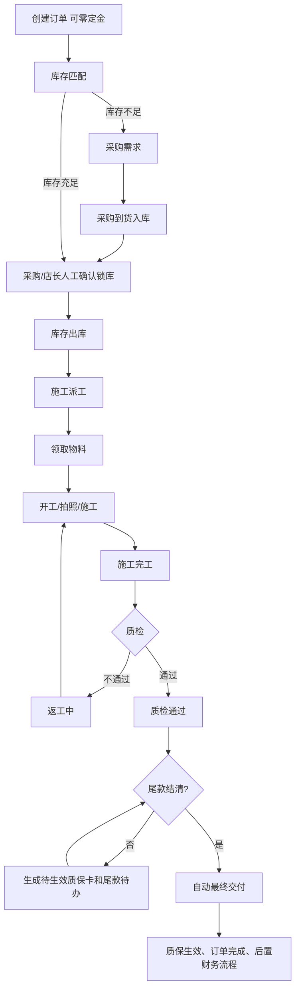

# 订单前后流程逻辑优化 PRD

## 1. 文档信息

| 项目 | 内容 |
|---|---|
| 需求名称 | 订单前后流程逻辑优化 |
| 文档版本 | V1.3 |
| 当前状态 | 评审通过，可进入研发 |
| 日期 | 2026-07-31 |
| 适用范围 | Web 管理端、API、库存、施工、质检、质保、收款及财务关联流程 |
| 评审报告 | `order-end-to-end-flow-optimization-review-final.md` |

## 2. 背景与目标

系统已具备客户、订单、库存采购、施工、质检、质保、售后、收款、发票、返利和提成模块，但各模块之间仍依赖人工切换，导致订单完成、质检、质保、尾款和库存确认口径不统一。

本需求目标：

- 建立以订单为中心的完整履约流程；
- 区分施工完成、质检通过、质保生效、尾款结清和最终交付；
- 明确采购到货后的人工锁库、返工和尾款待办；
- 保证订单收款、财务流水、库存和最终交付数据一致；
- 让页面使用后端返回的履约阶段和能力字段。

## 3. 已确认业务规则

1. 订单创建时允许零定金，零定金不阻断库存、施工和质保流程。
2. 采购到货后由采购或店长人工确认批次和数量后才能锁库，系统不得自动锁库。
3. 库存出库完成后才能派工；施工人员领取物料后才能开工。
4. 施工完工后进入待质检，不得直接进入订单完成。
5. 质检不通过进入“返工中”，返工完成后必须重新质检。
6. 返工复用施工记录和审计事件，不新增独立返工模型。
7. 质检通过后允许生成质保卡。
8. 尾款未结清时质保卡状态为 `PENDING_ACTIVATION`（待生效），有效期不开始计算。
9. 质检通过且尾款结清后，系统自动标记订单为“已完成/最终交付”，不需要店长二次确认。
10. 若最终交付时尚未生成质保卡，系统自动生成质保卡并同时置为“生效中”。
11. 质保卡新增 `PENDING_ACTIVATION` 状态；尾款结清触发最终交付时，系统在同一事务内将质保卡改为 `ACTIVE`，并将 `startDate` 写为最终交付日。
12. 进入“待收尾款”后生成站内待办，并在销售和财务工作台展示；本期不做微信或短信通知。
13. 历史已完成但缺少质检记录的订单不自动改写、不补造记录，标记为“历史完成，质检记录缺失”，进入历史数据待核验列表。
14. 返工本期只记录次数、原因、责任类型、前后质检结果、操作者和时间；施工工时、材料损耗、责任成本后置。
15. 订单履约阶段由现有订单状态、施工状态、质检、质保和收款数据派生，不新增大量订单状态枚举。

## 4. 非目标

- 第三方支付和自动退款；
- 微信/短信尾款通知；
- 独立返工数据模型；
- 自动锁库；
- 返工工时、材料损耗、责任成本和复杂提成结算；
- 历史订单自动补造质检记录或自动修复状态；
- 跨店施工规则重新设计。

## 5. 角色与权限

| 角色 | 主要操作 | 数据范围 |
|---|---|---|
| 销售 | 创建订单、查看履约、跟进尾款 | 本人订单 |
| 采购 | 采购、入库、人工确认锁库 | 本门店 |
| 店长 | 锁库、派工、质检、返工和异常处理 | 本门店 |
| 施工主管 | 派工、质检、返工安排和复检 | 本门店 |
| 师傅/学徒 | 领取物料、开工、拍照、完工 | 本人被分配任务 |
| 财务 | 收款、发票、返利和财务处理 | 本门店 |
| 管理员 | 跨门店管理 | 全平台 |

服务端必须执行角色、门店、对象归属和状态校验，前端隐藏按钮不能替代接口权限。

## 6. 核心对象

| 对象 | 本期要求 |
|---|---|
| Order | 保留现有订单状态，增加后端派生履约阶段 |
| OrderPayment | 初始定金和后续尾款统一写入 |
| PaymentRecord | 每笔订单收款必须有对应收入流水 |
| OrderInventoryAllocation | 只由人工确认锁库动作创建 |
| PurchaseRequirement | 缺货采购、到货数量和待确认锁库 |
| ConstructionRecord | 施工、照片、完工、质检及返工历史 |
| AuditEvent | 返工、质检、交付和关键动作审计 |
| Warranty | `PENDING_ACTIVATION` / `ACTIVE` / `EXPIRED` / `VOIDED`，生效日为最终交付日 |
| 站内待办 | 尾款待收生成并去重 |

## 7. 目标流程



## 8. 履约阶段

履约阶段由后端根据现有订单状态、施工记录、库存分配、质检、质保和收款数据派生，不新增大量 `OrderStatus` 枚举。

| 阶段 | 判定规则 | 下一步 |
|---|---|---|
| 待库存确认 | 存在缺口或未完成锁库 | 匹配/采购/人工确认 |
| 待出库 | 已确认锁库但未出库 | 出库 |
| 待派工 | 已出库但未派工 | 派工 |
| 待领取物料 | 已派工但未领取 | 领取物料 |
| 施工中 | 已开工未完工 | 施工/拍照 |
| 待质检 | 已完工未质检 | 质检 |
| 返工中 | 最近一次质检不通过 | 返工后复检 |
| 待生成质保 | 质检通过且无质保卡 | 生成质保 |
| 待收尾款 | 质检通过且存在待收金额 | 收款 |
| 待交付 | 质检通过且尾款已清，系统正在完成交付 | 自动完成 |
| 已完成 | 质检通过、尾款结清且已最终交付 | 查看/售后 |
| 历史待核验 | 历史已完成但缺少质检记录 | 数据核验 |

核心流转：

```text
施工完工 → 待质检
质检不通过 → 返工中 → 返工完成 → 待质检
质检通过 → 可生成质保卡
质检通过 + 尾款未清 → 质保待生效、待收尾款
质检通过 + 尾款结清 → 自动最终交付、质保生效、订单完成
```

## 9. 功能需求

### 9.1 订单创建与收款

- 定金为空或为零时允许创建订单。
- 定金大于零时校验收款账户属于当前门店且启用。
- 初始定金和后续尾款使用同一收款逻辑。
- 收款事务同时写入 `OrderPayment`、`PaymentRecord` 和订单收款汇总。
- 累计收款不得超过订单总额。
- 重复收款不得生成重复收款或流水。
- 零定金订单显示风险标签但不阻断后续流程。

### 9.2 库存匹配与人工锁库

- 缺货时创建或更新订单采购需求。
- 到货入库后重新计算缺口。
- 满足条件的订单进入“待人工确认锁库”，不自动产生分配。
- 采购或店长确认批次和数量后创建库存分配及锁库流水。
- 确认时校验门店、产品、批次、可用数量、单位和换算关系。
- 部分到货只能确认已到货数量，剩余数量保持缺货。
- 并发库存变化导致确认失败时整体回滚并提示刷新。

### 9.3 施工、质检与返工

- 未出库不得派工；未派工或未领取物料不得开工。
- 施工人员只能处理本人被派工的任务。
- 完工后进入待质检。
- 质检不通过必须填写返工原因和责任类型。
- 返工复用施工记录和 `AuditEvent`，记录次数、原因、责任类型、前后质检结果、操作者和时间。
- 返工完成后必须重新质检，不得直接改成通过。
- 本期不记录返工工时、材料损耗和责任成本。

### 9.4 质保与自动最终交付

- 质检通过且无有效质保卡时允许生成质保卡。
- 尾款未清时质保卡为“待生效”，不开始计算有效期。
- 尾款结清且质检通过时，系统自动完成最终交付。
- 如果尚未生成质保卡，最终交付事务自动创建质保卡并同时置为“生效中”。
- 如果已有待生效质保卡，最终交付事务将其变为“生效中”。
- 质保有效期起始日为最终交付日。
- 订单完成、质保生效、交付审计和待办关闭必须在同一事务内完成。
- 重复执行不得产生重复质保卡、交付记录或审计结果。

### 9.5 站内待办与工作台

- 质检通过且 `outstandingCents > 0` 时生成“待收尾款”待办。
- 接收人为该订单销售人员和本店财务。
- 销售和财务工作台展示订单号、客户、待收金额和当前阶段。
- 去重键为 `userId + orderId + todoType + stage`；销售和财务各保留一条未处理待办。
- 已读只改变已读状态，不代表已处理；工作台默认展示未处理事项，已读但未处理仍继续展示。
- 尾款结清或订单取消后待办自动关闭。
- 本期不发送微信或短信。

### 9.6 历史数据待核验

- 历史已完成但缺少质检记录的订单不修改原状态。
- 不补造质检记录或结果。
- 订单详情显示“历史完成，质检记录缺失”。
- 进入历史数据待核验列表，保留原始订单、收款、施工和质保数据。
- 列表至少对店长和管理员开放，具体接口由研发按现有权限实现。

### 9.7 履约工作台 API

订单详情 API 必须返回统一的 `workflow` 对象，包含当前阶段、子状态、阻塞原因和能力字段，例如：

```json
{
  "currentStage": "PENDING_BALANCE",
  "paymentStatus": "PARTIAL",
  "inventoryStatus": "OUTBOUND",
  "qualityStatus": "PASSED",
  "warrantyStatus": "PENDING_ACTIVATION",
  "capabilities": {
    "canCollectBalance": true,
    "canGenerateWarranty": false,
    "canStartRework": false,
    "canCompleteOrder": false
  },
  "blockingReasons": []
}
```

字段命名可由研发调整，但必须提供等价信息；前端不得仅根据枚举或文案推断按钮条件。

## 10. 异常与边界

| 场景 | 处理 |
|---|---|
| 零定金订单 | 允许继续流程，显示风险 |
| 收款超过订单总额 | 拒绝并回滚 |
| 到货不足 | 只更新可匹配量，不得超量锁库 |
| 锁库时库存被占用 | 整体失败，不产生部分分配 |
| 未出库派工/未领料开工 | 拒绝 |
| 未完工质检 | 拒绝 |
| 质检不通过未填写原因 | 拒绝 |
| 返工中生成质保 | 拒绝 |
| 尾款清但质检不通过 | 不完成订单 |
| 尾款清且无质保卡 | 在最终交付同一事务内自动创建并生效质保卡后完成订单 |
| 重复收款、锁库、质保或交付 | 返回首次结果，不重复写入 |
| 历史订单无质检记录 | 不补写，进入待核验 |

## 11. 数据一致性与技术要求

- 订单收款、财务流水和订单金额汇总同事务。
- 库存确认、批次数量、库存分配和库存流水同事务。
- 自动最终交付必须按“校验质检 → 校验收款 → 创建或更新质保 → 质保生效 → 订单完成 → 审计 → 待办关闭”顺序在同一事务执行。
- 任一步骤失败时整体回滚，不得出现订单已完成但质保未生成等半成品。
- 收款、锁库、出库、开工、完工、质检、返工、质保、最终交付和待办生成必须幂等。
- 所有关键接口必须服务端校验权限和状态。
- 保留现有内存流程测试，补充真实数据库/API 集成测试。

## 12. 指标与埋点

| 指标 | 口径 |
|---|---|
| 订单最终完成率 | 自动最终交付订单数 / 创建订单数 |
| 质检返工率 | 发生返工订单数 / 完工订单数 |
| 返工复检通过率 | 返工后复检通过订单数 / 返工订单数 |
| 质保生效率 | 生效质保卡数 / 质检通过订单数 |
| 尾款待收金额 | 质检通过但未收清订单的待收金额 |
| 到货待确认时长 | 入库时间到人工锁库时间 |
| 收款流水一致率 | 有对应财务流水的收款笔数 / 收款总笔数 |

埋点：零定金创建、库存缺货、采购到货、人工锁库、施工完工、质检通过、质检返工、质保生成、尾款结清、自动最终交付、待办生成和重复操作拦截。

## 13. 验收标准

### 正常流程

- Given：订单零定金创建，库存满足需求
- When：采购/店长人工锁库，完成出库、派工、领料、施工和质检
- Then：订单可生成待生效质保卡，尾款未清时不能完成。

- Given：订单已质检通过、尾款已结清且尚未生成质保卡
- When：系统处理最后一笔尾款
- Then：系统自动创建并生效质保卡，订单自动完成，质保有效期从最终交付日开始。

### 返工流程

- Given：施工完工进入待质检
- When：提交质检不通过并填写原因
- Then：进入返工中，不能生成质保或完成订单，并保留施工记录和审计。

- Given：订单处于返工中
- When：返工完成并复检通过
- Then：保留原质检结果，新增复检结果，允许生成待生效质保卡。

### 采购、收款和待办

- Given：订单缺口 18 米，采购分批到货共 18 米
- When：到货入库完成
- Then：进入待人工确认锁库，不自动创建库存分配。

- Given：质检通过且存在待收尾款
- When：进入待收尾款阶段
- Then：销售和财务各自可见同一条站内待办，重复触发不产生重复未处理待办。

- Given：订单创建时录入定金
- When：订单创建成功
- Then：订单收款、已收金额和财务收入流水金额一致。

### 历史数据、权限和幂等

- Given：历史订单已完成但无质检记录
- When：打开订单或历史待核验列表
- Then：显示历史完成、质检记录缺失，不修改或补造历史数据。

- Given：施工人员未被派工
- When：调用施工或返工接口
- Then：服务端拒绝且不修改数据。

- Given：同一关键动作重复提交
- When：服务端收到相同幂等请求
- Then：返回首次结果，不产生重复流水、质保、交付或审计。

## 14. 已确认研发约定

以下实现约定已完成研发评审确认，研发按此拆分任务：

1. API 使用统一 `workflow` 对象，前端只依据 `capabilities` 判断操作入口。
2. 履约阶段按已确认优先级派生，质检通过且尾款未清进入待收尾款；质检通过且尾款已清自动最终交付；最终交付后为已完成。
3. 返工复用 `ConstructionRecord` 当前快照与 `AuditEvent` 历史事件，不新增 `ReworkRecord`。
4. 历史待核验列表由店长/管理员工作台进入，销售仅在本人订单详情看到提示且不可处理。
5. 尾款待办按 `userId + orderId + todoType + stage` 去重，销售和财务各一条；已读不等于处理，结清或取消自动关闭。
6. 质保卡使用 `PENDING_ACTIVATION`、`ACTIVE`、`EXPIRED`、`VOIDED` 四种状态；最终交付事务将待生效质保卡改为生效并写入 `startDate`。

## 15. 变更记录

| 版本 | 日期 | 变更内容 |
|---|---|---|
| V1.2 | 2026-07-31 | 合并全部业务确认、评审修订及最终自动生成并生效质保规则 |
| V1.3 | 2026-07-31 | 完成研发评审确认：统一 workflow API、阶段派生、返工历史、历史核验、尾款待办及质保卡状态 |


