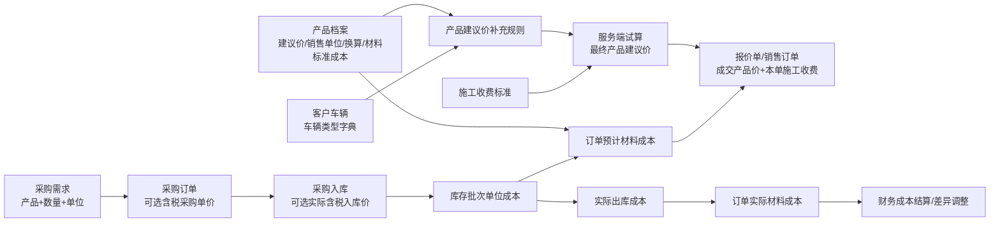

# 产品建议价、采购成本与车辆类型统一设计方案

## 1. 文档信息

- 版本：v1.0
- 日期：2026-07-17
- 状态：方案已确认；产品、车辆、建议价、施工收费、采购入库成本及“补价后的订单成本差异”闭环已实现，待完成全量验收和数据迁移演练
- 适用范围：产品管理、客户车辆、产品建议价补充规则、销售报价/订单、施工收费、采购订单、采购入库、库存成本、财务成本差异
- 关联方案：
  - [销售订单智能建议价与价格审批实施计划](./sales-order-pricing-engine-implementation-plan.md)
  - [销售订单施工收费与成本核算调整实施计划](./sales-order-construction-charge-cost-implementation-plan.md)

## 2. 方案目标

本方案统一解决以下问题：

1. 将产品档案中的“基础价”正式更名为“产品建议价（默认销售单位）”，不新增含义重叠的价格字段。
2. 产品可按销售单位匹配建议价；切换单位后，系统使用该单位的明确建议价或按产品换算关系生成可追溯的换算价。
3. 原“建议价设置”改为“产品建议价补充规则”，只在产品建议价基础上计算最终建议价，不再维护施工收费、车辆级别或车型映射。
4. 车辆类型统一从系统字典读取，在客户车辆档案维护；订单自动带出，历史车辆缺失时在下单环节补选。
5. 材料成本标准回归产品管理，不设置独立菜单，并与对客建议价严格分离。
6. 采购需求、采购订单、实际入库价、库存批次成本、订单实际材料成本形成完整成本链路。
7. 采购订单价和实际入库价均允许为空；采购员可修改实际入库价，并保留采购单价与实际入库价的差异记录。
8. “系统建议施工收费”和“本单施工收费”改为清晰的收费方式选择，避免重复按钮和字段语义混淆。

## 3. 统一业务口径

| 名称 | 面向对象 | 维护位置 | 作用 | 是否影响客户应收 |
| --- | --- | --- | --- | --- |
| 产品建议价 | 客户报价 | 产品管理 | 某产品在某销售单位下的建议销售单价，是补充规则的计算起点 | 是 |
| 产品建议价补充规则 | 客户报价 | 产品建议价补充规则 | 根据订单条件对产品建议价加价、优惠或按比例调整 | 是 |
| 产品成交单价 | 客户报价 | 报价单/销售订单 | 本单实际采用的产品单价 | 是 |
| 系统建议施工收费 | 客户报价 | 施工收费标准 | 系统按施工主项目、追加量和适用范围算出的建议收费 | 是 |
| 本单施工收费 | 客户报价 | 报价单/销售订单 | 本单实际向客户收取的施工服务费 | 是 |
| 材料成本标准 | 内部经营 | 产品管理 | 没有可靠批次成本时的内部成本参考与预计成本兜底 | 否 |
| 采购单价 | 采购计划 | 采购订单 | 与供应商约定的计划含税采购单价 | 否 |
| 实际入库价 | 库存成本 | 采购入库 | 本次实际到货的含税单价，用于形成批次成本 | 否 |
| 实际材料成本 | 内部经营 | 库存出库/成本结算 | 按实际出库批次、数量和批次成本计算 | 否 |

必须遵守以下边界：

- 产品建议价、施工收费和材料成本是三条独立数据线，不能互相替代或反推。
- 提高产品建议价或施工收费不会自动提高材料成本或施工成本。
- 采购价格变化不会直接改写产品建议价；门店可根据经营策略另行调整产品建议价。
- 缺失成本不能按 `¥0.00` 处理，应明确显示“待维护”或“待补齐”。

## 4. 整体业务链路



## 5. 产品管理设计

### 5.1 页面信息架构

产品新增、编辑和详情页按职责分为四个区域：

1. **基本信息**：品牌、名称、型号、类别、规格、状态。
2. **单位与换算**：库存单位、默认销售单位、可销售单位、卷米换算、数量精度。
3. **销售建议价**：默认销售单位建议价、其他销售单位建议价、换算来源和生效状态。
4. **内部材料成本**：材料成本标准、成本单位、更新时间、操作人和历史版本。

“材料成本标准”不再作为左侧独立菜单。财务从产品管理进入，但只看到其有权查看和维护的内部成本区域；产品业务信息仍按权限只读。

### 5.2 现有基础价迁移

- 现有 `basePriceCents` 的业务名称改为 `suggestedPriceCents`，含义为“默认销售单位的产品建议价”。
- 不创建第二个同义金额字段。
- 为降低发布风险，第一阶段可在应用模型中使用 `suggestedPriceCents` 并映射旧数据库列；完成 API、导出和历史兼容后，再执行数据库物理列重命名。
- 历史产品的原基础价原值迁移为默认销售单位建议价，金额不变。
- 历史订单、报价单继续读取创建时冻结的价格快照，不因产品档案改名或调价而变化。

### 5.3 按销售单位匹配建议价

产品默认销售单位的建议价维护在产品主档。非默认销售单位通过“单位建议价”明细维护，不与默认价重复：

- 选择默认销售单位：直接使用产品主档建议价。
- 选择其他销售单位且存在已启用单位建议价：使用该单位的明确建议价。
- 未维护明确单位建议价，但存在有效换算关系：系统从默认单位自动换算，并标记为“自动换算价”。
- 没有明确单位建议价且无法换算：允许保存产品草稿，但正式报价/订单必须先补齐价格或换算关系。

例如默认销售单位为“卷”、建议价为 `¥10,000/卷`，且 `1 卷 = 20 米`：

- 未单独维护米价时，系统建议价为 `¥500/米`，来源显示“由卷价自动换算”。
- 若门店明确维护 `¥550/米`，订单选择“米”时直接使用 `¥550/米`。

所有价格计算使用整数分；单位换算按产品数量精度统一舍入，并在价格快照中记录换算前金额、换算系数、舍入规则和结果。

### 5.4 材料成本标准

- 材料成本标准按产品的**库存基础单位**维护，不跟随销售单位重复录入。
- 页面可只读展示折算后的每卷、每米等参考成本，但内部计算统一回到库存基础单位。
- 材料成本标准不是采购价，也不是建议价；它只在缺少可靠批次成本时作为预计材料成本的兜底来源。
- 金额允许暂不维护；缺失时产品可以保存，但订单成本完整性显示“待补齐”。

## 6. 产品建议价补充规则

### 6.1 功能定位

原“建议价设置”改名为“产品建议价补充规则”。每条规则只允许调整“产品建议价”，不得维护以下内容：

- 产品档案的基础建议价；
- 施工主项目收费、追加收费或标准工时；
- 岗位小时成本、提成或补贴；
- 车辆类型字典和车型映射；
- 材料成本、采购价或实际入库价。

### 6.2 固定计算顺序

```text
单位产品建议价
→ 同组规则按优先级择一
→ 跨组规则依固定顺序叠加
→ 最低保护价与毛利校验
→ 最终系统产品建议价
```

规则继续沿用已确认的稳定业务因素，并从系统字典、产品档案、车辆档案和订单上下文读取选项。枚举字段只提供“为/属于”，数量等数值字段才提供“介于/不少于/不超过”，避免对车辆类型等枚举使用大小比较。

### 6.3 冲突控制

- 同一规则组、相同适用条件、相同优先级只能存在一条有效规则。
- 完全相同条件但调整金额不同，保存草稿时即阻止。
- 条件部分重叠时，发布前给出冲突明细；不能通过改规则名称或服务项目绕过。
- 正式订单永久冻结规则版本、产品单位建议价版本、车辆类型快照和计算过程。
- 草稿重开时可选择“保留原试算”或“按当前版本重新试算”。

## 7. 车辆类型与客户车辆

### 7.1 系统字典

新增系统字典 `VEHICLE_TYPE`，第一期固定包含：

| 编码 | 中文名称 |
| --- | --- |
| `SMALL_CAR` | 小车 |
| `STANDARD_CAR` | 常规车 |
| `LUXURY_LARGE_CAR` | 豪车/大车 |

车辆类型属于系统基础字典，不在产品建议价补充规则页面维护。规则页面只能选择已启用字典项作为条件。

### 7.2 客户车辆新增与修改

客户管理的车辆新增、编辑页面增加“车辆类型”字段，并保留车型名称、品牌、年份、车牌、VIN、颜色等车辆档案字段：

- 新增车辆时车辆类型必填。
- 编辑车辆时允许修改，修改后只影响未来报价和订单。
- 已创建订单使用订单快照，不随车辆档案修改而变化。
- 历史车辆允许暂时为空，避免迁移时凭车型名称错误猜测。

### 7.3 新建订单带出规则

- 选择已有车辆且车辆类型已维护：自动带出，只读展示，具备车辆编辑权限的人员可从车辆档案修改。
- 历史车辆未维护车辆类型：新建订单必须选择“小车/常规车/豪车/大车”后才能试算和提交。
- 补选时默认勾选“同步回车辆档案”，减少以后重复选择；无车辆编辑权限时只保存本单快照。
- 报价单和正式订单均保存车辆类型编码、名称和来源快照。

### 7.4 旧车型级别与映射迁移

- 旧 `VehiclePriceClass`、`VehicleModelMapping` 从新建议价页面下线，不再新增维护入口。
- 仅能明确映射到三类新字典值的数据才自动迁移；自定义 A/B 等含义不明确的数据保留为历史只读，不做猜测性转换。
- 无法迁移的历史车辆保持“未设置”，在下一次新建订单时由用户补选。
- 历史报价、订单和施工标准继续通过旧快照兼容读取，避免批量改写历史业务结果。

## 8. 新建报价与销售订单

### 8.1 产品价格交互

产品行按以下顺序操作：

1. 选择产品，自动带出默认销售单位。
2. 用户可切换到产品允许的其他销售单位。
3. 系统按所选单位匹配明确单位建议价或换算价。
4. 服务端应用产品建议价补充规则，返回最终系统建议价和计算说明。
5. 用户可“采用建议价”或手动输入成交单价。
6. 偏差超过阈值、低于最低保护价或预计毛利底线时进入报价审批。

页面必须同时展示：销售单位、产品档案建议价、单位价格来源、补充规则调整明细、最终系统建议价和本单成交单价。

### 8.2 施工收费交互

将现有两个金额输入框和重复按钮改为一个“本单施工收费方式”：

- **采用系统建议**：显示系统建议施工收费及计算依据，本单施工收费自动取该值且不可手改。
- **手动输入**：用户输入本单施工收费；与系统建议不一致时必须填写调整原因，并执行审批、保护价和毛利校验。

系统未匹配到施工收费标准时：

- “采用系统建议”不可选，并明确显示未匹配原因。
- 允许有权限的人员选择“手动输入”；正式提交仍需满足施工成本完整性或临时成本审批要求。

系统建议施工收费只负责给出参考金额，不再附带“使用系统建议”输入框或第二个“采用建议价”按钮。

### 8.3 定金

- 定金允许输入 `0`，不创建零金额收款记录。
- 定金不得为负数。
- 大于零时必须选择有效收款账户、收款类型和收款日期。

## 9. 采购价格与实际入库价

### 9.1 采购需求

采购需求只表达“需要什么、多少、什么单位”，不维护价格。多产品需求必须逐行展示产品名称、型号、数量、单位和剩余可采购数量，生成采购单时按产品行分配供应商与数量。

### 9.2 采购订单

采购订单每个产品行增加：

- 采购单位；
- 采购数量；
- 含税采购单价（可空）；
- 含税行金额（单价存在时自动计算）；
- 价格状态：待补价/已定价；
- 最近修改人和修改时间。

第一期统一按含税采购单价管理，不维护税率和未税拆分，不建设供应商—产品报价库，也不做采购价格差异提醒或自动审批。

含税采购单价不是必填项。空值表示“尚未确定”，与明确的 `¥0.00` 不同；若确实为零价，必须填写零价原因。

### 9.3 采购入库

每次入库按到货行记录：

- 本次入库数量和采购单位；
- 采购单含税单价；
- 实际含税入库单价（默认带出采购单价，但允许修改或清空）；
- 换算后的库存基础单位成本；
- 采购单价与实际入库价差额、差异率；
- 差异原因、操作人和操作时间。

实际入库价允许留空，库存批次成本状态标记为“待补价”。采购员或店长后续补录时，系统重新计算对应批次的基础单位成本并记录成本变更历史。

采购订单可能分批到货，因此实际入库价必须记录在每次入库/批次层级，不能只覆盖采购订单行的计划单价。

### 9.4 权限

- 采购员：录入和修改采购单价、实际入库价、成本差异原因。
- 店长：具有同等录入和修改权限，并可查看本门店全部差异记录。
- 财务：查看采购单价、实际入库价和差异记录，不直接修改采购业务价格；只处理已财务结算订单形成的成本差异调整。
- 其他岗位：按现有采购和内部成本可见权限控制，不展示敏感成本。

## 10. 库存成本、订单成本与结算差异

### 10.1 预计材料成本

报价和订单试算时按以下顺序取预计材料成本：

1. 当前可用库存批次存在完整成本时，按可用批次加权成本估算。
2. 没有可靠批次成本时，使用产品管理维护的材料成本标准。
3. 两者均缺失时，成本完整性为 `MISSING`，显示“待维护材料成本”，不得显示为零成本。

### 10.2 实际材料成本

订单实际材料成本只按真实出库批次、实际出库数量和批次基础单位成本计算。产品建议价、采购单计划价和材料成本标准均不能替代已有批次的真实成本。

### 10.3 后补实际入库价

- 订单尚未财务结算：补录批次成本后，重新计算受影响订单的实际材料成本和实际毛利，并保留前后差异审计。
- 订单已经财务结算：不得覆盖已冻结成本和毛利；系统生成成本差异调整记录，由财务查看、确认并计入后续结算。
- 一个批次的每次价格补录、修改都保留原值、新值、原因、操作人和时间。

## 11. 权限矩阵

| 功能 | 店长 | 销售 | 采购员 | 财务 | 施工人员 |
| --- | --- | --- | --- | --- | --- |
| 维护产品基本信息/单位 | 是 | 否 | 按现有产品权限 | 只读 | 否 |
| 维护产品建议价 | 是 | 否 | 否 | 只读 | 否 |
| 维护材料成本标准 | 是 | 否 | 否 | 是 | 否 |
| 维护产品建议价补充规则 | 是 | 否 | 否 | 只读 | 否 |
| 维护客户车辆类型 | 是 | 按客户车辆权限 | 否 | 只读 | 否 |
| 维护施工收费/标准工时 | 是 | 否 | 否 | 只读 | 否 |
| 维护岗位小时成本 | 只读 | 否 | 否 | 是 | 否 |
| 录入采购单价/实际入库价 | 是 | 否 | 是 | 只读 | 否 |
| 处理已结算成本差异 | 查看 | 否 | 提供原因 | 是 | 否 |
| 查看订单内部成本与毛利 | 是 | 否 | 否 | 是 | 否 |

所有权限必须同时在页面和服务端校验，不能只隐藏按钮。

## 12. 数据模型调整建议

### 12.1 产品与单位价格

- `Product.basePriceCents`：应用语义更名为 `suggestedPriceCents`，对应默认销售单位。
- 新增 `ProductUnitSuggestedPrice`：仅保存非默认销售单位的明确建议价、状态、生效时间和审计信息。
- `Product.standardCostCents`：继续作为库存基础单位的材料成本标准，并增加更新时间、操作人或独立版本记录。

### 12.2 车辆类型

- `CustomerVehicle.vehicleTypeCode`：引用系统字典编码。
- 报价单、订单和价格计算快照增加 `vehicleTypeSnapshot`。
- 旧 `vehiclePriceClassId` 暂时保留为历史兼容字段，不参与新订单主流程。

### 12.3 采购与入库成本

- 将 `PurchaseOrderItem.unitCostCents` 的业务语义明确为“采购单位含税计划单价”，兼容期可使用字段映射，后续物理更名。
- 新增采购入库成本记录，关联采购订单行和库存批次，保存实际入库单位、实际含税单价、换算后基础单位成本、差异、原因和审计信息。
- `InventoryBatch.unitCostCents` 始终表示库存基础单位成本，禁止直接写入未换算的采购单位价格。
- 采购入库成本记录保留批次成本变更历史；已结算订单复用成本调整记录，以 `MATERIAL_RECEIPT_COST_DIFFERENCE` 类型保存并审批材料成本差异。

## 13. 版本、快照与审计

- 产品建议价和材料成本标准的每次修改都记录原值、新值、单位、原因、操作人和时间。
- 产品建议价补充规则采用草稿、校验、发布、冻结的版本流程。
- 车辆类型字典使用稳定编码，名称调整不改历史订单快照。
- 采购价格、实际入库价和批次成本均记录修改历史。
- 正式报价/订单冻结：产品建议价来源、单位换算、补充规则版本、车辆类型、系统建议施工收费、预计成本来源和审批结论。
- 历史订单收入继续保留；历史成本缺失不伪造，新口径只影响启用时间之后的新业务和后续真实成本补录。

## 14. 分阶段实施计划

### 第一阶段：产品与车辆基础数据

1. 将基础价在 API、页面、导出和文档中统一改名为产品建议价。
2. 增加非默认单位建议价与自动换算逻辑。
3. 将材料成本标准移入产品管理，删除独立菜单入口。
4. 新增车辆类型系统字典和客户车辆字段。
5. 新订单自动带出或强制补选车辆类型，并冻结快照。

### 第二阶段：建议价与施工收费交互

1. 将建议价入口改为“产品建议价补充规则”。
2. 下线车型级别与匹配维护页的新业务入口。
3. 服务端按“单位产品建议价 + 补充规则”计算最终建议价。
4. 重构本单施工收费为“采用系统建议/手动输入”二选一。
5. 补齐规则冲突、权限、审批与价格快照测试。

### 第三阶段：采购价格与入库成本

1. 采购订单逐产品行增加采购单位、可空含税单价、金额和价格状态。
2. 入库增加可空实际入库价、单位换算和差异原因。
3. 建立入库/批次成本历史，修复不同采购单位直接写入批次成本的问题。
4. 补齐采购员、店长、财务权限和导出字段。

### 第四阶段：成本回溯与财务差异

1. 已实现：未结算订单在批次补价后重算实际材料成本和毛利。
2. 已实现：已结算订单生成材料成本差异调整记录，不覆盖历史冻结值。
3. 已实现：财务通过施工成本结算中的差异单查看、批准/拒绝并结算已结算订单的材料成本差异。
4. 待执行：完成全链路回归、数据迁移演练、灰度发布和回滚演练。

## 15. 验收标准

### 产品与建议价

- 产品原基础价无损迁移为默认销售单位建议价。
- 切换销售单位后，订单能正确显示明确单位价或带来源的自动换算价。
- 补充规则只调整产品建议价，不能修改施工收费或内部成本。
- 正式订单修改产品档案或规则后，历史建议价和审批结果不变化。

### 车辆类型

- 新增车辆必须从系统字典选择车辆类型。
- 已有车辆有类型时订单自动带出；无类型时必须补选。
- 产品建议价设置中不再出现车辆级别和车型映射维护功能。
- 车辆档案修改不回写历史订单。

### 施工收费

- 页面只提供“采用系统建议”和“手动输入”两种明确方式。
- 未匹配施工标准时显示具体原因，不生成虚假系统建议金额。
- 手动金额偏差正确触发原因、审批阈值、最低保护价和毛利底线校验。

### 采购与成本

- 采购需求多产品能逐行识别数量和单位。
- 采购订单每行可填写或留空含税采购单价。
- 实际入库价可修改、清空或后补，并保留与采购单价的差异历史。
- 入库单位与库存单位不同场景能正确换算批次基础单位成本。
- 未结算订单能随真实批次补价更新成本；已结算订单只生成财务差异，不覆盖冻结结果。

### 权限与审计

- 采购员和店长可维护采购及入库价格；财务只读采购业务价格。
- 店长和财务可按职责维护产品建议价与材料成本，其他角色无法越权调用 API。
- 所有价格、成本、单位、车辆类型和差异操作均可追溯操作前后值、原因、操作人和时间。

## 16. 第一阶段明确不做

- 不建设供应商—产品报价库。
- 不维护税率、未税价和进项税拆分。
- 不要求所有采购订单产品必须有采购单价。
- 不要求实际入库价在入库当时必须填写。
- 不做采购价格差异自动提醒或自动审批。
- 不根据自由文本车型名称自动猜测历史车辆类型。
- 不使用采购价格或材料成本自动反推产品建议价。

以上能力保留扩展点，后续有明确业务需求时再单独设计和启用。
