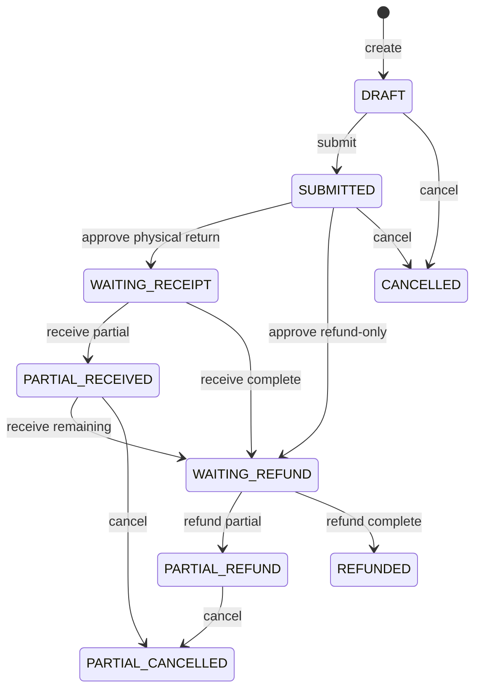
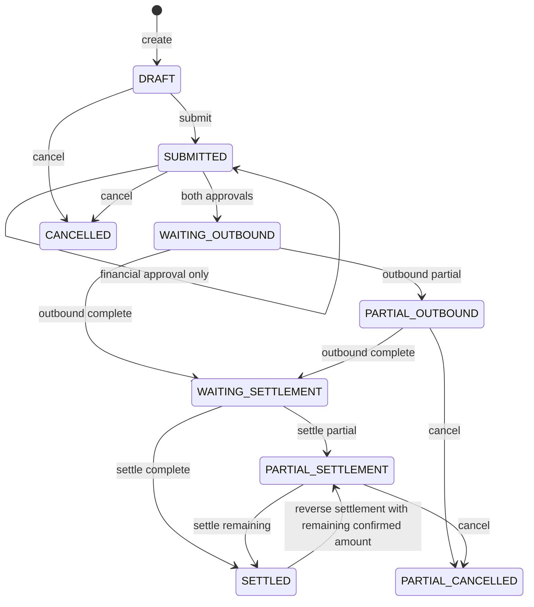

# 退货执行（ReturnsWorkflow）深化 PRD

## 1. 文档信息

| 项目 | 内容 |
|---|---|
| 需求名称 | 退货执行 command seam 深化 |
| 文档版本 | v0.2 |
| 当前状态 | 已评审，可进入研发 |
| 领域术语 | 退货执行 |
| 技术模块 | `ReturnsWorkflow` |
| 创建日期 | 2026-08-23 |
| 关联 ADR | ADR-0003、0005、0009、0014、0015、0016 |

## 2. 需求背景

### 2.1 业务背景

系统同时支持销售退货和采购退货。两条流程都包含申请、审批、幂等动作记录、状态推进、审计和跨模块事实编排：销售退货会产生退货收货、检验、退款或成本核验；采购退货会产生退货出库、供应商结算和结算冲销。

### 2.2 当前问题

`apps/api/src/returns/returns.service.ts` 当前由一个 578 行的 public interface 同时暴露 20+ 个销售/采购动作。每个动作都自行组合访问检查、状态判断、`ReturnAction` 幂等、事务、审计和 `CashFactWriter` / `InventoryLedger` 调用，导致：

- 调用方必须了解退货动作的实现细节，而不是提交一个退货执行意图。
- 销售和采购动作的共同一致性规则容易出现分支差异。
- 创建退货当前分为主单/action 事务与明细完成事务，不能完整表达一次原子执行。
- 现有测试主要覆盖纯领域规则，未以 command interface 覆盖幂等、事务失败和事实 adapter 协作。

### 2.3 已确认的架构约束

- 退货执行拥有销售/采购退货业务状态和动作记录。
- `CashFactWriter` 是现金事实唯一跨模块写入 seam；退货不得直接写 `PaymentRecord`。
- `InventoryLedger` 是库存数量事实唯一跨模块写入 seam；退货不得直接写库存批次或库存流水。
- Finance、Inventory 的事实写入与退货业务状态必须在同一业务事务中提交。
- 现有路由和 DTO 保持兼容，本期不做查询模型重构。

## 3. 产品目标

- 让 controller 只提交退货执行意图，不再直接依赖 20+ 个动作方法。
- 让所有 command 遵循统一的幂等、状态、事务、事实 adapter、审计和结果语义。
- 让销售退货与采购退货共享执行协议，同时保留各自的状态机和业务规则。
- 让 interface 成为主要测试面：重复提交、请求冲突、失败重试、状态冲突和事实调用都可通过 interface 验证。
- 保持现有业务行为、权限规则、路由、DTO 和查询结果不变。

## 4. 非目标

本期不包含：

- 不改变销售退货或采购退货的业务状态名称和业务含义。
- 不把现金事实 ownership 转移给退货执行。
- 不把库存数量事实 ownership 转移给退货执行。
- 不新增退货页面、通知、报表或新业务动作。
- 不重构列表和详情查询模型。
- 不新增面向调用方的版本字段。
- 不引入第二条退货 command implementation；迁移完成后 controller 只通过 `ReturnsWorkflow` 执行 command。

## 5. 用户角色与权限

权限仍由 `AccessContext` 计算，退货执行不复制权限模型。当前代码中的角色边界保持不变：

| 角色 | 主要场景 | 可执行范围 |
|---|---|---|
| 门店销售 / 客服 | 销售退货申请、提交及相关销售动作 | 访问主体所属门店及既有退货权限范围 |
| 门店经理 | 销售/采购退货管理、审批、取消 | 访问主体所属门店及既有退货权限范围 |
| 采购人员 | 采购退货提交、出库等 | 访问主体所属门店及既有退货权限范围 |
| 财务人员 | 销售退款、采购财务审批、供应商结算和冲销 | 访问主体所属门店及既有退货财务权限范围 |

本期不改变角色权限矩阵；所有 command 继续通过 `AccessContext.require` 校验访问主体和门店范围。

## 6. 核心业务对象

| 对象 | 定义 | 关键状态/字段 | 归属 |
|---|---|---|---|
| 销售退货 | 由销售订单发起的退货申请及退款过程 | `SalesReturn.status`、退货模式、申请/已退/剩余退款金额 | 退货执行 |
| 销售退货明细 | 销售订单明细的退货数量、收货、检验和成本核验记录 | `receivedQuantity`、`inspectionStatus`、`costStatus`、`refundedQuantity` | 退货执行 |
| 采购退货 | 由采购订单发起的退货及供应商结算过程 | `PurchaseReturn.status`、业务/财务审批、已出库/已结算金额 | 退货执行 |
| 采购退货明细 | 采购批次的退货数量和出库记录 | `batchId`、`outboundQuantity`、`approvedQuantity` | 退货执行 |
| 退货动作 | 一次 command 的幂等、执行状态和结果记录 | `returnType`、`actionType`、`idempotencyKey`、`status`、request/result summary | 退货执行 |
| 现金事实 | 实际退款、供应商付款及冲销事实 | `PaymentRecord`、来源和 `reversalOfId` | Finance / `CashFactWriter` |
| 库存数量事实 | 退货收货、检验转换、采购退货出库产生的批次/流水事实 | 批次、数量、来源、幂等 | Inventory / `InventoryLedger` |

## 7. 方案概述

### 7.1 外部 interface

退货执行对外提供一个 command execution interface。controller 将现有 DTO 转换为带有动作类型、访问主体、退货标识和动作输入的执行意图，由 `ReturnsWorkflow` 统一负责：

1. 校验幂等键和请求指纹。
2. 加载退货主单/明细并校验访问主体。
3. 校验当前状态和动作前置条件。
4. 在业务事务中创建或抢占 `ReturnAction`。
5. 更新退货业务状态、明细和结算记录。
6. 通过 `CashFactWriter` / `InventoryLedger` 写入跨模块事实。
7. 写入审计并完成 action 结果。

查询仍保持现有列表和详情行为，暂不作为本期 command seam 的重构目标。

### 7.2 interface 与迁移形态

- `ReturnsWorkflow` 是退货 command 的唯一外部 execution seam，controller 不直接调用具体动作实现。
- command 使用显式动作类型和动作输入，workflow 内部按销售退货/采购退货分派到各自状态规则；不把两套状态机伪装成一套通用状态机。
- 现有列表和详情读取继续由当前读取面提供，路由、DTO、返回字段和数据范围保持兼容。
- 不保留第二条可写 command implementation；迁移完成后旧的具体动作方法只作为 workflow 内部 implementation，不再作为 controller 的 interface。
- 本期不新增数据库版本字段；并发由 action 唯一约束、事务内状态条件校验和必要的行锁共同保护。

### 7.3 内部 adapter

- `AccessContext`：访问主体、能力和门店范围校验。
- `CashFactWriter`：客户退款、供应商付款和供应商付款冲销。
- `InventoryLedger`：销售退货收货、检验转换和采购退货出库。
- Prisma transaction client：由退货执行持有，用于退货业务事实、`ReturnAction` 和审计的原子提交。

这些 adapter 不向 controller 暴露；退货执行只使用窄事务上下文。Finance 和 Inventory 仍拥有各自事实的 interpretation 和 invariant。

## 8. 主流程与状态

### 8.1 销售退货

本期 canonical 状态只采用当前实际实现中的状态；数据库枚举已有但当前未使用的 `APPROVED`、`CLOSED` 不在本期启用。状态变化只在满足当前代码已有前置条件时发生。销售退货的库存收货、检验转换和退款必须在同一业务事务中完成其退货业务更新与对应事实 adapter 调用。

### 8.2 采购退货

采购业务审批和财务审批仍然是两个独立动作；两者完成后才进入出库等待。供应商退款由 `CashFactWriter` 写现金事实，付款冲销必须关联原现金事实。

本期不新增审核后取消能力，不把纯换货作为零现金结算完成条件；`EXCHANGE` 继续遵循现有金额校验，纯换货规则另立需求。成本核验只收拢现有提交、确认和重提动作，不新增独立驳回 workflow。

## 9. 功能需求

### 9.1 统一 command execution

#### 规则 R-01：动作类型显式表达

- 条件：controller 收到任一销售/采购退货 command。
- 动作：转换为带明确退货类型和动作类型的执行意图，调用 `ReturnsWorkflow`。
- 结果：controller 不再直接调用具体动作实现；动作实现只在 workflow 内部可见。

#### 规则 R-02：幂等键校验

- 条件：command 缺少幂等键。
- 动作：拒绝执行。
- 结果：不创建退货业务事实、现金事实、库存事实或 action。

- 条件：同一退货、同一动作类型和同一幂等键已成功。
- 动作：重放 command。
- 结果：返回原成功结果，不重复写业务事实、现金事实、库存事实或审计事实。

- 条件：同一幂等键对应的请求摘要不同。
- 动作：提交 command。
- 结果：返回 `RETURN_IDEMPOTENCY_CONFLICT`，不改变原 action。

- 条件：同一幂等键对应 action 为 `FAILED`。
- 动作：重试 command。
- 结果：返回失败语义，调用方必须使用新的幂等键；不得重复执行原失败 action。

#### 规则 R-03：状态条件与并发

- 条件：退货当前状态不允许目标动作，或同一退货正在并发执行冲突动作。
- 动作：在事务内进行状态条件校验并抢占 action。
- 结果：只允许一个有效动作提交；其他请求返回状态冲突或幂等进行中，不产生部分业务事实。

#### 规则 R-04：原子提交

- 条件：command 需要同时改变退货业务状态、明细/结算记录、action 和审计，或调用 Finance/Inventory adapter。
- 动作：由 `ReturnsWorkflow` 持有同一业务事务，并向 adapter 传递窄事务上下文。
- 结果：全部成功才提交；任一业务事实或 adapter 失败则回滚本次业务事务，并记录可诊断的 action 失败结果。退款成功还必须写入对应退货审计，补齐当前退款动作的审计缺口。

#### 规则 R-05：事实 ownership

- 条件：销售退款或供应商结算产生实际付款/退款。
- 动作：调用 `CashFactWriter` 的既有方向化方法。
- 结果：现金事实包含来源、幂等键和反向关系；退货只更新自身退款/结算状态及关联 record id。

- 条件：销售退货收货、检验转换或采购退货出库改变库存数量。
- 动作：调用 `InventoryLedger` 的既有 typed command。
- 结果：库存批次、数量、来源、流水和库存幂等由 Inventory 维护；退货只更新退货明细与业务状态。

#### 规则 R-06：本期状态与财务口径不扩张

- 条件：command 命中数据库中存在但当前 workflow 未使用的 `APPROVED` / `CLOSED` 状态、审核后取消或纯换货完成结算需求。
- 动作：按当前已确认的状态和金额规则处理；不在本期新增隐式迁移。
- 结果：未确认的产品规则不会被架构重构顺带改变；需要新增状态、取消窗口或纯换货结算时另立需求。

### 9.2 查询兼容

- 保持 `sales-returns`、`purchase-returns` 列表和详情路由不变。
- 保持现有查询字段、排序和数据范围行为不变。
- 查询不新增 command action，不改变事实 ownership。

## 10. 异常与边界

| 场景 | 系统处理 | 验收重点 |
|---|---|---|
| 幂等键缺失 | 拒绝，不写任何事实 | 返回参数错误 |
| 同键同请求重放 | 返回原结果 | 现金/库存/action 不重复 |
| 同键不同请求 | 拒绝冲突 | 原 action 不被覆盖 |
| action 已进行中 | 拒绝并发重入 | 不产生第二份事实 |
| 状态已被其他动作改变 | 事务内拒绝 | 状态和明细不部分更新 |
| Finance adapter 失败 | 业务事务回滚并记录失败 | 不出现只有退款状态没有现金事实 |
| Inventory adapter 失败 | 业务事务回滚并记录失败 | 不出现只有退货状态没有库存事实 |
| 原供应商现金事实已冲销 | 拒绝再次冲销 | `reversalOfId` 关系不重复 |
| 门店越权 | `AccessContext` 拒绝 | 不泄露退货详情 |
| 创建明细写入失败 | 主单、action、明细、审计原子回滚 | 不留下半成品退货 |
| 退款成功但审计写入失败 | 整体事务回滚 | 不出现无法追溯的退款事实 |
| 请求审核后取消或纯换货完成 | 按本期既有规则拒绝或进入待确认能力 | 不隐式改变状态和财务口径 |

## 11. 测试与验收标准

### 11.1 Interface contract tests

- Given：有效销售退货 command；When：通过 `ReturnsWorkflow` 执行；Then：只产生既有销售退货状态和事实结果。
- Given：有效采购退货 command；When：通过 `ReturnsWorkflow` 执行；Then：只产生既有采购退货状态和事实结果。
- Given：重复成功 command；When：再次执行；Then：返回原结果，CashFactWriter/InventoryLedger 不重复调用。
- Given：同幂等键但请求摘要变化；When：执行；Then：返回冲突，原 action 和业务事实不变化。
- Given：action 已失败；When：使用相同幂等键重试；Then：拒绝并要求新幂等键。
- Given：退货状态不允许动作；When：执行；Then：拒绝且退货、action、审计和事实均不出现部分提交。
- Given：销售退款 command 成功；When：事务提交；Then：退款现金事实、退货金额状态、action 和退款审计同时存在。
- Given：销售或采购退货处于审核后但未执行状态；When：提交本期未支持的取消 command；Then：拒绝且不改变退货状态。
- Given：采购结算仅包含换货数量而无退款或应付抵扣金额；When：执行结算；Then：按现有金额规则拒绝，不将其标记为 `SETTLED`。

### 11.2 真实事务集成测试

- 销售退款与客户收款冲销在同一事务中提交。
- 销售退款成功时产生退货审计，失败时退款和审计均不提交。
- 采购供应商退款/冲销与采购退货结算状态在同一事务中提交。
- 销售退货收货/检验转换调用 InventoryLedger 并与退货明细原子提交。
- 采购退货出库调用 InventoryLedger 并与退货明细和主单状态原子提交。
- 创建销售/采购退货时主单、明细、初始 action 和审计同事务提交。
- adapter 失败时不留下半成品业务状态或重复 action。

### 11.3 Architecture contract tests

- controller command route 只通过 `ReturnsWorkflow` 执行，不直接调用具体 action 方法。
- `returns` 目录不存在 `PaymentRecord` 直接写入。
- `returns` 目录不存在库存批次/库存流水直接写入。
- `CashFactWriter` / `InventoryLedger` 继续接收窄事务上下文。

## 12. 指标与观测

本期不新增产品指标目标值。技术观测至少保留：

- command action 类型、结果状态和失败原因。
- 幂等重放、幂等冲突、并发冲突数量。
- CashFactWriter / InventoryLedger 调用失败数量。
- 退货业务状态与事实提交失败的关联记录。

指标基线、目标值和统计周期待业务/运营确认，不在本 PRD 中虚构。

## 13. 待确认事项

| 编号 | 事项 | 当前处理 | 负责人 |
|---|---|---|---|
| 1 | 退货执行失败后的运营补偿动作 | 本期保留现有错误反馈和新幂等键重试；不新增补偿队列 | 产品/财务 |
| 2 | 退货执行技术指标目标值 | 先记录观测字段，目标值上线前补充 | 产品/数据 |
| 3 | 真实数据库并发压测阈值 | 由研发在实现计划中评估 | 研发 |

以上事项不阻塞本期 command seam 实现；若业务确认需要补偿队列、新状态、审核后取消或纯换货结算，需另开需求评审。

## 14. 变更记录

| 版本 | 日期 | 变更内容 | 原因 |
|---|---|---|---|
| v0.1 | 2026-08-23 | 基于三轮设计澄清形成 command seam、ownership、原子性和验收范围 | ReturnsWorkflow 深化 |
| v0.2 | 2026-08-23 | 根据需求评审收敛状态、取消、纯换货、成本核验、sourceId 和退款审计口径 | 评审通过 |
