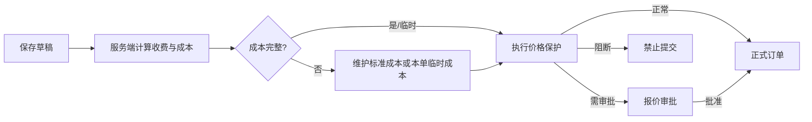
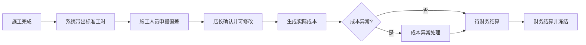

# 销售订单施工收费与成本核算调整实施计划（正式版）

## 文档控制

| 项目 | 内容 |
|---|---|
| 文档类型 | 正式功能实施计划 |
| 版本 | v1.0 |
| 编制日期 | 2026-07-16 |
| 文档状态 | 实施中；本文作为后续开发、测试、灰度和验收的唯一执行基线 |
| 业务决策状态 | 本文第 3 节所列决策已确认；变更须走版本评审，不得由开发过程自行变更 |
| 变更控制 | 影响数据口径、审批、权限、冻结规则或发布策略的变更，须经产品、财务和技术负责人共同确认 |

- 适用范围：建议价设置、施工收费、标准工时、岗位成本、订单预计成本、施工成本确认、实际毛利、价格审批和成本异常
- 来源依据：施工收费与成本口径专项访谈、[销售订单智能建议价与价格审批实施计划](./sales-order-pricing-engine-implementation-plan.md)、当前订单/价格/施工/库存/提成实现
- 目标读者：产品负责人、后端开发、前端开发、测试、财务负责人、门店店长和实施人员

## 实施治理与发布门禁

| 阶段 | 进入条件 | 必交付物 | 放行人 | 放行标准 |
|---|---|---|---|---|
| 开发 | 本文第 3 节决策已确认，数据模型与 API 契约完成评审 | migration、服务端、Web、测试和回滚说明 | 技术负责人 | 不破坏历史订单；服务端不信任客户端成本金额 |
| 联调 | 单元测试与契约测试通过 | 端到端联调记录、样例订单与导出样例 | 产品负责人、测试负责人 | 收费、预计成本和毛利口径可复算且一致 |
| 试运行 | 目标门店完成字典、施工标准和岗位费率发布 | SHADOW 对账报告、培训材料、问题清单 | 门店店长、财务负责人 | 连续观察期内无未解释的关键差异 |
| 正式启用 | 试运行问题闭环，回滚方案演练完成 | ACTIVE 配置、验收记录、运维手册 | 产品、财务、技术负责人 | 本文第 20 节完成定义逐项验收 |

任何阶段未达到放行标准，必须停留在当前阶段修复；不得以手工修改数据库、前端绕过校验或临时关闭审批作为上线手段。

## 0. 执行摘要

当前系统中的 `laborCostCents`、`suggestedLaborCostCents` 和页面“人工费”同时承载对客施工收费与内部施工成本语义；成本估算器还会把成交人工费直接加入预计成本。当产品成本缺失时，页面可能出现“建议人工费、成交人工费、预计成本金额相同”的误导结果，并据此计算错误毛利。

本计划必须完成以下口径拆分：

```text
对客收入 = 产品成交金额 + 本单施工收费
预计总成本 = 预计材料成本 + 预计施工成本
实际总成本 = 实际材料成本 + 实际施工成本
预计毛利 = 对客收入 - 预计总成本
实际毛利 = 实际收入 - 实际总成本
```

“施工收费与成本标准”不是独立于建议价设置的第二套系统，而是建议价设置中的基础标准模块：它同时提供基础施工收费以及标准工时、班组和成本组成；建议价规则在基础施工收费之上调整对客建议收费，成本侧独立计算预计施工成本并参与毛利保护。

## 1. 文档规范符合性

MUST：

- 本计划只描述待实施能力，不将计划内容标记为已上线。
- 每项任务必须可独立提交、验证和回滚。
- 所有收费、预计成本、实际成本和毛利必须由服务端计算或复核。
- 对客施工收费与内部施工成本必须使用不同字段、不同 DTO 语义和不同计算路径。
- 已审批报价、正式订单、已确认施工成本和已结算成本必须保留版本快照与审计记录。
- 修改本文时必须同步检查 [文档索引](../README.md) 和根 [README](../../README.md)。

MUST NOT：

- 不允许继续把成交施工收费作为预计施工成本。
- 不允许产品成本缺失时静默按 0 形成“完整毛利”。
- 不允许前端提交一个可编辑的预计总成本作为审批权威数据。
- 不允许店长通过修改岗位小时成本规避毛利审批。
- 不允许确认后的施工成本被原地覆盖。
- 不允许用员工真实工资明细直接暴露给店长、销售或施工人员。

## 2. 建设目标与非目标

### 2.1 建设目标

MUST：

1. 将“建议人工费”统一改为“系统建议施工收费”，将“成交人工费”改为“本单施工收费”。
2. 在建议价设置中增加“施工收费与成本标准”，同一版本维护基础施工收费、标准工时、班组、追加规则与成本组成。
3. 按材料成本和标准施工成本生成不可编辑的预计成本明细。
4. 将预计成本快照纳入产品行、施工收费、整单总价、最低保护价和预计毛利的最严格审批判断。
5. 施工完成后按标准工时默认结算，由施工人员申报偏差，所有任务均由店长确认。
6. 按实际出库材料、店长确认工时、岗位小时成本快照、个人提成、补贴、外包和返工形成实际成本。
7. 完工后比较预计成本与实际成本，实际毛利低于底线时生成事后成本异常。
8. 保留历史订单收入，不使用历史成交施工收费伪造历史成本。

### 2.2 非目标

第一期 MUST NOT：

- 以摄像头、定位、照片 EXIF 或按钮计时自动认定真实工时。
- 建设完整人力资源工资核算系统。
- 将订单成本核算金额要求与工资实发金额逐分钱相等。
- 自动回写或修改已审批订单价格。
- 自动使用实际成本撤销已经批准或已经履约的报价。

## 3. 已确认业务决策

以下决策均为本计划的约束，不应在开发阶段重新解释：

1. 下单时按标准成本预估，完工后按实际人员、确认工时、提成及其他费用结算并记录差异。
2. 施工收费与成本在同一个维护入口分列管理，但收费与成本不能使用同一个金额。
3. 施工收费由店长维护；标准施工成本由标准工时、班组、岗位小时成本、提成和补贴自动计算。
4. 实际施工成本包括岗位小时成本、个人提成、补贴、外包和返工人工成本；材料单独计入实际材料成本。
5. 计时和照片只作为辅助证据；标准工时默认结算，偏差由施工人员申报，所有任务均由店长确认并可修改。
6. 确认前可直接修改；确认后只能通过成本调整单修改；财务结算后冻结。
7. 正常任务可由店长批量确认，异常任务必须逐单确认。
8. 允许交车和收款，但成本未确认前不得完成成本结算与提成结算。
9. 店长维护业务标准；财务维护岗位小时成本及成本口径；系统自动合算。
10. 岗位标准小时成本参与订单核算，个人提成据实；员工真实工资明细仅财务可见。
11. 同组采用“主项目 + 追加项目”，跨组叠加；收费与成本使用同一合并结构。
12. 草稿允许成本缺失；正式提交必须补齐，或由店长维护本单临时成本并进入审批。
13. 审批冻结预计成本；完工核算实际成本；实际超标进入事后成本异常。
14. 对客报价与内部成本分区，预计成本不再作为可编辑字段。
15. 收费、标准工时和成本组成作为同一个版本发布。
16. 历史收入保留、历史成本不伪造，新订单按门店启用时间使用新口径。

## 4. 统一术语与字段语义

### 4.1 业务术语

| 术语 | 英文建议 | 定义 |
|---|---|---|
| 基础施工收费 | `baseConstructionChargeCents` | 施工标准中未应用价格调整前的对客收费基数 |
| 系统建议施工收费 | `suggestedConstructionChargeCents` | 应用车型、地点、产品组合等规则后的系统建议收费 |
| 本单施工收费 | `finalConstructionChargeCents` | 本单最终向客户收取的施工服务金额 |
| 预计材料成本 | `estimatedMaterialCostCents` | 下单时依据库存、入库或标准成本估算的材料成本 |
| 预计施工成本 | `estimatedConstructionCostCents` | 依据标准工时、班组、岗位成本、提成和补贴估算的内部成本 |
| 预计总成本 | `estimatedTotalCostCents` | 预计材料成本与预计施工成本之和 |
| 实际材料成本 | `actualMaterialCostCents` | 按实际出库批次及实际消耗确认的材料成本 |
| 实际施工成本 | `actualConstructionCostCents` | 按店长确认工时及实际成本组成形成的内部施工成本 |
| 实际总成本 | `actualTotalCostCents` | 实际材料成本与实际施工成本之和 |

### 4.2 兼容字段处理

当前字段必须按以下方式渐进迁移：

- `OrderAmount.laborCostCents`：历史语义确定为“本单施工收费”，不得再用于内部成本计算。
- `OrderAmount.suggestedLaborCostCents`：历史语义确定为“系统建议施工收费”。
- `PricingCalculation.suggestedLaborCostCents`、`SalesQuote.finalLaborCostCents` 同理。
- 第一阶段新增明确字段并双写；读取优先新字段、缺失时回退旧字段。
- 第二阶段完成 API、Web、导出、报表和测试切换后停止写旧字段。
- 删除旧字段必须进入独立后续 migration，不得与首轮兼容迁移同批执行。

## 5. 目标业务架构


MUST：

- `pricing` 模块负责标准版本、建议收费、预计成本和价格保护。
- `construction` 模块负责工时申报、店长确认和施工成本结算。
- `inventory` 模块提供预计材料成本来源与实际出库批次成本。
- `commissions` 模块提供提成规则和实际提成快照。
- `finance` 模块负责岗位成本标准发布、调整单结算与财务冻结。
- 模块之间通过服务接口和快照协作，不允许 Web 端拼装权威成本。

## 6. 字典、基础档案、业务规则和单据边界

| 类型 | 内容 | 维护原则 |
|---|---|---|
| 系统字典 | 施工类别、施工地点、产品类别、计量单位、施工岗位类型、补贴类型、工时偏差原因、成本调整原因、成本异常原因 | 使用稳定编码；系统项不可删除或改码 |
| 基础档案 | 施工项目、施工组、车型级别与映射、产品、员工岗位、门店 | 支持启停和审计；不保存版本化金额规则 |
| 业务规则 | 施工收费与成本标准、班组、追加项目、岗位成本、提成、审批阈值、保护价和毛利底线 | 草稿、试算、发布和版本冻结 |
| 业务单据 | 报价单、正式订单、工时申报、成本确认、成本调整、成本异常 | 状态流转、权限校验和不可变历史 |
| 冻结快照 | 建议价、预计成本、审批、实际成本和成本调整快照 | 保存版本、输入、输出和计算明细 |

MUST NOT 将金额、比例、工时、班组人数、生效日期或保护阈值放入普通字典。

## 7. 数据模型调整

### 7.1 施工项目基础档案

新增或扩展：

```text
ConstructionServiceItem
  id
  storeId / templateScope
  code
  name
  constructionTypeCode
  serviceGroupCode
  defaultProductCategoryCode
  status
```

`ConstructionServiceItem` 是基础档案，不是普通字典，因为需要关联施工组、产品范围、规则版本和班组标准。

### 7.2 同版本施工标准

RECOMMENDED 将施工标准行直接归属现有 `PricingRuleSet`，保证收费、工时、成本组成与保护策略同版本发布：

```text
ConstructionStandardLine
  id
  pricingRuleSetId
  serviceItemId
  vehiclePriceClassId?
  constructionLocationCode
  productCategoryCode?
  salesUnitCode?
  quantityFrom / quantityTo?
  baseConstructionChargeCents
  standardWorkMinutes
  addonChargeCents
  addonWorkMinutes
  priority
  enabled

ConstructionStandardCrewRole
  id
  standardLineId
  positionTypeCode
  workerCount
  workMinutes
```

同一门店、同一版本、同一服务组和重叠适用条件 MUST 拒绝重复标准，不允许通过不同优先级绕过冲突检查。

### 7.3 岗位成本版本

```text
PositionCostRateVersion
  id
  storeId
  version
  status
  effectiveFrom / effectiveTo
  publishedById / publishedAt

PositionCostRate
  id
  versionId
  positionTypeCode
  hourlyCostCents
  confidentialDetailSnapshot?
```

财务发布岗位成本版本。价格规则版本发布时必须保存所引用的岗位成本版本 ID，并在计算快照中保存实际使用的费率，不因后续调薪改变历史订单。

### 7.4 预计成本快照

扩展 `PricingCalculation` 输出及报价/订单快照：

```text
costCompleteness: COMPLETE | TEMPORARY | MISSING
estimatedMaterialCostCents
estimatedConstructionCostCents
estimatedTotalCostCents
estimatedGrossProfitCents
estimatedGrossMarginBps
materialCostLines[]
constructionCostGroups[]
temporaryCostReasons[]
pricingRuleSetId / pricingRuleSetVersion
positionCostRateVersionId
calculationHash
```

服务端必须根据权威产品、库存、施工标准和岗位成本重新构建快照，不能信任前端金额。

### 7.5 实际成本结算

新增：

```text
ConstructionCostSettlement
  id
  storeId
  orderId
  constructionRecordId
  status: PENDING_CONFIRMATION | CONFIRMED | SETTLED
  standardWorkMinutes
  declaredWorkMinutes?
  confirmedWorkMinutes
  actualMaterialCostCents
  actualConstructionCostCents
  actualTotalCostCents
  actualGrossProfitCents
  actualGrossMarginBps
  confirmedById / confirmedAt
  settledById / settledAt
  sourceSnapshot

ConstructionCostWorkerLine
  settlementId
  workerId
  positionTypeCode
  standardMinutes
  declaredMinutes?
  confirmedMinutes
  hourlyCostCentsSnapshot
  baseCostCents
  commissionCents
  allowanceCents
  varianceReasonCode?
  varianceReasonText?

ConstructionCostAdjustment
  settlementId
  adjustmentType
  amountCents
  reasonCode
  reasonText
  status: PENDING | APPROVED | REJECTED | SETTLED
  requestedById / approvedById

OrderCostException
  orderId
  exceptionType
  expectedCents
  actualCents
  varianceCents
  status
  ownerId?
  resolution
```

## 8. 计算规则

### 8.1 建议施工收费

```text
系统建议施工收费
= 同组主项目基础施工收费
+ 同组追加项目收费
+ 跨组施工收费
+ 车型、地点、数量和其他结构化价格规则调整
```

同组主项目必须使用确定性排序：优先级、基础收费、稳定 ID。跨组按固定组顺序叠加。计算过程必须返回自然语言说明。

### 8.2 预计施工成本

```text
预计施工成本
= Σ（班组岗位人数 × 标准工时 × 岗位小时成本）
+ 标准提成
+ 标准补贴
```

收费调整不应同比调整成本。车型或外出地点确实增加工时/补贴时，必须通过施工标准或成本规则明确增加，不能从售价比例倒推。

### 8.3 多产品合并

MUST：

- 同施工组选择一个主项目。
- 同组其余产品只使用追加收费、追加工时、追加提成和追加补贴。
- 跨施工组分别形成收费组和成本组后叠加。
- 数量超过标准用量时按追加单位规则计算。
- 收费和成本必须使用同一分组结果，但分别计算金额。

### 8.4 预计材料成本

成本来源优先级：

1. 实际可用库存批次加权成本。
2. 最近入库成本。
3. 产品档案标准成本。
4. 店长填写并注明依据的本单临时成本。
5. 缺失。

缺失成本 MUST 返回 `MISSING`，不得静默变成完整成本。临时成本 MUST 返回 `TEMPORARY` 并强制进入价格审批。

### 8.5 价格保护

服务端同时检查：

1. 每个产品行成交单价与建议价偏差。
2. 本单施工收费与系统建议施工收费偏差。
3. 整单成交金额与建议总价偏差。
4. 产品最低保护价。
5. 预计毛利率与毛利硬底线。
6. 成本完整性。

最终结果取最严格值：`NORMAL < APPROVAL_REQUIRED < BLOCKED`。

### 8.6 实际成本与异常

```text
实际施工成本
= Σ（确认工时 × 岗位小时成本快照）
+ 个人实际提成
+ 实际补贴
+ 外包费用
+ 返工人工成本
```

实际材料成本读取实际出库批次及确认损耗。实际成本不得回写审批时的预计成本快照。实际毛利低于底线或成本偏差超过阈值时创建 `OrderCostException`。

## 9. 状态与业务流程

### 9.1 报价和订单



MUST：草稿允许成本缺失；正式提交必须补齐，或由店长使用本单临时成本并进入审批。

### 9.2 工时与成本确认



计时、照片、领料、下一任务等只作为辅助证据。所有记录均由店长确认；正常记录可批量确认，异常记录必须逐单确认。

### 9.3 修改与冻结

- `PENDING_CONFIRMATION`：店长可直接修改确认值，必须记录修改前后值。
- `CONFIRMED`：禁止覆盖原记录，只能创建成本调整单。
- `SETTLED`：永久冻结；店长只能发起调整申请，由财务或管理员审批处理。

## 10. 权限矩阵

| 能力 | 店长 | 财务 | 管理员 | 销售 | 施工人员 |
|---|---:|---:|---:|---:|---:|
| 维护施工收费、工时、班组 | 是，本门店 | 查看 | 是 | 否 | 否 |
| 维护岗位小时成本 | 否 | 是 | 是 | 否 | 否 |
| 查看预计成本和毛利 | 是，本门店 | 是 | 是 | 否，仅看审批结果 | 否 |
| 申报工时偏差 | 否 | 否 | 否 | 否 | 是，本人任务 |
| 确认施工成本 | 是，本门店 | 查看 | 是 | 否 | 否 |
| 创建确认后调整单 | 是 | 是 | 是 | 否 | 否 |
| 财务结算与冻结 | 否 | 是 | 是 | 否 | 否 |
| 查看个人真实工资明细 | 否 | 是 | 是 | 否 | 否 |

所有越权访问 MUST 在服务端拒绝，不能只依靠前端隐藏。

## 11. Web 信息架构与交互

### 11.1 建议价设置

保留一个主菜单“建议价设置”，内部使用以下页签：

1. 概览。
2. 产品建议价规则。
3. 施工收费与成本标准。
4. 车型级别与匹配。
5. 改价审批与保护。
6. 草稿及版本。
7. 建议价试算。

“施工收费与成本标准”必须提供：

- 业务化列表，不直接展示规则 JSON、数据库 ID 或枚举英文值。
- 施工项目、车型级别、地点、基础收费、标准工时、班组、预计标准成本和状态列。
- 新增/编辑抽屉，分为“适用范围、对客收费、标准工作量、成本预览”四段。
- 同组冲突实时预检，保存时仍由服务端最终校验。
- 从系统字典和基础档案选择常量，不允许自由输入系统编码。
- 发布前试算典型车辆、产品组合和地点。

### 11.2 新建订单

产品与施工区域拆分为：

**对客报价**

- 产品建议单价、产品成交单价和一键采用。
- 系统建议施工收费，只读。
- 本单施工收费，可修改并一键采用建议。
- 价格偏差、调整原因和审批状态。

**内部成本与毛利**

- 仅店长、财务和管理员可见，默认折叠。
- 展示预计材料成本、预计施工成本、预计总成本、预计毛利和成本完整性。
- 金额只读；点击查看成本来源和计算步骤。
- 销售只看到正常、需要审批或禁止提交。

必须删除可编辑的“预计成本”输入框。

### 11.3 待成本确认工作台

新增店长工作台：

- 待确认、异常、已确认、已结算筛选。
- 列表显示订单、车辆、施工项目、标准/申报工时、预计/实际成本差额和异常标记。
- 正常记录可勾选批量确认。
- 异常记录必须进入详情，填写确认工时和原因。
- 超时未确认只提醒，不自动结算。

## 12. API 调整

### 12.1 建议价与标准

建议新增或扩展：

```text
GET    /pricing/rule-sets/:id/construction-standards
PUT    /pricing/rule-sets/:id/construction-standards
POST   /pricing/rule-sets/:id/construction-standards/validate
POST   /pricing/calculate
POST   /pricing/cost-estimates
GET    /position-cost-rates
POST   /position-cost-rate-versions
POST   /position-cost-rate-versions/:id/publish
```

`POST /pricing/calculate` 必须同时返回：

- 建议产品价格明细。
- 系统建议施工收费及计算步骤。
- 预计材料、施工与总成本。
- 预计毛利。
- 成本完整性。
- 最严格审批结果。

### 12.2 施工成本结算

建议新增：

```text
GET    /construction/cost-settlements
GET    /construction/cost-settlements/:id
POST   /construction/cost-settlements/:id/declaration
POST   /construction/cost-settlements/:id/confirm
POST   /construction/cost-settlements/batch-confirm
POST   /construction/cost-settlements/:id/adjustments
POST   /construction/cost-adjustments/:id/approve
POST   /construction/cost-settlements/:id/settle
GET    /orders/:id/cost-comparison
```

所有写接口 MUST：

- 校验门店和角色边界。
- 使用幂等键或状态条件防止重复确认、重复调整和重复结算。
- 写入 `AuditEvent`。
- 返回业务名称和状态中文映射所需数据，不要求页面解释内部枚举。

## 13. 实施阶段与任务清单

### 13.1 阶段交付与验收门槛

| 阶段 | 目标 | 可交付成果 | 阶段验收门槛 | 回退边界 |
|---|---|---|---|---|
| Phase A | 停止收费与成本混用 | 兼容字段、口径修复、订单文案与只读成本区 | 新订单不再把本单施工收费计入预计成本；历史订单仍可读取 | 仅切回旧页面呈现，不回滚已写入的新快照 |
| Phase B | 建立可版本化的收费与成本标准 | 字典、施工项目、岗位成本版本、施工标准与成本引擎 | 同一适用范围冲突被拒绝；同一输入每次试算结果稳定 | 停用未发布版本，保留全部草稿和审计 |
| Phase C | 将成本纳入报价和订单决策 | 服务端快照、临时成本审批、订单/报价页面和冻结机制 | 销售不可读取成本明细；缺失成本不能直接形成正式订单 | 门店保持 SHADOW 或 LEGACY，已审批快照不删除 |
| Phase D | 完成完工后的实际成本核算 | 工时申报、店长确认、调整、结算、异常和对账 | 正常任务可批量确认；异常必须逐单确认；结算后不可覆盖 | 停止新结算入口，不修改已确认/已结算历史 |
| Phase E | 可运营、可审计地发布 | 报表导出、历史迁移、灰度、演练、手册和验收证据 | 报表可复算，灰度与回滚演练通过 | 对单店切回 LEGACY，保留 SHADOW 数据用于对账 |

### 13.2 实施顺序与依赖


MUST：Phase C 不得绕过 Phase B 的已发布标准与岗位费率版本；Phase D 不得在 Phase C 未冻结预计成本快照前启用；Phase E 的 ACTIVE 启用不得早于试运行对账完成。

### Phase A：语义止损与兼容基础

- [x] 任务 A1：修复当前成本估算语义错误。
  - 修改 `apps/api/src/pricing/domain/cost-estimator.ts`、DTO、服务及测试。
  - 停止把本单施工收费直接加入内部预计成本。
  - 缺失材料成本返回 `MISSING`，不再形成完整毛利。
  - 回滚：保持旧字段读取兼容，使用门店灰度开关退回旧流程。
- [x] 任务 A2：统一 Web 文案和订单页面结构。
  - 修改 `apps/web/app/orders/create/page.tsx`、订单详情、报价详情和导出模板。
  - 将人工费文案改为施工收费，删除预计成本输入框。
  - 回滚：页面组件保留兼容渲染，不改变历史数据。
- [x] 任务 A3：新增兼容字段与双写 migration。
  - 新增明确的施工收费与拆分成本字段。
  - 回填历史施工收费，不回填历史内部成本。
  - 回滚：migration 只新增可空字段和索引，不删除旧列。

### Phase B：收费与成本标准

- [x] 任务 B1：补齐系统字典和施工项目基础档案。
  - 稳定编码、系统项保护、门店权限与审计。
- [x] 任务 B2：实现岗位成本版本。
  - 财务发布、版本冻结、历史快照和保密权限。
- [x] 任务 B3：实现同版本施工标准。
  - 施工收费、标准工时、班组和追加规则与 `PricingRuleSet` 同版本。
  - 保存时执行服务端重叠条件冲突校验。
- [x] 任务 B4：实现标准施工成本引擎。
  - 纯函数覆盖班组、工时、岗位费率、提成、补贴和多产品合并。

### Phase C：订单、报价与毛利审批

- [x] 任务 C1：扩展服务端建议价与预计成本计算。
  - 权威主数据重建、自然语言步骤、稳定 hash 和成本完整性。
- [x] 任务 C2：扩展报价审批和订单快照。
  - 产品、施工收费、整单、保护价、毛利和成本完整性取最严格结果。
  - 临时成本强制审批。
- [x] 任务 C3：重构新建订单和审批页面。
  - 对客报价与内部成本分区；成本按角色显示。
- [x] 任务 C4：完善草稿重算和正式订单冻结。
  - 草稿选择沿用或重算；正式订单永久冻结收费与成本版本。

### Phase D：完工成本结算

- [x] 任务 D1：实现工时偏差申报和店长确认状态机。
- [x] 任务 D2：接入实际出库批次成本和个人提成快照。
- [x] 任务 D3：实现正常批量确认和异常逐单确认。
- [x] 任务 D4：实现确认后调整单、财务结算与冻结。
- [x] 任务 D5：实现预计/实际成本对比及成本异常。

### Phase E：报表、迁移和发布

- [x] 任务 E1：统一订单、报价、施工成本和毛利导出模板。
- [x] 任务 E2：历史订单标记、双读对账和数据预检。
- [x] 任务 E3：LEGACY/SHADOW/ACTIVE 门店灰度。
- [x] 任务 E4：真实浏览器、临时数据库迁移和回滚演练。
  - 证据见 [本地发布演练记录](../qa/release-evidence/sales-order-construction-cost-20260716.md)；不完整门店已自动降级为 `SHADOW`，待通过预检后方可切换 `ACTIVE`。
- [x] 任务 E5：更新功能说明、验收清单和运维手册。

## 14. 推荐提交边界

每个提交 SHOULD 只包含一类可验证变更：

1. `fix(pricing): separate construction charge from estimated cost`
2. `feat(pricing): add construction service master data`
3. `feat(finance): version position cost rates`
4. `feat(pricing): version construction charge and workload standards`
5. `feat(pricing): calculate construction cost and margin snapshot`
6. `feat(orders): separate customer charges from internal costs`
7. `feat(construction): confirm actual work cost`
8. `feat(finance): settle construction cost adjustments`
9. `feat(reports): compare estimated and actual margin`
10. `docs(pricing): record rollout and acceptance evidence`

数据库、服务端契约、Web 页面和测试可以按任务组合，但 MUST 保证每个提交通过类型检查并可回滚。

## 15. 交付责任与审阅机制

| 交付事项 | 负责（R） | 最终负责（A） | 协作/审阅（C） | 知会（I） |
|---|---|---|---|---|
| 数据模型、迁移、服务端口径与权限 | 后端开发 | 技术负责人 | 财务负责人、测试负责人 | 产品负责人 |
| 订单、报价、标准维护与成本确认页面 | 前端开发 | 技术负责人 | 产品负责人、门店店长、测试负责人 | 财务负责人 |
| 收费标准、工时、班组与适用范围 | 门店店长 | 产品负责人 | 财务负责人 | 销售、施工人员 |
| 岗位小时成本、提成成本口径与结算冻结 | 财务负责人 | 财务负责人 | 产品负责人、技术负责人 | 门店店长 |
| 测试用例、数据对账、灰度和回滚演练 | 测试负责人 | 技术负责人 | 产品、财务、门店店长 | 项目相关人员 |
| 上线批准与范围变更 | 产品负责人 | 产品、财务、技术负责人共同确认 | 测试负责人、门店店长 | 项目相关人员 |

说明：R 为实际执行人，A 为最终签字责任人，C 为必须参与评审者，I 为必须同步结果者。涉及毛利底线、岗位成本或财务结算冻结的变更，财务负责人必须同时为 C；涉及订单提交或审批路径的变更，产品负责人必须同时为 C。

## 16. 测试与验收矩阵

### 16.1 单元测试

MUST 覆盖：

- 施工收费与施工成本使用不同输入和输出字段。
- 同组主项目、追加项目、跨组叠加和数量追加。
- 岗位人数、分钟数、小时成本、提成与补贴的整数分计算。
- 成本来源优先级、临时成本和缺失成本。
- 价格行、施工收费、整单、保护价、毛利和成本完整性的最严格判断。
- 同版本重叠施工标准冲突。
- 标准工时默认、偏差申报、店长修改和批量确认。
- 确认后不可覆盖、调整单和财务冻结。

### 16.2 集成测试

MUST 覆盖：

1. 店长发布施工收费和工时标准，财务发布岗位成本版本。
2. 订单试算同时返回建议施工收费和预计施工成本。
3. 普通销售无法读取具体成本和毛利。
4. 材料成本缺失时只能保存草稿；本单临时成本触发审批。
5. 报价批准后预计成本快照永久冻结。
6. 实际出库和店长工时确认形成实际成本。
7. 实际毛利低于底线生成成本异常，不修改原审批结果。
8. 正常记录批量确认，异常记录批量接口拒绝。
9. 财务结算后店长修改被拒绝。

### 16.3 页面验收

MUST 验收：

- 新建订单不再出现“建议人工费、成交人工费、预计成本”三项同值误导。
- 系统建议施工收费只读，本单施工收费可修改并一键采用建议。
- 店长可查看预计材料、施工、总成本和毛利；销售不可见具体金额。
- 预计成本没有可编辑输入框。
- 建议价试算使用业务化表单和自然语言结果，不展示 JSON。
- 施工标准维护页可解释收费、工时、班组和成本组成。
- 店长待成本确认工作台支持正常批量确认和异常逐单处理。

### 16.4 验证命令

```bash
corepack pnpm --filter @mallbay/api test
corepack pnpm --filter @mallbay/api typecheck
corepack pnpm --filter @mallbay/api build
corepack pnpm --filter @mallbay/web test
corepack pnpm --filter @mallbay/web typecheck
corepack pnpm --filter @mallbay/web build
corepack pnpm --filter @mallbay/shared typecheck
corepack pnpm lint
corepack pnpm --filter @mallbay/api exec prisma validate --schema prisma/schema.prisma
git diff --check
```

## 17. 数据迁移与发布策略

### 17.1 历史数据

MUST：

- 将历史 `laborCostCents` 解释并迁移为对客施工收费。
- 已完成历史订单显示“历史订单，未进行成本核算”。
- 不使用历史施工收费回填预计或实际施工成本。
- 未完成订单从新流程启用后开始采集实际成本，不追溯伪造过去工时。
- 草稿重新打开时由用户选择沿用旧快照或按最新完整版本重算。

### 17.2 灰度步骤

1. `LEGACY`：保留现有订单流程，但使用修正后的文案；不展示错误预计成本。
2. `SHADOW`：并行计算新收费、预计成本和毛利，只记录差异，不改变订单决策。
3. `ACTIVE`：门店完成字典、施工标准和岗位成本版本发布后启用新流程。
4. 门店缺少完整配置时不得切换 `ACTIVE`。

### 17.3 回滚原则

- 所有首轮 migration 必须为新增列、新增表和可回填字段，不删除旧列。
- 灰度异常时切回 `LEGACY`，保留新快照供排查，不删除业务单据。
- 已确认或已结算成本不得因应用回滚而丢失。
- 删除兼容字段和旧 API 必须在至少一个稳定发布周期后单独实施。

## 18. 可观测性与对账

MUST 记录：

- 价格规则版本、岗位成本版本和输入 hash。
- 建议施工收费与本单施工收费偏差。
- 预计材料、施工和总成本及成本来源。
- 标准、申报和确认工时差异。
- 店长确认、批量确认、调整和财务结算操作。
- 预计/实际成本差异与成本异常处置。

RECOMMENDED 指标：

- 成本缺失订单率。
- 临时成本使用率。
- 店长成本确认及时率。
- 标准工时偏差率。
- 预计与实际成本偏差率。
- 实际毛利低于底线订单数。
- 确认后调整单发生率。

## 19. 风险与控制

| 风险 | 影响 | 控制措施 |
|---|---|---|
| 收费与成本字段继续混用 | 毛利和审批错误 | 明确字段、服务端类型、契约测试和兼容迁移 |
| 店长降低成本标准规避审批 | 风险价格被放行 | 财务维护岗位成本，店长只能维护工时和班组 |
| 产品成本缺失按 0 | 虚假高毛利 | `MISSING` 状态、正式提交阻断或临时成本审批 |
| 标准重复或冲突 | 建议收费不确定 | 服务端重叠条件校验，与优先级无关 |
| 工时计时不可信 | 实际成本失真 | 标准工时默认、人员申报、店长全量确认 |
| 历史订单被错误回算 | 历史报表失真 | 只迁移收入语义，不伪造历史成本 |
| 成本信息泄露 | 员工和采购敏感信息暴露 | 服务端权限、字段级响应和审计 |
| 确认积压 | 提成和结算延迟 | 待确认工作台、提醒、正常批量确认 |

## 20. 完成定义

本计划只有同时满足以下条件才可标记为完成：

- [x] 对客施工收费与内部施工成本已在数据库、API、页面、导出和文档中分离。
- [x] 当前错误的“成交施工收费加入预计成本”路径已删除并有回归测试。
- [x] 施工收费、标准工时、班组与成本组成可以同版本发布并试算。
- [x] 预计材料、施工、总成本及毛利由服务端生成完整快照。
- [x] 成本缺失、临时成本和毛利保护按最严格结果执行。
- [x] 新建订单按角色展示对客报价或内部成本，不存在可编辑预计成本字段。
- [x] 店长可以确认全部施工成本，正常批量确认、异常逐单确认。
- [x] 确认后调整、财务结算与永久冻结可审计。
- [x] 实际材料和施工成本、实际毛利及成本异常可以查询和导出。
- [x] 历史订单迁移不伪造成本，LEGACY/SHADOW/ACTIVE 灰度与回滚演练通过。
- [x] API/Web 全量测试、类型检查、生产构建、Prisma 校验、临时数据库迁移和真实浏览器验收全部通过。
