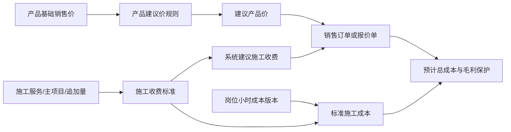

# 产品建议价与施工收费功能介绍及使用场景

- 文档类型：已交付功能说明
- 文档状态：现行版本（2026-07-17）
- 适用范围：门店销售订单、报价审批、产品建议价规则、施工收费标准、标准工时和预计成本
- 来源依据：[销售订单建议价实施计划](./sales-order-pricing-engine-implementation-plan.md)、[施工收费与成本核算实施计划](./sales-order-construction-charge-cost-implementation-plan.md)及当前 Web/API 实现
- 目标读者：店长、销售、财务、门店实施人员

> 本文说明“为什么有两个模块、分别解决什么问题”。实际点击操作请使用[操作手册](./sales-order-pricing-construction-charge-operation-manual.md)。

## 1. 一句话说明

- **产品建议价规则**解决“这个产品卖给这辆车、在这个业务条件下，建议卖多少钱”。
- **施工收费标准**解决“这单施工服务应向客户收多少施工费、标准要做多久、需要什么班组”。
- **岗位小时成本**解决“为了完成这项施工，门店内部预计要花多少人工成本”。

三者共同服务订单报价，但绝不能把对客收费当作内部成本。



## 2. 三类金额的边界

| 名称 | 面向谁 | 从哪里来 | 是否可直接修改 | 用途 |
|---|---|---|---|---|
| 产品建议价 | 客户报价 | 产品基础销售价 + 产品建议价规则 | 不可直接改；可一键采用到成交单价 | 给每个产品行提供建议单价 |
| 系统建议施工收费 | 客户报价 | 已发布施工收费标准 | 不可直接改；可一键采用 | 给订单施工服务提供建议收费 |
| 本单施工收费 | 客户报价 | 操作人本单确认的最终金额 | 可改；偏离建议须填写原因并按保护规则处理 | 实际向客户收取的施工服务费 |
| 预计材料成本 | 内部经营 | 出库/库存批次、最近入库或产品标准成本 | 不可编辑 | 预计产品材料成本 |
| 预计施工成本 | 内部经营 | 标准工时、班组、岗位小时成本、标准提成及补贴 | 不可编辑 | 预计施工人工与相关内部成本 |

**MUST：** 产品建议价和系统建议施工收费只能由服务端按已发布版本计算。\
**MUST NOT：** 用本单施工收费反推施工成本，也不得把预计成本作为普通订单字段手工填写。

## 3. 产品建议价规则

### 3.1 它做什么

产品档案中维护的是产品的基础销售价。产品建议价规则在此基础上，根据业务条件作加价、减价或比例调整，生成某一产品行的建议单价。

典型条件包括产品品牌、产品分类、施工地点、车辆价格级别、销售单位等；可选项来自系统字典、产品档案或车型级别，不需要填写内部编码。

规则只影响**产品建议价**，不维护施工项目收费、标准工时或岗位成本。页面入口为“建议价设置 → 产品建议价规则”。

### 3.2 典型使用场景

| 场景 | 建议配置 | 订单效果 |
|---|---|---|
| 高端车型使用同款膜 | 车型级别为“豪华车型”时，产品建议价加价 | 产品行建议单价上调；施工收费不自动跟随变化 |
| 指定品牌的促销 | 产品品牌为某品牌时，产品建议价优惠固定金额或比例 | 只影响该品牌产品行 |
| 到店与外出差异 | 施工地点为“外出”时，对产品建议价作调整 | 影响产品价格；外出额外工时/补贴仍应在施工标准中维护 |
| 按米销售的材料 | 销售单位为“米”时，使用专门的建议价调整 | 不影响按卷销售的同类产品 |

### 3.3 规则冲突与优先级

系统会在保存、检查和发布时校验冲突。相同规则组、相同适用条件且会同时命中的两条产品价格规则，不能通过重复配置产生两个相互矛盾的结果。

规则的比较方式会随字段类型变化：

- 产品分类、品牌、施工地点、销售单位等枚举项使用“为 / 属于”。
- 数量、年份等数值项使用“介于 / 不少于 / 不超过”。
- 不应对“车型级别 B”这类枚举项使用“不少于 B”；车型级别匹配是具体值匹配。

同一规则组按优先级择一，跨组规则按固定顺序叠加；发布后的规则版本不可原地修改，需创建新草稿版本。

## 4. 施工收费标准

### 4.1 它做什么

施工收费标准维护一项施工服务如何收费与如何施工：

1. 对客的**主项目收费**；
2. 同组第 2 个及以后产品的**每个追加项目收费**；
3. 主项目及追加项目的标准工时；
4. 标准施工班组（岗位、人数、每人标准工时）；
5. 标准提成与补贴；
6. 所引用的财务已发布岗位小时成本版本。

入口为“施工收费标准”。首页按职责拆为“施工服务项目”“岗位小时成本”“施工收费与标准工时”，避免店长和财务在同一页面维护不属于自己的数据。

### 4.2 对客施工收费与内部施工成本的关系

```text
系统建议施工收费 = 主项目收费 + 同组追加数量 × 每个追加项目收费

预计施工成本 = Σ(岗位人数 × 每人标准工时 ÷ 60 × 岗位小时成本)
             + 标准提成 + 标准补贴
```

二者可以相同，也经常不同：客户支付的是服务售价，内部成本是门店为完成服务预计投入的资源。提高施工收费不会自动提高成本；车型复杂、外出等确实增加工时或补贴时，应同时通过施工标准明确维护。

### 4.3 “主项目 + 追加量”示例

同一施工组内不应为每一个产品重复建立同样适用范围的标准。应配置一条主标准：

| 字段 | 示例：漆面保护膜施工组 |
|---|---|
| 主施工项目 | 全车漆面保护膜 |
| 主项目收费 | ¥1,800 |
| 主项目标准工时 | 240 分钟 |
| 每个追加项目收费 | ¥300 |
| 每个追加项目工时 | 30 分钟 |
| 标准班组 | 施工师傅 1 人 × 240 分钟；施工学徒 1 人 × 240 分钟 |

客户订单中这个施工组有 3 个产品时，系统按“1 个主项目 + 2 个追加项目”计算，而不是命中 3 条重复标准。只有收费真正按**单个产品数量区间**变化时，才增加下一条分段标准，且数量区间不可重叠，例如 `1–2` 与 `3–5`。

### 4.4 典型使用场景

| 场景 | 应维护的位置 | 说明 |
|---|---|---|
| 漆面保护膜到店施工 | 施工收费与标准工时 | 配主项目、追加量、班组与工时 |
| 外出施工多一名人员、增加补贴 | 施工收费与标准工时 | 为“外出”建立适用标准，明确附加工时或补贴 |
| 施工师傅小时成本调整 | 岗位小时成本 | 财务新建并发布成本版本；不要修改旧版本 |
| 新增“局部改色”服务 | 施工服务项目 → 施工收费标准 | 先建服务项目及施工组，再维护标准 |
| 客户要求特价施工 | 新建订单的本单施工收费 | 本单改价、填写原因；不改写门店标准 |

## 5. 从试算到订单的完整场景

### 场景 A：标准报价，直接采用建议

销售选择客户、车辆、产品和施工条件后，系统试算产品建议价与系统建议施工收费。销售分别点击“采用建议价”“采用建议施工收费”；若未触发保护，直接创建订单。

### 场景 B：客户议价

销售将某产品成交单价或本单施工收费改低。系统保留建议金额、记录调整原因，并按产品行、施工收费、整单总价、最低保护价和预计毛利取最严格结果：正常可下单，超阈值则转报价审批，低于硬性底线则阻止提交。

### 场景 C：多产品同组施工

订单中同一施工组有多个产品。系统只收一次主项目收费，后续项目按追加规则累加，同时增加标准工时和预计施工成本。店长不需要创建多条重复施工标准。

### 场景 D：配置未完成

如果产品缺材料成本、或者没有匹配施工标准：

- 页面明确显示“待维护材料成本”或“待维护施工标准”；
- 不显示虚假的 `¥0.00` 成本，也不会生成不存在的系统建议施工收费；
- 草稿可以保存；正式订单须补齐标准，或由店长填写本单临时预计成本并随报价审批；
- 销售只看到是否可提交/需审批，不看到内部成本金额。

## 6. 权限与版本规则

| 角色 | 可以做什么 | 不可以做什么 |
|---|---|---|
| 店长 | 维护产品建议价草稿、服务项目、施工收费/工时/班组标准；发布建议价版本；处理临时成本 | 查看个人真实工资明细；直接修改已发布版本 |
| 财务 | 维护和发布岗位小时成本版本；查看个人成本明细；审批调整并结算 | 用岗位成本直接改变客户施工收费 |
| 销售 | 发起订单、采用建议、填写成交价/本单收费、提交报价 | 维护规则、读取内部成本与毛利金额 |
| 施工人员 | 申报实际工时偏差 | 修改报价、岗位成本或已确认成本 |

**RECOMMENDED：** 新规则先发布到“观察试运行（SHADOW）”，用典型订单试算并核对后再正式启用（ACTIVE）。\
**MUST NOT：** 已发布版本不能原地修改；历史报价和正式订单使用其原始快照，不会被新规则重算。

## 7. 相关文档

- [产品建议价与施工收费操作手册](./sales-order-pricing-construction-charge-operation-manual.md)
- [建议价与价格审批实施计划](./sales-order-pricing-engine-implementation-plan.md)
- [施工收费、成本核算实施计划](./sales-order-construction-charge-cost-implementation-plan.md)
- [建议价与价格审批验收清单](../qa/sales-order-pricing-checklist.md)
- [施工收费与成本验收清单](../qa/sales-order-construction-cost-checklist.md)
