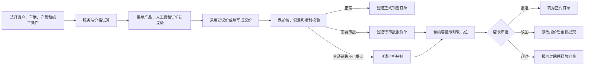

# 销售订单智能建议价与价格审批实施计划

- 文档类型：功能实施计划
- 文档状态：实施完成（首版代码、自动化验证、迁移回滚演练及本地真实浏览器业务验收均已完成）
- 适用范围：基础字典、车辆价格级别、车型映射、价格规则、订单试算、报价审批、容量软占位、毛利保护、总部模板
- 来源依据：销售订单建议价需求访谈、现有产品/订单/施工容量/库存成本实现、MallBay 文档与工程治理规范
- 目标读者：产品负责人、后端开发、前端开发、测试、门店实施人员

## 文档规范符合性

MUST：

- 本文只描述尚未完成的建设任务，不将计划能力描述为已上线。
- 每项任务必须可以独立提交、验证和回滚。
- 所有建议价格必须由服务端计算，Web 端不得成为权威价格来源。
- 规则、报价和正式订单必须保留计算版本及历史快照。
- 修改本文时必须同步检查 [文档索引](../README.md) 和根 [README](../../README.md)。

MUST NOT：

- 不允许在 Web 端继续维护写死的价格公式。
- 不允许将价格、系数、保护价或审批阈值塞入通用基础字典。
- 不允许已发布规则被原地修改。
- 不允许规则更新后自动改写历史报价或正式订单。
- 不允许待价格审批报价单提前锁库存、产生应收、佣金或正式订单号。

## 1. 建设目标

系统必须同时产生三类建议价格：

1. 每个产品行的建议单价与建议小计。
2. 订单建议人工费。
3. 建议订单总价。

用户可以一键采用建议价，也可以填写成交价。建议价必须只读；成交价偏离建议价后，系统按产品行、人工费、订单总价和预计毛利四个层级执行保护与审批。

建设完成后的主流程：



## 2. 当前实现基线

当前实现中：

- `Product.basePriceCents` 已存在，但产品选择后直接作为订单成交单价。
- [新建订单页面](../../apps/web/app/orders/create/page.tsx)允许直接编辑产品单价和人工费。
- [create-order-form.ts](../../apps/web/src/features/orders/create-order-form.ts)中存在基于施工类型、施工地点和车型关键词的前端写死人工费逻辑。
- `OrderAmount` 已增加价格计算 ID、规则版本、输入哈希和输出快照字段；前端旧订单仍可走兼容路径。
- [CreateOrderUseCase](../../apps/api/src/orders/use-cases/create-order.use-case.ts)在提交 `pricingCalculationId` 时会调用服务端快照复核，未接入快照的旧订单仍保持兼容。
- [Dictionary](../../apps/api/prisma/schema.prisma) 已进入旧 `items: Json` 与 `DictionaryItem` 双读迁移期，前端仍需切换到稳定条目编码。
- `CustomerVehicle` 已增加可空车辆价格级别字段；车型映射支持年份范围、默认级别、冲突校验和未识别车型关键词建议，建议仍需人工确认。
- `DailyCapacity` 已增加 `CapacityReservation` 明细和报价占位服务；容量页面和报表已区分报价 `HELD` 与正式订单 `CONFIRMED`。
- 当前库存和采购成本已通过统一成本估算服务接入报价保护，支持库存批次加权、最近采购、标准成本和卷/米/平方米换算。

本轮已落地：

- `apps/api/src/pricing/pricing.service.ts`：试算前从门店产品主数据重建品牌、型号、单位和基础销售价，前端提交值不再作为价格权威。
- `apps/api/src/pricing/domain/shadow-comparison.ts` 与 `apps/web/app/orders/pricing/simulator/page.tsx`：记录影子模式新旧差异并提供结构化试算明细。
- `apps/api/src/pricing/domain/unit-conversion.ts`：支持卷、米、平方米之间的成本换算。
- 订单与报价产品数量已使用 `DECIMAL(12,3)`，与产品数量精度和库存单位换算保持一致；服务端价格引擎、DTO 和报价转单均接受小数数量并按产品精度校验。
- `apps/api/src/pricing/domain/money.ts` 统一处理小数数量乘单价的半入舍入，建议价、报价、订单和审批比较均只使用整数分。
- 规则保护策略中的 `baseLaborCostCentsByConstruction` 由门店工作区维护，已发布规则场景不再信任前端人工费基准。
- `apps/api/src/settings/dictionaries.service.ts`：固定字典禁止新增、删除和停用系统项；业务字典提供可审计默认项。
- `apps/web/app/construction/capacities/page.tsx`：容量日历和导出报表显示报价软占位与正式预约的来源拆分。
- `apps/api/src/pricing/domain/pricing-engine.ts`：纯服务端确定性价格计算、规则固定顺序、同组择一、跨组叠加、整数分/基点调整、输入哈希和可解释计算步骤。
- `apps/api/src/pricing/domain/pricing-engine.ts`：产品行、人工费、整单总价和预计毛利的最严格保护判定，支持普通阈值、审批上限、最低保护价和毛利硬底线。
- `apps/api/src/pricing/pricing.controller.ts`：增加受门店权限保护的 `POST /pricing/calculate` 模拟试算入口；该入口明确返回 `SIMULATION`，在规则持久化和订单快照接入完成前不得直接作为正式订单价格来源。
- `apps/api/src/pricing/vehicle-pricing.service.ts`：增加车辆价格级别、车型关键词映射、年份范围、默认级别和本单手动级别修正接口。
- `apps/api/src/pricing/pricing-rules.service.ts`：增加规则集草稿创建、列表、发布和发布版本消费接口；发布会退役旧版本，历史版本不原地修改。
- `apps/api/src/orders/use-cases/create-order.use-case.ts`：正式订单可携带价格试算快照，服务端复核快照中的产品行、成交价和人工费；超出审批范围时拒绝直接建单。
- `apps/web/app/orders/create/page.tsx`：新建订单有已发布规则时自动调用服务端试算，显示逐产品建议价和“采用建议价”操作，并提交价格计算快照 ID。
- `apps/api/src/sales-quotes/`：增加超出普通阈值时的报价单创建、待审批列表、店长批准和驳回接口；报价单及审批记录保留产品快照和有效期。
- `apps/api/src/construction/capacity-reservation.service.ts`：报价提交时创建限时容量占位，批准转确认，驳回/过期释放预约计数。
- `apps/api/src/settings/dictionaries.service.ts`：字典接口开始双读旧 `items` 与稳定编码 `dictionaryItems`，首次读取/写入时自动补齐条目编码。
- `apps/web/app/orders/pricing/page.tsx`：增加店长可见的规则版本工作区，支持创建保护策略/单条结构化规则草稿、查看版本和发布草稿。
- `apps/web/app/orders/quotes/page.tsx`：增加报价审批工作区，支持门店范围列表、批准、驳回和批准后转正式订单。
- `apps/web/src/features/workbench/management-menu.tsx`：将“建议价规则”和“报价审批”加入角色菜单与路由高亮。
- `apps/api/prisma/migrations/20260715180000_pricing_engine_foundation/migration.sql`：新增价格引擎基础表及车辆价格级别字段。
- `apps/api/src/sales-quotes/sales-quote-expiry.scheduler.ts`：定时过期待审批报价、释放容量并触发每日容量对账。
- `apps/api/src/pricing/pricing-template.service.ts` 与 `apps/web/app/admin/pricing-templates/page.tsx`：总部模板发布、门店复制和来源版本追溯。
- `apps/api/src/pricing/pricing-rollout.service.ts`：门店 `LEGACY/SHADOW/ACTIVE` 灰度模式配置。
- `apps/api/src/observability/audit-log.service.ts` 与 `persist-audit-event.ts`：规则、报价、容量、模板和灰度变更统一输出结构化日志并持久化到 `AuditEvent`，保留操作者、门店、目标对象和业务元数据。
- `apps/api/src/pricing/cost-estimator.service.ts`：库存加权、最近入库、标准成本和缺失成本的服务端估算。
- `apps/api/src/pricing/domain/pricing-engine.test.ts`：覆盖固定顺序、条件匹配、确定性、审批、阻断和毛利保护。

## 3. 已确认业务决策

MUST：

- 建议价由“建议产品价 + 建议人工费”组成并汇总为建议订单总价。
- 车辆因素采用“车型自动匹配 + 本单允许修正”。
- 规则采用结构化配置，不开放任意代码或自由公式。
- 普通销售改价受偏差阈值、最低保护价、预计毛利和审批控制。
- 多产品人工费默认采用“最高基础人工费 + 其他项目追加人工费”。
- 草稿可以选择沿用原规则或使用最新规则重算；正式订单永久冻结价格快照。
- 规则固定计算顺序，同组择一、跨组叠加。
- 第一期条件仅包括产品、单位/数量、车辆级别、施工类型、施工地点、多产品组合和生效时间。
- 门店规则独立生效；总部模板只用于复制，不自动覆盖门店规则。
- 超出阈值先生成报价单，批准后再转正式订单。
- 报价审批期间只占用预约容量，不锁库存。
- 报价容量采用可配置的限时软占位。
- 产品行、人工费、整单价格和毛利同时校验，采用最严格结果。
- `Product.basePriceCents` 定义为门店标准销售基础价，不代表采购成本。

## 4. 基础字典与业务配置边界

总原则：基础字典定义“是什么”，价格规则定义“多少钱、怎么算”。

### 4.1 系统固定字典

以下编码与 Prisma 枚举或服务端执行逻辑绑定。门店只允许配置显示名称、排序或启停，不允许新增未知编码：

| 字典 | 示例编码 |
|---|---|
| 产品类别 | `PPF`、`COLOR_FILM`、`HEAT_FILM`、`MODIFICATION` |
| 产品单位 | `ROLL`、`METER`、`SQUARE_METER`、`PIECE` |
| 施工类型 | `PPF`、`COLOR_FILM`、`HEAT_FILM`、`MODIFICATION`、`INSPECTION` |
| 施工地点 | `IN_STORE`、`OUTSIDE` |
| 价格调整方式 | `ADD_CENTS`、`SUBTRACT_CENTS`、`MULTIPLY_BPS`、`DISCOUNT_BPS` |
| 规则组 | `PRODUCT`、`VEHICLE`、`CONSTRUCTION`、`SURCHARGE`、`BUNDLE` |
| 条件运算符 | `EQ`、`IN`、`BETWEEN`、`GTE`、`LTE` |
| 车辆级别来源 | `AUTO`、`MANUAL` |

### 4.2 门店可扩展字典

门店店长可以维护：

- `PRICE_ADJUSTMENT_REASON`：客户议价、活动优惠、竞品价格、特殊车型、店长特批、其他。
- `QUOTE_REJECTION_REASON`：保护价过低、毛利不足、理由不充分、信息不完整、其他。
- `PRICING_RULE_TAG`：用于规则检索和归类。
- `CAPACITY_HOLD_RELEASE_REASON`：审批驳回、销售撤回、超时、预约变更、其他。

### 4.3 必须使用独立业务模型的内容

以下内容 MUST NOT 使用通用字典：

- 车辆价格级别与车型映射。
- 产品基础销售价和产品标准成本。
- 产品、车辆和施工价格系数。
- 基础人工费、追加人工费和店外附加费。
- 多产品组合套餐。
- 最低保护价、改价阈值和毛利底线。
- 价格规则版本、发布、回滚和总部模板。
- 报价、审批、容量占位及计算快照。

## 5. 目标模块划分

### 5.1 API 模块

新增：

```text
apps/api/src/pricing/
  pricing.module.ts
  pricing.controller.ts
  pricing.service.ts
  vehicle-pricing.service.ts
  pricing-rules.service.ts
  pricing-templates.service.ts
  dto/
  domain/
    pricing-engine.ts
    rule-resolver.ts
    rule-conflict-validator.ts
    multi-product-labor.ts
    price-guard.ts
    cost-estimator.ts
    money.ts

apps/api/src/sales-quotes/
  sales-quotes.module.ts
  sales-quotes.controller.ts
  sales-quotes.service.ts
  pricing-approval.service.ts
  quote-conversion.service.ts
  dto/
```

修改：

- `apps/api/src/settings/`：基础字典规范化。
- `apps/api/src/orders/`：正式订单创建必须消费有效价格计算结果或已批准报价。
- `apps/api/src/construction/`：容量预约与软占位。
- `apps/api/src/inventory/`：报价成本估算数据源。
- `apps/api/src/common/policies/permission.policy.ts`：价格权限。
- `apps/api/src/app.module.ts`：注册新模块。

### 5.2 Web 模块

新增：

```text
apps/web/src/features/pricing/
  api.ts
  display.ts
  rule-builder.ts
  calculation.ts
  permissions.ts
  *.test.ts

apps/web/src/features/sales-quotes/
  api.ts
  display.ts
  workflow.ts
  *.test.ts

apps/web/app/orders/pricing/page.tsx
apps/web/app/orders/pricing/rule-sets/[id]/page.tsx
apps/web/app/orders/pricing/simulator/page.tsx
apps/web/app/orders/quotes/page.tsx
apps/web/app/orders/quotes/[id]/page.tsx
```

修改：

- `apps/web/app/orders/page.tsx`：增加价格规则和报价审批入口。
- `apps/web/app/orders/create/page.tsx`：接入服务端试算。
- `apps/web/app/orders/[id]/page.tsx`：展示价格快照和计算明细。
- `apps/web/src/features/workbench/management-menu.tsx`：必要时增加报价审批菜单或保持为销售订单子入口。
- `apps/web/app/settings/page.tsx`：升级基础字典编辑器。

## 6. 目标数据模型

### 6.1 字典

新增 `DictionaryItem`，并给 `Dictionary` 增加 `mode`：

```text
DictionaryItem
- id
- dictionaryId
- code
- name
- description?
- sortOrder
- status
- isSystem
- metadata?
- createdAt / updatedAt
```

迁移期间 API 同时返回旧 `items: string[]` 和新 `dictionaryItems`。前端全部切换后再停止旧格式写入。

### 6.2 车辆级别与映射

```text
VehiclePriceClass
- id
- storeId
- code
- name
- description?
- sortOrder
- isDefault
- status

VehicleModelMapping
- id
- storeId
- brand?
- modelKeyword
- yearFrom?
- yearTo?
- vehiclePriceClassId
- priority
- status
```

`CustomerVehicle` 增加可空的 `vehiclePriceClassId`。正式报价必须同时保存车辆级别编码、名称和匹配来源快照。

### 6.3 价格规则

```text
PricingRuleSet
- id
- storeId
- version
- status: DRAFT / PUBLISHED / RETIRED
- effectiveFrom
- effectiveTo?
- createdById
- publishedById?
- publishedAt?
- sourceTemplateVersionId?

PricingRule
- id
- ruleSetId
- group
- target
- name
- conditions Json
- actionType
- actionValue
- priority
- enabled
- sortOrder

PricingProtectionPolicy
- ruleSetId
- normalDeviationBps
- approvalDeviationBps
- minimumMarginBps
- softHoldHours
- allowSpecialApproval
- internalLaborCostConfig Json
```

MUST 使用整数分和基点，禁止数据库和 API 使用浮点货币。

### 6.4 价格计算快照

```text
PricingCalculation
- id
- storeId
- ruleSetId
- ruleSetVersion
- inputHash
- inputSnapshot Json
- outputSnapshot Json
- appliedRules Json
- decision
- createdById
- createdAt
- expiresAt
```

同一版本、同一输入必须产生相同结果。`inputHash` 用于发现前端提交后输入已经变化的情况，不用于替代权限和业务校验。

### 6.5 报价与审批

```text
SalesQuote
- id
- storeId
- quoteNo
- customerId
- vehicleId?
- salesPersonId
- pricingCalculationId
- status
- vehicleClassSnapshot Json
- suggestedProductAmountCents
- suggestedLaborCostCents
- suggestedTotalCents
- finalProductAmountCents
- finalLaborCostCents
- finalTotalCents
- estimatedCostCents
- estimatedMarginBps
- adjustmentReasonCode?
- adjustmentReasonText?
- validUntil
- approvedAt?
- convertedOrderId?
- createdAt / updatedAt

SalesQuoteItem
- quoteId
- productId
- productSnapshot Json
- quantity
- salesUnit
- basePriceCents
- suggestedUnitPriceCents
- finalUnitPriceCents
- suggestedAmountCents
- finalAmountCents
- minimumPriceCents
- calculationSnapshot Json

PricingApproval
- quoteId
- status
- approvalType
- submittedById
- reviewedById?
- reviewNote?
- submittedAt
- reviewedAt?
```

报价转订单必须建立数据库唯一约束，确保一个报价最多生成一张正式订单。

### 6.6 容量预约

```text
CapacityReservation
- id
- storeId
- date
- constructionLocation
- constructionType
- sourceType: QUOTE / ORDER
- quoteId?
- orderId?
- status: HELD / CONFIRMED / RELEASED / EXPIRED
- expiresAt?
- releasedReasonCode?
- createdAt / updatedAt
```

第一阶段继续同步维护 `DailyCapacity.*Reserved`，但每次计数变化必须有对应的 `CapacityReservation` 明细。

## 7. 权威价格计算规则

固定执行顺序：

1. 读取产品标准销售基础价。
2. 应用产品类别、品牌或型号规则。
3. 应用车辆价格级别规则。
4. 应用施工类型和施工地点规则。
5. 应用固定附加费。
6. 计算主项目基础人工费和其他项目追加人工费。
7. 应用多产品组合优惠。
8. 估算材料和内部人工成本。
9. 校验产品行、人工费、整单偏差和预计毛利。
10. 返回 `DIRECT`、`APPROVAL_REQUIRED` 或 `BLOCKED`。

规则选择：

- 不同规则组按固定顺序叠加。
- 同一规则组只选择适用范围最精确的规则。
- 精确度相同时使用优先级最高的规则。
- 优先级相同时使用当前版本中排序最前的规则。
- 发布前必须拒绝无法确定唯一结果的规则冲突。

舍入规则 MUST 在 `money.ts` 中集中实现，并在每个规则组结束时按整数分执行半入舍入。

## 8. API 契约

### 8.1 价格试算

```text
POST /pricing/calculate
```

输入只包含业务事实：门店、车辆、本单车辆级别修正、产品和数量、施工条件、预约时间。前端不得提交基础价、保护价、规则结果或毛利结论作为可信输入。

返回：

```text
calculationId
ruleSetId / ruleSetVersion
resolvedVehicleClass
productLines[]
suggestedProductAmountCents
suggestedLaborCostCents
suggestedTotalCents
estimatedCostCents
estimatedMarginBps
decision
appliedRules[]
calculationSteps[]
warnings[]
expiresAt
```

### 8.2 规则维护

```text
GET    /pricing/rule-sets
POST   /pricing/rule-sets
GET    /pricing/rule-sets/:id
PATCH  /pricing/rule-sets/:id
POST   /pricing/rule-sets/:id/validate
POST   /pricing/rule-sets/:id/simulate
POST   /pricing/rule-sets/:id/publish
POST   /pricing/rule-sets/:id/retire
POST   /pricing/rule-sets/:id/copy
```

已发布版本的 `PATCH` 必须返回冲突错误。

### 8.3 车辆维护

```text
GET    /pricing/vehicle-classes
POST   /pricing/vehicle-classes
PATCH  /pricing/vehicle-classes/:id
GET    /pricing/vehicle-model-mappings
POST   /pricing/vehicle-model-mappings
POST   /pricing/vehicle-model-mappings/import
PATCH  /pricing/vehicle-model-mappings/:id
```

### 8.4 报价审批

```text
GET  /sales-quotes
POST /sales-quotes
GET  /sales-quotes/:id
POST /sales-quotes/:id/submit
POST /sales-quotes/:id/withdraw
POST /sales-quotes/:id/approve
POST /sales-quotes/:id/reject
POST /sales-quotes/:id/recalculate
POST /sales-quotes/:id/convert-to-order
```

写接口 MUST 支持幂等键或数据库唯一约束，防止重复提交、重复审批和重复转订单。

## 9. 权限矩阵

| 操作 | 店长 | 销售 | 客服 | 财务 | 平台管理员 |
|---|---:|---:|---:|---:|---:|
| 查看当前规则摘要 | 是 | 是 | 是 | 只读 | 是 |
| 编辑、试算、发布门店规则 | 是 | 否 | 否 | 否 | 是 |
| 维护车辆级别和车型映射 | 是 | 建议回填 | 建议回填 | 否 | 是 |
| 计算建议价 | 是 | 是 | 是 | 只读 | 是 |
| 修改成交价 | 是 | 是 | 是 | 否 | 是 |
| 提交价格审批 | 是 | 是 | 是 | 否 | 是 |
| 审批普通改价 | 是 | 否 | 否 | 否 | 是 |
| 执行特殊保护价特批 | 按策略 | 否 | 否 | 否 | 是 |
| 查看预计成本和毛利 | 是 | 只看是否达标 | 只看是否达标 | 是 | 是 |
| 维护总部模板 | 否 | 否 | 否 | 否 | 是 |

在 `PermissionPolicy` 中新增明确方法，页面隐藏不能替代服务端鉴权。

## 10. Web 交互要求

### 10.1 销售订单列表

顶部增加：

- 店长可见的“价格规则”。
- 订单创建角色可见的“报价单”。
- 店长可见的“待价格审批”数量提醒。

### 10.2 价格规则工作区

页面区块：

1. 规则版本。
2. 基础字典。
3. 车辆级别与车型映射。
4. 产品规则。
5. 人工费规则。
6. 组合套餐。
7. 保护与审批策略。
8. 价格试算。
9. 发布和回滚记录。

规则编辑器 MUST 使用结构化条件和动作控件，不允许自由文本代码。

### 10.3 新建订单

产品行新增：

- 基础销售价。
- 建议单价，只读。
- 成交单价，可修改。
- “采用建议价”。
- “查看计算明细”。

人工费区域新增：

- 建议人工费，只读。
- 成交人工费，可修改。
- “采用建议价”。
- 计算明细。

订单汇总新增建议总价、成交总价、偏差、毛利状态和审批判断。

用户手动修改成交价后，重新试算 MUST NOT 自动覆盖成交价。页面只更新建议价并显示“建议价已变化，请重新确认”。

## 11. 实施任务

### Task 0：建立价格域回归基线

**优先级：P0**

**文件：**

- Create: `apps/api/src/pricing/domain/pricing-baseline.test.ts`
- Modify: `apps/web/src/features/orders/create-order-page.test.ts`
- Modify: `apps/web/src/features/orders/create-order-form.test.ts`

**步骤：**

- [x] 固化当前产品基础价、人工费、订单总额和容量预约行为。
- [x] 增加回归测试覆盖兼容人工费计算，并保留其仅作为无规则时的兜底。
- [x] 记录当前创建订单请求结构，后续作为兼容迁移依据。

**验证：**

```powershell
pnpm --filter @mallbay/api test
pnpm --filter @mallbay/web test
```

**回滚：** 仅增加测试，不修改生产行为。

**建议提交：** `test: capture pricing workflow baseline`

### Task 1：规范化基础字典

**优先级：P0；依赖：Task 0**

**文件：**

- Modify: `apps/api/prisma/schema.prisma`
- Create: `apps/api/prisma/migrations/<timestamp>_normalize_dictionary_items/migration.sql`
- Modify: `apps/api/src/settings/dictionaries.service.ts`
- Modify: `apps/api/src/settings/dto/dictionary.dto.ts`
- Modify: `apps/web/src/features/settings/api.ts`
- Modify: `apps/web/app/settings/page.tsx`
- Add/Modify corresponding tests

**步骤：**

- [x] 新增 `DictionaryItem` 和字典模式。
- [x] 将现有字符串数组在读写时迁移为稳定编码条目。
- [x] 添加价格改价、报价驳回、规则标签和容量释放原因字典。
- [x] 保持旧 API 读取兼容。
- [x] 限制系统固定字典新增和删除编码。

**验证：**

```powershell
pnpm --filter @mallbay/api test
pnpm --filter @mallbay/web test
pnpm --filter @mallbay/api typecheck
pnpm --filter @mallbay/web typecheck
```

**回滚：** 保留旧 JSON 字段和双读逻辑；新表可停止写入而不影响旧页面。

**建议提交：** `feat: normalize store dictionaries`

### Task 2：车辆价格级别与车型映射

**优先级：P0；依赖：Task 1**

**文件：**

- Modify: `apps/api/prisma/schema.prisma`
- Create: pricing vehicle services, DTOs and tests
- Modify: customer vehicle DTO/service，仅用于可选的车辆价格级别关联
- Create: Web vehicle class and mapping components/tests

**步骤：**

- [x] 新增车辆级别和车型映射模型。
- [x] 实现关键词、年份范围和默认级别匹配。
- [x] 实现映射冲突检测和批量导入。
- [x] 支持车辆自动匹配、本单车辆级别修正，并由服务端按车辆归属、门店映射和默认级别解析；修正值进入价格输入快照。
- [x] 提供未识别车型待归类列表。

**验证重点：** 同门店隔离、优先级、年份范围、默认级别、本单修正不污染主数据。

**回滚：** 新字段保持可空；未启用价格引擎时不参与订单创建。

**建议提交：** `feat: add vehicle pricing classification`

### Task 3：规则版本与价格计算引擎

**优先级：P0；依赖：Task 2**

**文件：**

- Modify: Prisma schema and migration
- Create: `apps/api/src/pricing/**`
- Modify: `apps/api/src/app.module.ts`
- Modify: `apps/api/src/common/policies/permission.policy.ts`

**步骤：**

- [x] 新增规则集、规则、保护策略和计算快照模型及迁移。
- [x] 实现金额和基点工具。
- [x] 实现固定计算管道。
- [x] 实现同组规则选择和完整规则语义冲突校验。
- [x] 实现多产品人工费聚合（最高基础人工费 + 其他项目追加人工费）。
- [x] 实现产品行、人工费和整单保护判断。
- [x] 实现 `POST /pricing/calculate` 模拟试算入口。
- [x] 服务端返回可解释计算步骤。

**验证重点：** 确定性、舍入、规则冲突、组合优惠、越权门店、失效版本。

**回滚：** 价格模块先以影子模式运行；订单仍可继续旧逻辑。

**建议提交：** `feat: add versioned pricing engine`

### Task 4：价格规则维护、试算和发布

**优先级：P1；依赖：Task 3**

**文件：**

- Create: pricing Web feature and routes
- Modify: `apps/web/app/orders/page.tsx`
- Modify: `apps/web/app/globals.css`
- Add page/API/display tests

**步骤：**

- [x] 增加服务端价格规则入口和门店权限控制。
- [x] 实现服务端规则版本列表和草稿创建。
- [x] 实现完整结构化规则编辑器。
- [x] 工作区支持保护策略、结构化多规则草稿创建和版本发布。
- [x] 通过统一结构化条件/动作模型实现车辆、产品、施工和套餐规则维护。
- [x] 提供服务端试算明细接口和应用规则步骤；前端明细面板仍列入后续体验优化。
- [x] 发布前执行基础冲突、保护策略完整性和规则版本状态检查。
- [x] 支持生效时间、停用、复制生成新版本；历史版本不原地修改。

**验证重点：** 销售不可编辑；已发布版本不可修改；回滚生成新发布行为而不改历史版本。

**回滚：** 隐藏入口并保持规则为草稿，不影响订单流程。

**建议提交：** `feat: add pricing rule workspace`

### Task 5：新建订单接入建议价

**优先级：P0；依赖：Task 3，可与 Task 4 后半段并行**

**文件：**

- Modify: `apps/web/app/orders/create/page.tsx`
- Modify: `apps/web/src/features/orders/create-order-form.ts`
- Modify: `apps/web/src/features/orders/api.ts`
- Modify: `apps/api/src/orders/dto/create-order.dto.ts`
- Modify: `apps/api/src/orders/use-cases/create-order.use-case.ts`
- Modify/Add tests

**步骤：**

- [x] 服务端正式订单支持校验已持久化价格试算快照。
- [x] 已移除已发布规则场景下前端写死逻辑的权威性；无规则时仅保留兼容兜底。
- [x] 产品或施工条件变化时请求服务端试算。
- [x] 建议产品价、人工费和建议总价改为只读。
- [x] 成交价保留手工输入和逐行一键采用建议价。
- [x] 手工成交价不会被后续试算覆盖，并保留调整原因。
- [x] 创建订单时提交 `pricingCalculationId` 和成交价。
- [x] 服务端复核计算输入、版本、价格和决策。
- [x] 订单详情展示价格计算快照摘要。

**验证重点：** 防篡改、建议价变化提醒、草稿恢复、多个产品、单位变化、网络失败降级。

**回滚：** 门店运行模式切回 `LEGACY`；旧 DTO 保留一个迁移版本。

**建议提交：** `feat: integrate suggested pricing into orders`

### Task 6：报价单和价格审批

**优先级：P0；依赖：Task 5**

**文件：**

- Modify: Prisma schema and migration
- Create: `apps/api/src/sales-quotes/**`
- Create: `apps/web/src/features/sales-quotes/**`
- Create: quote list/detail routes
- Modify: order list badges and navigation

**步骤：**

- [x] 创建报价和报价明细快照。
- [x] 超出普通阈值时创建待审批报价单。
- [x] 实现报价单列表、批准和驳回接口。
- [x] 增加报价审批 Web 工作区及角色菜单入口。
- [x] 实现报价批准后转正式订单，并复用价格计算快照和容量占位。
- [x] 已补充报价撤回、重算、过期和并发状态保护的服务层回归。
- [x] 实现逐项、整单和毛利最严格判断。
- [x] 实现销售只能查看本人报价，店长查看全门店。
- [x] 转订单复用报价快照并重新检查报价状态和有效期。
- [x] 通过报价转单状态条件更新和唯一关联字段防止重复转订单。

**验证重点：** 重复提交、重复审批、驳回重提、过期报价、已发布规则变化、并发转订单。

**回滚：** 停止创建新报价；已存在报价保持只读和可撤回。

**建议提交：** `feat: add sales quote pricing approval`

### Task 7：容量软占位

**优先级：P1；依赖：Task 6**

**文件：**

- Modify: Prisma schema and migration
- Modify: construction capacity service/controller/tests
- Modify: order create use case
- Modify: quote approval service
- Modify: capacity Web display

**步骤：**

- [x] 新增容量预约明细。
- [x] 报价提交审批时创建限时 `HELD`。
- [x] 报价批准转订单时转为 `CONFIRMED`。
- [x] 驳回、撤回、过期释放服务、定时任务和每日对账接口已实现。
- [x] 增加定时过期任务和每日对账/修正接口。
- [x] 容量接口返回来源、状态和关联报价/订单，前端可区分正式预约与价格审批占位。
- [x] 直接新建正式订单也创建 ORDER/CONFIRMED 预约明细，容量更新使用条件更新避免并发超卖。

**验证重点：** 事务一致性、并发容量、重复释放、过期任务幂等、计数对账。

**回滚：** 禁用软占位创建；保留已有明细并由对账任务释放。

**建议提交：** `feat: add quote capacity holds`

### Task 8：成本估算和毛利保护

**优先级：P1；依赖：Task 3、Task 6**

**文件：**

- Modify: Product schema/DTO/service for optional standard cost
- Modify/Create: inventory cost query service
- Create: `pricing/domain/cost-estimator.ts`
- Modify: pricing protection and quote UI

**成本优先级：**

1. 可用库存批次加权平均成本。
2. 最近采购入库成本。
3. 产品标准成本。
4. 缺失时标记为需要审批。

内部人工成本必须与销售人工费分开维护。

**实现状态：**

- [x] 实现库存批次加权平均、最近入库、产品标准成本和缺失成本的服务端估算顺序。
- [x] 将成本快照写入价格试算/报价输出，库存后续变化不会改写历史判断。
- [x] 将产品、人工费、整单和预计毛利底线纳入统一最严格审批判断。
- [x] 成本缺失、负毛利和低于保护线的结果进入阻止或报价审批，不按零成本放行。

**验证重点：** 单位换算、零库存、无成本、负毛利、成本权限、成本快照不随库存变化。

**回滚：** 毛利保护切换为仅告警，不阻止报价提交。

**建议提交：** `feat: enforce pricing margin protection`

### Task 9：总部模板与门店复制

**优先级：P2；依赖：Task 4**

**文件：**

- Modify: Prisma schema and migration
- Create: pricing template service/controller/tests
- Create: admin template Web routes
- Modify: store pricing workspace

**步骤：**

- [x] 新增总部模板和模板版本模型及服务。
- [x] 管理员可创建、发布模板。
- [x] 店长可将总部模板复制为本门店独立草稿。
- [x] 模板复制为独立规则，后续模板更新不会自动覆盖门店版本。
- [x] 门店规则保留来源模板版本。

**验证重点：** 总部与门店权限隔离、跨门店数据隔离、模板复制后的独立编辑、模板升级提醒、来源版本追溯。

**回滚：** 停用模板入口，不影响门店已复制规则。

**建议提交：** `feat: add pricing rule templates`

### Task 10：历史迁移和影子运行

**优先级：P0；依赖：Task 3、Task 5**

**步骤：**

- [x] 将现有产品基础价保留为标准销售基础价；成本估算另使用 `standardCostCents`。
- [x] 无价格计算快照的历史订单由订单列表、详情和导出统一标记为 `LEGACY`，不触发重算。
- [x] 提供店长生成默认规则草稿接口和工作区入口，默认草稿不会自动发布。
- [x] 未识别车型接口返回关键词建议映射，只有人工导入/创建后才进入正式映射。
- [x] 增加 `LEGACY / SHADOW / ACTIVE` 门店运行模式及切换接口。
- [x] 影子模式持久化旧逻辑与新建议价差异，正式订单仍不消费影子计算快照。

**影子指标：**

- 车型未匹配率。
- 建议价差异分布。
- 成本缺失率。
- 规则冲突数。
- 审批触发比例。
- 容量占位释放准确率。

**验证重点：** 历史订单不可重算、影子结果不影响成交与财务、门店模式切换可审计、待确认映射不进入正式计算。

**回滚：** 切回 `LEGACY`，不删除影子计算数据。

**建议提交：** `feat: add pricing rollout modes`

### Task 11：完整回归和业务验收

**优先级：P0；依赖：全部前置任务**

**文件：**

- Create: `docs/qa/sales-order-pricing-checklist.md`
- Create/Modify: API flow tests
- Modify: 本实施计划交付状态

**自动验证：**

```powershell
pnpm --filter @mallbay/api test
pnpm --filter @mallbay/api test:flow
pnpm --filter @mallbay/web test
pnpm typecheck
pnpm build
pnpm --filter @mallbay/api db:preflight
```

**数据库演练：**

```powershell
pnpm --filter @mallbay/api exec prisma migrate deploy --schema prisma/schema.prisma
pnpm --filter @mallbay/api db:preflight
```

MUST 使用包含历史产品、订单、车辆、容量和库存批次的临时数据库进行迁移演练。

**回滚：** 验收未通过时保持或切回 `LEGACY`；撤销功能入口，不删除规则版本、报价、审批、计算快照及审计记录。

**建议提交：** `test: verify sales order pricing workflow`

## 12. 分阶段交付里程碑

### 里程碑 A：价格基础能力

包含 Task 0～3。

完成条件：服务端可以针对稳定业务输入产生确定、可解释的建议价，但不影响真实订单。

### 里程碑 B：门店维护与订单试算

包含 Task 4～5。

完成条件：店长可以发布规则，新建订单可以显示只读建议价并填写成交价。

### 里程碑 C：报价审批闭环

包含 Task 6～8。

完成条件：异常价格进入报价审批，批准后转订单，软占位和毛利保护生效。

### 里程碑 D：模板、灰度与正式上线

包含 Task 9～11。

完成条件：单门店影子运行通过，完成迁移演练、业务验收和回滚演练后逐店启用。

### 历史验证记录

此前阶段曾完成 API/Web 类型检查、构建和 275 项 API 回归；由于本轮新增报价生命周期、模板、灰度和容量对账代码，以下最新记录只采用本轮实际重新执行的结果。

### 最新验证记录（2026-07-16）

- 修改文件语法转译：通过（API/Web 修改文件使用项目 TypeScript 编译器逐文件转译，未发现语法诊断）。
- 本轮运行级领域校验：通过（价格引擎可计算 1.5 位小数数量；产品行缺失时返回 BLOCKED，且同时产生行数、缺失行和总价校验）。
- 工作区差异校验：通过（git diff --check）。
- 完整 API 类型检查：通过（`pnpm --filter @mallbay/api typecheck`）。
- 完整 Web 类型检查：通过（`pnpm --filter @mallbay/web typecheck`）。
- API 单元回归：295 项通过；覆盖订单、容量、价格引擎、报价、产品、库存、权限、审计持久化和既有业务模块；新增覆盖当前已发布规则自动匹配、已审批报价转单和重复转单幂等。
- Web 回归：581 项通过，新增草稿价格快照保留与恢复选择覆盖。
- API 生产构建：通过（`pnpm --filter @mallbay/api build`）。
- Web 生产构建：通过（`pnpm --filter @mallbay/web build`），新规则、报价、车辆和订单路由均成功生成。
- 本地生产服务路由探测：通过（/auth、/orders/create、/orders/pricing、/orders/quotes 返回 200 且无框架错误；未登录访问 /admin/pricing-templates 正确回到 /auth）。
- Prisma Client 生成和 schema 校验：通过（`prisma generate`、`prisma validate`）。
- 数据库迁移演练：通过（临时 Docker PostgreSQL 执行 `prisma migrate deploy`，5 个新增迁移全部应用；`prisma migrate status` 显示 schema up to date；`db:preflight` 通过；API flow 6 项通过）。
- 审计回归：通过（规则发布/停用/复制、报价提交/审批/撤回/重算/转单、容量占位/确认/释放/对账、模板发布/复制和灰度切换均同时写入结构化日志与 `AuditEvent`；窄 Prisma mock 兼容测试通过）。
- 迁移回滚演练：通过（从开发库备份恢复到临时库 `mallbay_rehearsal_20260716`，故意失败 Prisma 迁移进入待恢复状态；清理部分副作用后执行 `prisma migrate resolve --rolled-back`，修复迁移重新 deploy 成功并显示 schema up to date；临时门店可切回 `LEGACY`；演练库已销毁）。
- 本地认证 API 业务流：通过。店长发布 v2 结构化规则后，服务端自动读取产品主数据并计算 `5 米 × ¥1100 + ¥1800 人工费 = ¥7300`；成交价分别验证 `NORMAL / APPROVAL_REQUIRED / BLOCKED`；待审批报价经店长批准后成功转正式订单，重复转换返回同一订单。
- 浏览器级业务验收：通过。真实登录后验证规则版本与运行模式、服务端试算和计算步骤、报价审批列表、已转订单、正式订单 v2 冻结快照、新建订单单位展示、自动建议价、一键采用及成交价手动修正；浏览器控制台无 warning/error。
- 浏览器验收发现并修复三项运行缺陷：审批通过报价转单不再重复进入审批；重复转单优先返回既有订单；未指定规则集 ID 时自动消费当前生效的已发布版本并返回实际规则集 ID。

迁移演练使用本地 Docker PostgreSQL 的既有开发卷完成，未执行 reset；回滚演练使用独立临时库，正式环境发布仍需按同一流程先备份、再执行 `prisma migrate deploy`，禁止覆盖业务库。

## 13. 最终验收标准

- 相同输入和规则版本重复计算结果一致。
- 不同产品、车辆级别和施工地点产生符合配置的不同建议价。
- 建议产品价、建议人工费和建议总价均不可编辑。
- 成交价可以手工修改，且不会被重新试算自动覆盖。
- 多产品订单只计算一次主项目基础人工费。
- 规则冲突在发布前被阻止。
- 低于产品或人工保护价时准确触发阻止或特批。
- 毛利不足或成本缺失时进入审批。
- 报价批准后最多生成一张正式订单。
- 报价过期、驳回或撤回后自动释放容量。
- 规则发布、回滚不改变历史报价和订单。
- 草稿可以选择沿用原版本或按最新规则重算。
- 门店之间规则、车型映射和报价严格隔离。
- 总部模板更新不会覆盖门店规则。
- 所有发布、改价、审批、特批、回滚和容量释放都有审计记录。

## 14. 风险与控制

| 风险 | 控制措施 |
|---|---|
| 规则过多导致结果不可解释 | 固定计算顺序、同组择一、发布前冲突检查 |
| 前端篡改价格 | 服务端读取产品基础价并复核计算快照 |
| 历史订单价格漂移 | 正式订单保存规则版本和计算快照 |
| 成本数据缺失导致毛利失真 | 成本缺失进入审批，不默认按零成本处理 |
| 报价占满预约容量 | 软占位过期、释放任务和每日对账 |
| 重复审批或转订单 | 幂等键、唯一约束和事务 |
| 字典值改名影响历史显示 | 历史报价保存编码和显示名称快照 |
| 一次性切换风险过高 | `LEGACY / SHADOW / ACTIVE` 分阶段启用 |

## 15. 粗略工作量

| 工作包 | 预计开发工作日 |
|---|---:|
| 字典规范化 | 2～3 |
| 车辆级别和车型映射 | 2～3 |
| 规则模型与价格引擎 | 5～7 |
| 规则维护和试算页面 | 4～5 |
| 新建订单接入 | 3～4 |
| 报价审批 | 4～5 |
| 容量软占位 | 3～4 |
| 成本、毛利和模板 | 4～6 |
| 迁移、灰度和验收 | 3～4 |

单开发人员总量约 30～41 个工作日。多人并行时必须以服务端契约和迁移任务为前置，不建议前后端同时自行定义价格字段。
